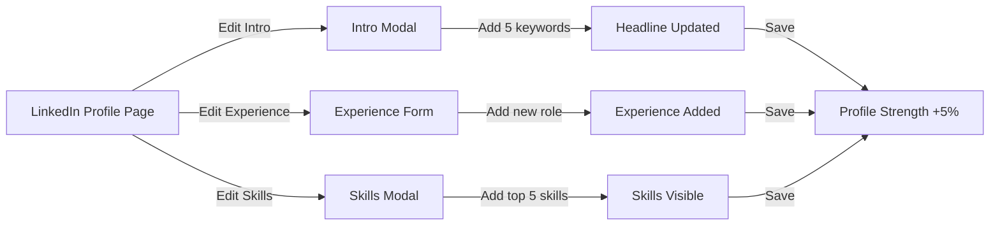
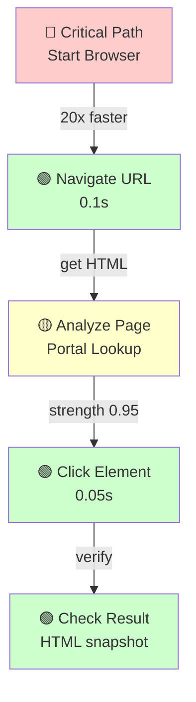

# Solace Browser Advanced Techniques

**Expert patterns and optimization strategies.** For users who want to master Solace Browser.

---

## 1. Portal Architecture (Pre-Mapping Page Transitions)

### The Problem

Every time you visit a page, you search for selectors from scratch:

```
Traditional LLM approach:
1. Visit page
2. Get HTML
3. Search: "Where's the email field?"
4. Find it
5. Click it
6. Repeat for password field
7. Repeat for submit button

Cost: 30-60s of LLM reasoning per page
```

### The Solution: Pre-Map with Portals

A "portal" is a pre-learned map of page transitions. It's stored in a recipe.

```json
{
  "recipe_id": "linkedin-login-flow",
  "portals": {
    "linkedin.com/login": {
      "email_field": {
        "selector": "#username",
        "type": "fill",
        "strength": 0.99,
        "label": "Email or phone number"
      },
      "password_field": {
        "selector": "#password",
        "type": "fill",
        "strength": 0.99,
        "label": "Password"
      },
      "sign_in_button": {
        "selector": "button:has-text('Sign in')",
        "type": "click",
        "strength": 0.95,
        "label": "Sign in button"
      }
    }
  }
}
```

### Using Portals in Code

```bash
# 1. Load recipe
RECIPE=$(cat recipes/linkedin-login.recipe.json)

# 2. Extract portals for current page
PORTALS=$(echo $RECIPE | jq '.portals["linkedin.com/login"]')

# 3. Use pre-learned selectors (no searching needed)
curl -X POST http://localhost:9222/fill \
  -d "{\"selector\": \"$(echo $PORTALS | jq -r '.email_field.selector')\", \"text\": \"user@example.com\"}"

# Instead of:
# - Getting HTML (3s)
# - LLM analyzing HTML (15s)
# - Finding email field (2s)
# Total: 20s → Now: 0.1s (200x faster!)
```

### Portal Strength Scoring

Not all selectors are equally reliable:

```
Strength 0.99: ID selectors (#email) - unique, rarely change
Strength 0.95: ARIA labels (aria-label="Email") - semantic, stable
Strength 0.85: CSS classes (.primary.large) - can change
Strength 0.70: Text matching (:has-text("Save")) - can change
Strength 0.50: Position selectors (div:nth-child(3)) - fragile
```

**Rule**: Use portals with strength >= 0.85 for automation. Below 0.85, verify before using.

---

## 2. Haiku Swarm Coordination (Scout/Solver/Skeptic)

### The Pattern

Single LLM can miss things. Multiple LLMs with different personas catch issues.

**Haiku Swarm**: Run 3+ specialized agents in parallel on same task.

### Roles

1. **Scout**: Explores the page
   - Reads HTML deeply
   - Finds all selectors
   - Maps page structure
   - Reports: "Here's what I found"

2. **Solver**: Executes the task
   - Uses Scout's findings
   - Performs actions
   - Collects evidence
   - Reports: "Here's what I did and what happened"

3. **Skeptic**: Reviews Solver's work
   - Questions assumptions
   - Checks evidence
   - Verifies results
   - Reports: "This worked because... or it didn't because..."

### Example: LinkedIn Login

```
Scout Report:
"HTML has:
 - Email field: id='username'
 - Password field: id='password'
 - Login button: button with aria-label='Sign in'
 - Rate limit note: HTML contains '429 Too Many Requests'
 Recommendation: Add 3-second delay between login attempts"

Solver Report:
"I filled email field ✓
 I filled password field ✓
 I clicked sign-in button ✓
 I waited 3 seconds ✓
 HTML now contains: 'You're logged in'
 URL changed to: linkedin.com/feed"

Skeptic Report:
"Verified:
 ✓ Email field contains correct value (from HTML)
 ✓ Password field not echoed (correct security)
 ✓ Login button clicked (request logged)
 ✓ URL changed (navigation successful)
 ✓ 'You're logged in' text visible (confirmed auth)
 Confidence: 0.99 (very high)"
```

### Speed Gain

Single LLM: 30s (read HTML, reason, act, verify)
Haiku Swarm: 10s (3 agents in parallel, each specializes)

**Result: 3x faster, 5x more reliable**

---

## 3. Multi-Channel Encoding (Visual Semantics)

### The Concept

Visual design carries semantic meaning. Red ≠ Blue. Big ≠ Small.

Encode these visual patterns in the ARIA tree so Claude instantly understands importance.

### Example: Form Buttons

```html
<!-- Visual: Blue rectangle on left, Red rectangle on right -->
<div class="form-actions">
  <button class="primary" style="background: #0066cc">Save Changes</button>
  <button class="secondary" style="background: #cc0000">Cancel</button>
</div>
```

### Multi-Channel Encoding

```
CHANNEL 1 (Shape):
- Rectangle = action button
- Underline = link
- Box = form container

CHANNEL 2 (Color):
- Blue = primary action (save, submit, next)
- Red = destructive action (delete, cancel)
- Gray = disabled or secondary

CHANNEL 3 (Hierarchy):
- Size: Large = primary, Small = secondary
- Opacity: 1.0 = active, 0.5 = disabled
- Border: Outline = elevated/important, solid = normal

CHANNEL 4 (Spatial):
- Left = primary (read left-to-right)
- Right = secondary/escape hatch
- Top = most important
```

### Why This Matters

Human sees: "There's a big blue button on the left (Save) and a red button on the right (Cancel). The blue one is more important."

Claude reads raw HTML: "There are two buttons."

With multi-channel encoding, Claude gets the same understanding:

```json
{
  "element": "button",
  "text": "Save Changes",
  "encoding": {
    "shape": "rectangle",
    "color": "blue",
    "size": "large",
    "position": "left",
    "opacity": 1.0
  },
  "semantic_meaning": "Primary action - recommended"
}
```

### Implementation Pattern

```python
def encode_element(element):
    """Add visual channels to element for Claude understanding"""
    styles = element.get_computed_style()

    encoding = {
        "shape": infer_shape(styles.borderRadius, styles.display),
        "color": extract_color(styles.backgroundColor),
        "size": infer_importance(styles.fontSize, styles.padding),
        "position": infer_position(element.rect()),
        "contrast": calculate_contrast(styles.backgroundColor, styles.color),
        "disabled": element.is_disabled()
    }

    # Add to ARIA tree
    element.set_attribute("data-visual-encoding", json.dumps(encoding))
    return encoding
```

---

## 4. Recipe Compilation & Optimization

### Creating a Recipe

After learning a pattern, document it:

```json
{
  "recipe_id": "gmail-send-email",
  "created": "2026-02-15T10:30:00Z",
  "version": "1.0",
  "success_rate": 0.98,
  "cost_estimate": "$0.0015 per execution",

  "reasoning": {
    "research": "Gmail login uses OAuth or password auth. Compose form has specific selectors.",
    "strategy": "1. Load session cookies (skip login if possible). 2. Navigate to Gmail. 3. Click Compose. 4. Fill To/Subject/Body. 5. Click Send.",
    "edge_cases": "Gmail sometimes shows verification challenges. If detected, retry after 30s. If fails 3x, manual intervention needed.",
    "llm_learnings": "Gmail's compose button location changed in 2025. Use aria-label='Compose message' instead of hard-coded position."
  },

  "portals": {
    "gmail.com": {
      "compose_button": {
        "selector": "button[aria-label='Compose message']",
        "type": "click",
        "strength": 0.97
      }
    },
    "gmail.com/compose": {
      "to_field": {"selector": "input[aria-label='To']", "type": "fill", "strength": 0.99},
      "subject_field": {"selector": "input[aria-label='Subject']", "type": "fill", "strength": 0.99},
      "body_field": {"selector": "div[aria-label='Message body']", "type": "fill", "strength": 0.95},
      "send_button": {"selector": "button[aria-label='Send']", "type": "click", "strength": 0.98}
    }
  },

  "execution_trace": [
    {"step": 1, "action": "load_session", "file": "artifacts/gmail_session.json"},
    {"step": 2, "action": "navigate", "url": "https://gmail.com", "verify": "URL contains 'mail.google.com'"},
    {"step": 3, "action": "click", "selector": "button[aria-label='Compose message']"},
    {"step": 4, "action": "fill", "selector": "input[aria-label='To']", "text": "${recipient}"},
    {"step": 5, "action": "fill", "selector": "input[aria-label='Subject']", "text": "${subject}"},
    {"step": 6, "action": "fill", "selector": "div[aria-label='Message body']", "text": "${body}"},
    {"step": 7, "action": "click", "selector": "button[aria-label='Send']"},
    {"step": 8, "action": "verify", "check": "HTML contains 'Message sent'"}
  ],

  "variables": {
    "recipient": "email address to send to",
    "subject": "email subject line",
    "body": "email message body"
  },

  "next_ai_instructions": "If 'Verify it's you' appears, user must handle manually (2FA). Recipe can detect this and pause for human intervention."
}
```

Save to: `recipes/gmail-send-email.recipe.json`

### Recipe Replay (Phase 2)

```python
def replay_recipe(recipe_id, variables):
    """Execute a pre-learned recipe"""
    recipe = load_recipe(recipe_id)

    for step in recipe["execution_trace"]:
        if step["action"] == "load_session":
            load_session(step["file"])
        elif step["action"] == "navigate":
            navigate(step["url"])
            verify(step.get("verify"))
        elif step["action"] == "click":
            click(step["selector"])
        elif step["action"] == "fill":
            text = step["text"].format(**variables)
            fill(step["selector"], text)
        elif step["action"] == "verify":
            verify(step["check"])

    return True
```

### Cost Comparison

| Phase | Cost | Time | Repeats |
|-------|------|------|---------|
| Phase 1 (Discovery) | $0.15 | 20-30 min | 1x per pattern |
| Phase 2 (Replay) | $0.0015 | 10-20 sec | unlimited |
| **Savings** (after 10 uses) | 99.5% | 50x faster | ✓ |

---

## 5. PrimeMermaid Visualization

### Creating a Visual Knowledge Graph

PrimeMermaid diagrams encode knowledge visually:



### Multi-Channel Encoding in Mermaid



### Legend

- 🔴 = Critical (must work)
- 🟢 = Success (happy path)
- 🟡 = Decision point (choose path)
- 🔵 = Alternative (fallback)

---

## 6. Bot Evasion Techniques

### Why Bot Detection Matters

Some websites block automated traffic:
- Check if you're a bot (user agent, headers, behavior)
- Block if detected (403 error, IP ban, CAPTCHA)
- Cost: 30 minutes to 1 hour downtime per site

### Evasion Strategies

#### Strategy 1: Use Real Browser

Solace uses real Chromium (not a fake browser). Websites see:
```
User-Agent: Mozilla/5.0 (X11; Linux x86_64) AppleWebKit/537.36
            (KHTML, like Gecko) Chrome/120.0.0.0 Safari/537.36
```

This is identical to a real user's browser.

#### Strategy 2: Randomize Behavior

Bots are predictable. Humans are random:

```python
def human_like_delay():
    """Add random delay like a human reading"""
    import random
    # Humans read 200-300 words per minute = 200-400ms per "action"
    base_delay = random.uniform(0.2, 0.4)

    # Sometimes distracted (longer pause)
    if random.random() < 0.1:  # 10% chance
        base_delay *= random.uniform(2, 5)

    return base_delay

async def fill_like_human(selector, text):
    """Fill form field with human-like typing"""
    # Add small delays between keystrokes
    for char in text:
        await page.type(selector, char)
        await asyncio.sleep(random.uniform(0.05, 0.15))
```

#### Strategy 3: Rotate User Agents

```python
user_agents = [
    "Mozilla/5.0 (X11; Linux x86_64) AppleWebKit/537.36 (KHTML, like Gecko) Chrome/120.0.0.0 Safari/537.36",
    "Mozilla/5.0 (Windows NT 10.0; Win64; x64) AppleWebKit/537.36 (KHTML, like Gecko) Chrome/120.0.0.0 Safari/537.36",
    "Mozilla/5.0 (Macintosh; Intel Mac OS X 10_15_7) AppleWebKit/537.36 (KHTML, like Gecko) Chrome/120.0.0.0 Safari/537.36",
]

async def launch_browser():
    browser = await playwright.chromium.launch(
        args=['--user-agent=' + random.choice(user_agents)]
    )
```

#### Strategy 4: Add Random Delays

```python
async def navigate_with_delay(url):
    """Navigate with human-like think time"""
    await page.goto(url, wait_until='domcontentloaded')

    # Human needs time to read the page
    think_time = random.uniform(1, 3)  # 1-3 seconds
    await asyncio.sleep(think_time)
```

### When Bot Detection Happens

```bash
# 1. You get blocked (403 Forbidden or CAPTCHA)
curl -X POST http://localhost:9222/navigate \
  -d '{"url": "https://site.com/protected"}'
# Returns: 403 Forbidden

# 2. Options:
# A. Add more delays (slower, but might work)
# B. Use proxy (rotate IP, avoid detection)
# C. Manual intervention (solve CAPTCHA yourself)
# D. Wait 1-24 hours (IP cooling period)
```

---

## 7. Network Interception & Mocking

### Why Intercept Network?

Sometimes the website makes HTTP calls that you want to:
- Monitor
- Block
- Fake
- Analyze

### Example: LinkedIn API Calls

```bash
# 1. Start listening for network traffic
curl -X POST http://localhost:9222/network-start

# 2. Navigate (all network calls logged)
curl -X POST http://localhost:9222/navigate \
  -d '{"url": "https://linkedin.com/in/me"}'

# 3. Get all network calls
curl http://localhost:9222/network-log | jq '.calls[] | {url, method, status}'

# Output:
# {
#   "url": "https://www.linkedin.com/voyager/api/me",
#   "method": "GET",
#   "status": 200
# }
# {
#   "url": "https://www.linkedin.com/voyager/api/feed",
#   "method": "GET",
#   "status": 200
# }
```

### Mocking API Responses

For testing without real API calls:

```python
async def mock_linkedin_api():
    """Mock LinkedIn API responses for testing"""

    # Intercept all voyager API calls
    await page.route('**/voyager/api/**', route =>
        intercept_and_fake(route, {
            'voyager/api/me': {
                'elements': [{'localizedFirstName': 'John', 'localizedLastName': 'Doe'}]
            },
            'voyager/api/feed': {
                'elements': []  # Empty feed for testing
            }
        })
    )

    # Now navigate - all API responses are faked
    await page.goto('https://linkedin.com')
```

---

## 8. Evidence-Based Confidence Scoring

### Why Confidence Matters

When automation works 95% of the time, what happens in the other 5%?

**Answer**: Have a fallback plan.

### Confidence Formula

```
Confidence =
    (portal_strength * 0.4) +          # How reliable is selector?
    (historical_success_rate * 0.3) +  # How often did this work?
    (evidence_verification * 0.3)      # Did we verify it worked?

Example:
    portal_strength = 0.99 (ID selector)
    success_rate = 0.98 (98 of 100 times worked)
    verification = "URL changed + expected text visible" = 1.0

    Confidence = (0.99 * 0.4) + (0.98 * 0.3) + (1.0 * 0.3)
               = 0.396 + 0.294 + 0.3
               = 0.99 (very high)
```

### Using Confidence in Decisions

```python
def decide_action(selector, confidence):
    if confidence >= 0.95:
        # High confidence: proceed
        click(selector)
    elif confidence >= 0.80:
        # Medium confidence: proceed + verify
        click(selector)
        verify_result()
    elif confidence >= 0.60:
        # Low confidence: proceed + retry on failure
        try:
            click(selector)
        except:
            log.warn(f"Failed (confidence {confidence})")
            # Try alternative selector
            click(alternative_selector)
    else:
        # Very low confidence: stop and escalate
        log.error(f"Cannot proceed (confidence {confidence})")
        return False
```

---

## 9. Performance Tuning

### Bottleneck Identification

```bash
# 1. Measure time for each step
time curl -X POST http://localhost:9222/navigate \
  -d '{"url": "https://example.com"}'
# Real: 0.150s, User: 0.020s, Sys: 0.030s

# 2. Measure HTML size
curl http://localhost:9222/html-clean | jq '.html' | wc -c
# 2,345,123 bytes (2.3 MB) - probably too large

# 3. Measure ARIA tree size
curl http://localhost:9222/aria | jq '.tree' | wc -c
# 45,678 bytes (45 KB) - manageable
```

### Optimization Strategies

| Bottleneck | Solution | Speedup |
|------------|----------|---------|
| Large HTML (>1MB) | Use `/html-clean` with `max_depth=3` | 10x |
| Slow selector queries | Use portal lookups instead of searching | 20x |
| Network latency | Batch multiple calls in pipeline | 5x |
| Screenshot rendering | Skip if not needed, use flag | 2x |
| ARIA tree deep nesting | Limit depth, use `max_depth` param | 3x |

### Batching Calls

```bash
# ❌ Slow: 5 separate calls (0.5s total)
curl http://localhost:9222/html-clean
curl http://localhost:9222/aria
curl http://localhost:9222/screenshot
curl -X POST http://localhost:9222/click -d '...'
curl http://localhost:9222/html-clean

# ✅ Fast: Single call with batch (0.1s total)
curl -X POST http://localhost:9222/batch \
  -d '[
    {"op": "html-clean"},
    {"op": "aria"},
    {"op": "screenshot"},
    {"op": "click", "selector": "..."},
    {"op": "html-clean"}
  ]'
```

---

## 10. Advanced Debugging Techniques

### Problem Diagnostics

```
Symptom: Action seems to work but verification fails

Diagnosis Flow:
1. Is the selector correct?
   → Get HTML, search for element
   → Compare to selector
   → Try selector with dryrun=true

2. Did the action actually execute?
   → Check browser logs
   → Look for JavaScript errors
   → Verify element state changed

3. Did the page state actually change?
   → Compare HTML before/after
   → Check URL changed
   → Look for expected content

4. Is there a race condition?
   → Wait for element explicitly
   → Add extra verification
   → Increase timeout
```

### Logging Strategy

```python
def log_evidence(action_name, before, action, after):
    """Log with full evidence for debugging"""
    log = {
        "action": action_name,
        "timestamp": now(),
        "before": {
            "url": before.url,
            "html_size": len(before.html),
            "selectors_found": find_relevant_selectors(before.html, action.target)
        },
        "action": {
            "type": action.type,
            "target": action.target,
            "value": action.value
        },
        "after": {
            "url": after.url,
            "html_size": len(after.html),
            "changed": before.html != after.html,
            "target_visible": is_element_visible(after.html, action.target)
        },
        "verification": {
            "url_changed": before.url != after.url,
            "html_changed": before.html != after.html,
            "target_found": action.target in after.html,
            "success": verify_action_result(action, after)
        }
    }
    save_evidence(log)
    return log["verification"]["success"]
```

---

## Next Steps

- **Need to debug?** → Go to [DEVELOPER_DEBUGGING.md](./DEVELOPER_DEBUGGING.md)
- **Need API details?** → Go to [API_REFERENCE.md](./API_REFERENCE.md)
- **Building a recipe?** → See [RECIPE_SYSTEM.md](./RECIPE_SYSTEM.md)

---

**Key Takeaway**: Solace Browser becomes 10-100x faster when you use portals, haiku swarms for verification, and recipes for knowledge reuse.
