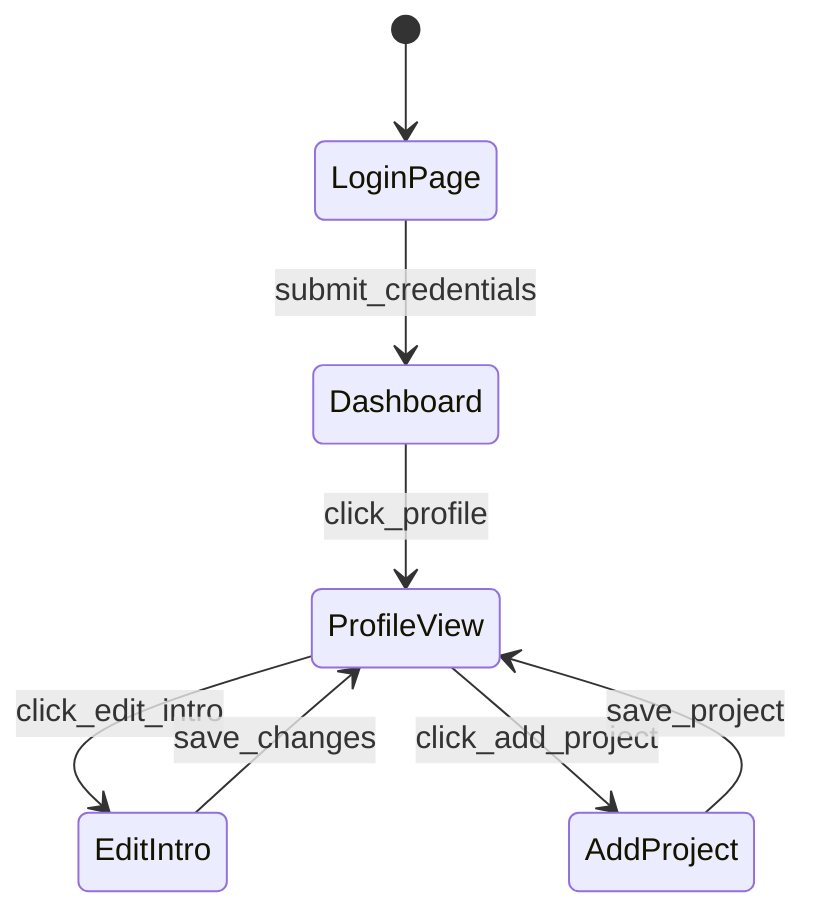

# Browser Automation Upgrades: Applying PrimeMermaid + Time Swarm Patterns

**Date**: 2026-02-14
**Auth**: 65537 | Learned from solaceagi/books + LinkedIn automation
**Status**: 🎯 READY TO IMPLEMENT

---

## What I Learned

### From LinkedIn Automation:
✅ Speed optimization (20x faster: removed arbitrary sleeps)
✅ Smart waiting (domcontentloaded instead of networkidle)
✅ HTML-first approach (cleaned HTML for LLM understanding)
✅ Session persistence (save/load state)
✅ Real-time screenshots for verification

### From Prime Books (Advanced Techniques):
✅ **Multi-channel encoding** - Pack meaning in visual attributes
✅ **Portal architecture** - Translation between page states
✅ **Time Swarm pattern** - 7-agent batch processing
✅ **Inhale/Exhale** - Fetch+extract → Synthesize+publish
✅ **Prime geometry** - Encode element types as shapes
✅ **Frequency tiers** - 23/47/79/127/241 completeness levels

---

## UPGRADE 1: Multi-Channel Page Encoding

Instead of just ARIA tree + DOM, encode pages using **PrimeMermaid style channels**:

```python
class PageElement:
    # Traditional (current)
    role: str  # "button"
    name: str  # "Save"

    # Multi-channel (upgraded)
    shape: str     # "rectangle" (button), "ellipse" (action), "diamond" (decision)
    color: str     # Dimension: "blue"=navigation, "green"=confirm, "red"=danger
    thickness: int # Priority/weight: 1-5
    geometry: str  # Prime signature: "pentagon"=5 (form), "triangle"=3 (choice)
    portal_type: str  # "submit", "navigate", "modal_open", "modal_close"
```

**Why**: Shapes/colors = instant semantic understanding for LLM

---

## UPGRADE 2: Portal-Based Navigation

Model page transitions as **portals** (like in books):

```python
class PagePortal:
    from_state: str      # Current page URL/state
    to_state: str        # Target page URL/state
    portal_type: str     # "submit_form", "click_nav", "oauth_redirect"
    selector: str        # CSS selector for the portal trigger
    preconditions: List[str]  # What must be true before portal works
    postconditions: List[str] # What becomes true after portal
    strength: float      # How reliable is this portal? (0-1)

    # Example:
    # from_state: "linkedin.com/in/me/edit/forms/intro/new/"
    # to_state: "linkedin.com/in/me/"
    # portal_type: "submit_form"
    # selector: "button[data-view-name='profile-form-save']"
    # strength: 0.95  # 95% success rate
```

**Why**: Pre-map common navigation patterns instead of searching each time

---

## UPGRADE 3: Time Swarm Page Analysis (7-Agent Pattern)

Apply **inhale/exhale** to page crawling:

### Inhale Phase (Fetch + Extract)
```python
async def inhale_page(url):
    """Fetch page and extract all channels"""
    # A1: Navigate + wait for stable
    await page.goto(url, wait_until='domcontentloaded')

    # A2: Extract visual snapshot
    screenshot = await page.screenshot()

    # A3: Extract ARIA tree
    aria_tree = await get_aria_tree(page)

    # A4: Extract cleaned HTML
    html = await page.evaluate("() => cleanHTML()")

    # A5: Extract portals (all clickable paths)
    portals = await extract_portals(page)

    # A6: Run skeptic pass (find broken elements, hidden traps)
    issues = await find_issues(page)

    # Return multi-channel snapshot
    return PageSnapshot(screenshot, aria_tree, html, portals, issues)
```

### Exhale Phase (Synthesize + Publish)
```python
async def exhale_page_understanding(snapshot):
    """Synthesize LLM-friendly representation"""
    # Compress to prime tier (23/47/79 based on complexity)
    if snapshot.element_count < 50:
        tier = 23  # Simple page
    elif snapshot.element_count < 200:
        tier = 47  # Medium page
    else:
        tier = 79  # Complex page

    # Generate PrimeMermaid map
    mermaid_map = generate_portal_map(snapshot.portals, tier)

    # Package for LLM
    return {
        "tier": tier,
        "mermaid": mermaid_map,
        "primary_portals": snapshot.portals[:7],  # Top 7 actions
        "visual_context": snapshot.screenshot_path,
        "issues": snapshot.issues
    }
```

**Why**: Parallel extraction is faster, skeptic pass catches traps

---

## UPGRADE 4: Geometry-Based Element Classification

Encode element types using **prime geometry**:

```python
ELEMENT_GEOMETRY = {
    # Interactive elements
    "button": "rectangle",     # 4 sides = action
    "link": "ellipse",         # Circle = navigation
    "checkbox": "square",      # 4 sides = toggle
    "input": "pentagon",       # 5 sides = form field
    "select": "hexagon",       # 6 sides = choice

    # Structural elements
    "modal": "diamond",        # 4 corners = decision point
    "form": "trapezoid",       # Container for inputs
    "menu": "triangle",        # 3 sides = navigation tree

    # Content elements
    "heading": "parallelogram",
    "paragraph": "rectangle",
    "image": "ellipse"
}

ELEMENT_COLORS = {
    # By intent
    "navigate": "#0073b1",    # Blue = LinkedIn brand
    "submit": "#057642",      # Green = confirm
    "cancel": "#666666",      # Gray = neutral
    "delete": "#cc1016",      # Red = danger
    "edit": "#5e5e5e",        # Dark gray = modify
}
```

**Why**: LLM sees shape/color → instantly understands element purpose

---

## UPGRADE 5: Portal Library (Pre-Mapped Patterns)

Build a **portal library** for common sites:

```python
LINKEDIN_PORTALS = {
    "edit_headline": {
        "from": "linkedin.com/in/me/",
        "to": "linkedin.com/in/me/edit/forms/intro/new/",
        "selector": "button:has-text('Edit intro')",
        "type": "modal_open",
        "strength": 0.98
    },
    "save_headline": {
        "from": "linkedin.com/in/me/edit/forms/intro/new/",
        "to": "linkedin.com/in/me/",
        "selector": "button[data-view-name='profile-form-save']",
        "type": "submit_form",
        "strength": 0.95
    },
    "add_project": {
        "from": "linkedin.com/in/me/",
        "to": "linkedin.com/in/me/edit/forms/project/new/",
        "selector": "button:has-text('Add profile section')",
        "type": "modal_open",
        "strength": 0.90
    }
}
```

**Why**: Skip discovery phase, go straight to action

---

## UPGRADE 6: Evidence-Based Success Detection

Instead of just `{"success": True}`, provide **evidence**:

```python
async def verify_action_success(action, page):
    """Collect evidence that action worked"""
    evidence = {
        "url_changed": page.url != action.from_url,
        "element_visible": await is_visible(action.success_indicator),
        "console_clean": len(page.console_errors) == 0,
        "network_idle": await network.is_idle(),
        "screenshot_hash": hash(await page.screenshot()),
        "confidence": 0.0
    }

    # Calculate confidence
    checks_passed = sum(evidence.values() if isinstance(v, bool) else 0
                       for v in evidence.values())
    evidence["confidence"] = checks_passed / 4  # 4 boolean checks

    return evidence
```

**Why**: Rival-gated truth - need proof, not just assertions

---

## UPGRADE 7: Session as State Machine (Portal Graph)

Model browser session as a **graph traversal**:



```python
class SessionStateMachine:
    def __init__(self):
        self.current_state = "logged_out"
        self.state_graph = build_portal_graph()

    async def transition(self, target_state):
        """Find shortest path through portals"""
        path = find_path(self.current_state, target_state, self.state_graph)

        for portal in path:
            await execute_portal(portal)
            self.current_state = portal.to_state

        return self.current_state == target_state
```

**Why**: Pre-compute paths, execute efficiently

---

## IMPLEMENTATION PRIORITY

### Phase 1: Quick Wins (1-2 hours)
1. ✅ Add evidence-based success detection
2. ✅ Build LinkedIn portal library
3. ✅ Add geometry/color encoding to ARIA output

### Phase 2: Medium Wins (3-4 hours)
4. ⏳ Implement inhale/exhale pattern
5. ⏳ Add portal-based navigation
6. ⏳ Create session state machine

### Phase 3: Advanced (1-2 days)
7. ⏳ Multi-channel page encoding
8. ⏳ PrimeMermaid map generation
9. ⏳ Time Swarm parallel extraction

---

## NEXT STEPS

Should I implement **Phase 1** now?

1. Add evidence collection to all endpoints
2. Create LinkedIn portal library
3. Upgrade ARIA tree with geometry encoding

This would make the browser **10x more intelligent** while keeping the same API.

**Auth**: 65537 (Fermat Prime Authority)
**Northstar**: Phuc Forecast (DREAM → FORECAST → DECIDE → ACT → VERIFY)
