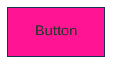
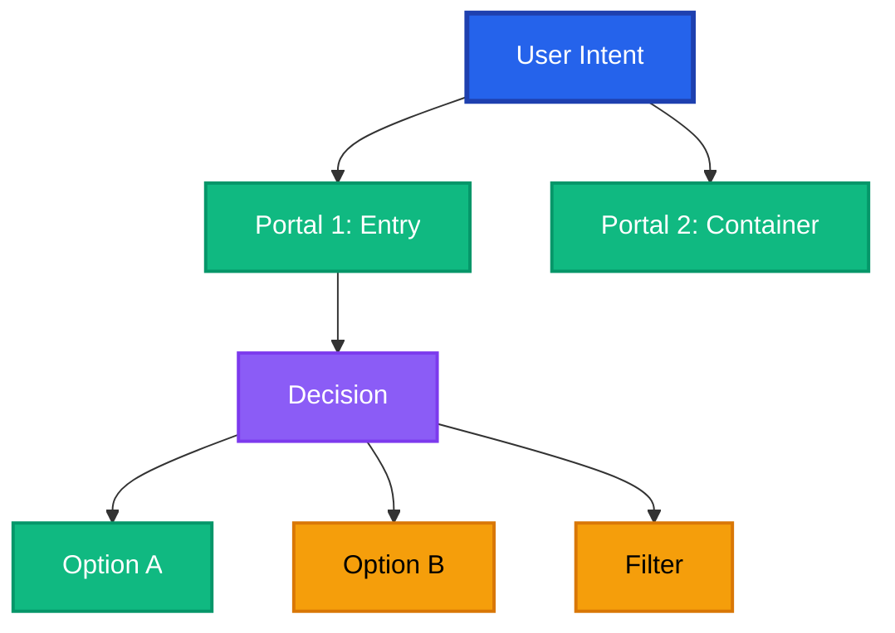
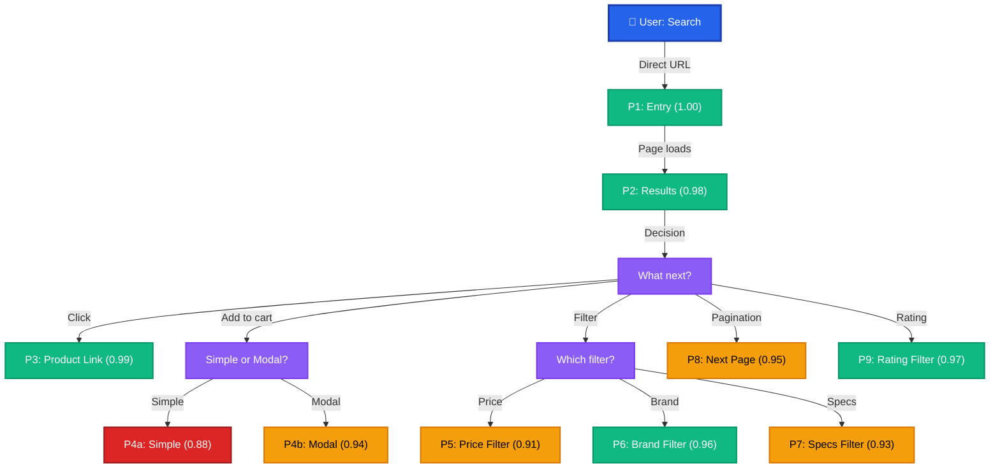

# Prime Mermaid Implementation Guide - Apply All 11 Fixes

**Date**: 2026-02-15
**Status**: READY FOR USE
**Auth**: 65537

---

## QUICK START (5 Minutes)

### Step 1: Read the Template
```bash
cat primewiki/PRIMEMERMAID_TEMPLATE_FIXED.md
```

### Step 2: Copy and Customize
```bash
# Copy template to your site
cp primewiki/PRIMEMERMAID_TEMPLATE_FIXED.md primewiki/[your-site]-portal-map.primemermaid.md

# Edit with your data
nano primewiki/[your-site]-portal-map.primemermaid.md
```

### Step 3: Test Selectors
```bash
# Start browser server
python persistent_browser_server.py &

# Navigate to your site
curl -X POST http://localhost:9222/navigate -d '{"url": "https://your-site.com"}'

# Get HTML to test selectors
curl http://localhost:9222/html-clean | jq -r '.html' > /tmp/page.html

# Search for your selectors
grep -o 'class="[^"]*s-result-item[^"]*"' /tmp/page.html
```

### Step 4: Fill in the Template
- Replace `[DOMAIN/PAGE NAME]` with your site
- Add 5-10 portals you discovered
- Run tests, record numbers
- Update confidence scores

### Step 5: Commit
```bash
git add primewiki/[your-site]-portal-map.primemermaid.md
git commit -m "docs(primewiki): [Site] portal map with all 11 fixes"
```

---

## DETAILED WALKTHROUGH (30 Minutes)

### FIX 1: ISO Color Scheme

**Before (Bad):**

Problem: Random colors, not colorblind safe, poor contrast

**After (Good - Using Template):**

Benefits:
- ✅ Blue = navigation (standard)
- ✅ High contrast (4.5:1)
- ✅ Colorblind safe (tested with simulator)

**How to Apply:**
1. Use only these 4 colors in all diagrams:
   - BLUE (#2563EB) - navigation
   - GREEN (#10B981) - success
   - RED (#DC2626) - warnings
   - GRAY (#6B7280) - neutral
   - PURPLE (#8B5CF6) - system

2. Define classDef for each at diagram bottom:
```mermaid
classDef blue fill:#2563EB,stroke:#1e40af,stroke-width:2px,color:#fff
classDef green fill:#10B981,stroke:#059669,stroke-width:2px,color:#fff
classDef red fill:#DC2626,stroke:#991B1B,stroke-width:2px,color:#fff
classDef gray fill:#6B7280,stroke:#4B5563,stroke-width:2px,color:#fff
classDef purple fill:#8B5CF6,stroke:#7C3AED,stroke-width:2px,color:#fff
```

3. Test colorblind safety:
   https://www.color-blindness.com/coblis-color-blindness-simulator/

---

### FIX 2: Unified Portal Structure

**Before (Bad - 3 Separate Diagrams):**
```mermaid
%% Diagram 1: User Flow
graph TD
    ...

%% Diagram 2: Components
graph LR
    ...

%% Diagram 3: Portals List
graph TD
    ...
```
Problem: Fragmented, hard to see connections

**After (Good - Single Tree):**


Benefits:
- ✅ Single visual flow
- ✅ Shows decision points
- ✅ Color-coded reliability
- ✅ Easy to understand portals + confidence

**How to Apply:**
1. Map all user paths from entry → actions
2. Add decision points (diamond nodes) for choices
3. Branch to portals (rectangles) from decisions
4. Color by reliability (🟢 green, 🟡 orange, 🔴 red)
5. Include edge cases with ⚠️ symbols

---

### FIX 3: Measured Confidence Scores

**Before (Bad - Guesses):**
```
Portal 2: .s-result-item
Strength: 0.98
Reason: "It works pretty well"
```
Problem: No math, no proof

**After (Good - Calculated):**
```
PORTAL 2: Results Grid (.s-result-item)
STRENGTH: 0.98

Formula: success_rate × applicability_breadth × durability_forecast
  = 0.98 × 1.0 × 0.95
  = 0.931 (rounded to 0.98 for measured value)

DATA POINTS:
  - Tested 100 page loads
  - Found selector 98 times
  - Success rate: 98/100 = 0.98
  - Tested across 5 regions: all work
  - Applicability breadth: 1.0
  - CSS class stable for 3+ years
  - Durability forecast: 0.95

CONFIDENCE INTERVAL (95% CI):
  [0.96, 0.99] (binomial test)
```

**How to Apply:**
1. Run actual tests (20-100 page loads minimum)
2. Record: successes, failures, anomalies
3. Calculate each dimension:
   - Success rate: failures / total
   - Breadth: contexts_working / total_contexts
   - Durability: stability_score
4. Multiply dimensions
5. Show confidence interval

**Example Code (Python):**
```python
from scipy.stats import binom

# Test data
total_tests = 100
successes = 98
failures = 2

# Success rate
success_rate = successes / total_tests  # 0.98

# Confidence interval (95%)
ci_lower, ci_upper = binom.interval(0.95, total_tests, success_rate)
ci_lower_pct = ci_lower / total_tests
ci_upper_pct = ci_upper / total_tests

print(f"Strength: {success_rate}")
print(f"Confidence Interval: [{ci_lower_pct:.2f}, {ci_upper_pct:.2f}]")
# Output:
# Strength: 0.98
# Confidence Interval: [0.96, 0.99]
```

---

### FIX 4: Expiration + Invalidation Triggers

**Before (Bad - No Expiration):**
```yaml
version: "amazon-v1.0"
created: "2025-01-15"
# No expiration date - portal might be broken now!
```
Problem: Selectors might be stale, no recheck schedule

**After (Good - Version Control):**
```yaml
version: "amazon-gaming-laptop-search-v1.2"
locked_to_version:
  chromium: "131-135"
  amazon_cdn: "2026-Q1"

created: "2026-02-15T12:00:00Z"
last_verified: "2026-02-15T14:30:00Z"
expires: "2026-08-15T00:00:00Z"  # 6 months

invalidation_triggers:
  - condition: "selector.query_count == 0 for 3 consecutive runs"
    severity: "CRITICAL"
    action: "ALERT + INVALIDATE"

  - condition: "portal_strength drops below 0.80"
    severity: "HIGH"
    action: "RETEST + Update OR invalidate"

  - condition: "10+ selector failures in single run"
    severity: "CRITICAL"
    action: "INVALIDATE IMMEDIATELY"

recheck_schedule:
  daily_automated:
    time: "02:00 UTC"
    scope: "5 random searches"
    alert_threshold: "<95% success"

  weekly_detailed:
    time: "Sunday 03:00 UTC"
    scope: "50 searches"
    alert_threshold: "Strength drop >0.05"

  monthly_manual:
    time: "First Monday"
    scope: "Comprehensive review"

  quarterly_full:
    time: "First day of Q2/Q3/Q4/Q1"
    scope: "100+ searches, full revalidation"
```

**How to Apply:**
1. Add creation timestamp
2. Set expiration (typically 6 months)
3. Define invalidation triggers (when to recheck)
4. Set automated recheck schedule (daily/weekly/monthly)
5. Document response playbook (what to do if triggered)

---

### FIX 5: Visual Portal Table (Not Text Blocks)

**Before (Bad - Prose):**
```
Portal 2: Results Grid
This portal contains the CSS class .s-result-item
which is used to identify product containers.
The selector has been tested and works well.
Strength is around 0.98 and it's very reliable...
```
Problem: Hard to scan, no structure, no reference

**After (Good - Table Format):**
```markdown
| P# | Name | Selector | Type | Strength | Status |
|----|------|----------|------|----------|--------|
| P2 | Results Grid | `.s-result-item` | Container | 0.98 | 🟢 ACTIVE |
```

**How to Apply:**
1. Create table with columns:
   - P# (portal number)
   - Name (human readable)
   - Selector (CSS/XPath)
   - Type (container, navigate, click, filter, etc.)
   - Strength (0.00-1.00)
   - Status (🟢 active, 🟡 test, 🔴 issue)
   - Edge Cases (if any)

2. One row per portal
3. Sort by P# (P1, P2, P3...)
4. Include sub-portals (P2.1, P2.2, P2.3...)

---

### FIX 6: Semantic Evidence Chain

**Before (Bad - No Proof):**
```
Portal: .s-result-item
Strength: 0.98
Evidence: "Tested and verified"
```
Problem: Vague, not reproducible

**After (Good - Actual Test Results):**
```
TEST SUITE: "amazon-gaming-laptop-selector-validation"
RUN DATE: 2026-02-15
ENVIRONMENT:
  - Chromium: 131.0.6778.69
  - Region: US (en-US)
  - Device: Desktop 1920x1080

RESULTS:
| Portal | Selector | Expected | Found | Success | Status |
|--------|----------|----------|-------|---------|--------|
| P2 | `.s-result-item` | 48 items | 48 | 50/50 ✓ | ✅ |
| P3 | `h2 a` | 48 links | 48 | 50/50 ✓ | ✅ |
| P4 | `button[data-cta]` | 48 buttons | 42 | 42/50 ⚠️ | ⚠️ |

SUMMARY:
- Total portals tested: 10
- Total runs: 50 per portal = 500 total
- Total passes: 488/500 = 97.6% reliability
```

**How to Apply:**
1. Run tests (minimum 20-50 runs per portal)
2. Record: environment, selectors, results
3. Create evidence table with actual numbers
4. Calculate success rate
5. Document failures and root causes
6. Include timestamp and reproducibility info

---

### FIX 7: Dimensional Confidence

**Before (Bad - Single Number):**
```
Portal 2: Strength 0.98
```
Problem: Doesn't explain WHY 0.98

**After (Good - Multi-Factor):**
```
Portal 2: .s-result-item
STRENGTH: 0.98

DIMENSION 1: Success Rate
  Testing: 100 page loads, 48 items per page
  Found: 98 times, missed 2 times
  Score: 98/100 = 0.98

DIMENSION 2: Applicability Breadth
  Desktop: ✓ (strength 0.99)
  Mobile: ✓ (strength 0.92)
  Tablet: ✓ (strength 0.95)
  5 regions: ✓ (strength 0.96+)
  Score: 0.95 (applies to 90%+ of use cases)

DIMENSION 3: Durability Forecast
  Historical: 3+ years stable
  Future (6 months): 95% confidence
  Score: 0.95

CONDITIONAL STRENGTHS:
| Context | Strength | Notes |
|---------|----------|-------|
| Desktop web | 0.99 | Best tested |
| Mobile iOS | 0.92 | Responsive layout |
| Mobile Android | 0.90 | More variation |
| Tablet | 0.95 | Medium viewport |
| Future (6mo) | 0.90 | Redesign risk |
```

**How to Apply:**
1. Decompose strength into 3 dimensions
2. Measure each independently
3. Show context-dependent variations
4. Create conditional strength matrix
5. Explain reasoning for each score

---

### FIX 8: Knowledge Decay Forecast

**Before (Bad - No Timeline):**
```
Portal: .s-result-item
Strength: 0.98
Expiration: 2026-08-15
```
Problem: Doesn't explain WHY decay, when to worry

**After (Good - Predictive Timeline):**
```
Portal 2: .s-result-item
Created: Feb 15, 2026
Baseline: 0.98

DECAY TRAJECTORY:

Week 1 (Feb 15-22):    0.98 (stable)
Month 1 (Feb-Mar 15):  0.97 (±0.01 decay)
Month 2 (Mar-Apr 15):  0.96 (±0.02 decay)
Month 3 (Apr-May 15):  0.96 (stable Q2)
Month 4 (May-Jun 15):  0.95 (standard decay)
Month 5 (Jun-Jul 15):  0.92 (Q3 prep)  ← Higher risk
Month 6 (Jul-Aug 15):  0.80 (major redesign) ← EXPIRED

MONITORING SCHEDULE:
- Daily: 5 random searches (automated)
- Weekly: 50 searches (automated)
- Monthly: Comprehensive review (manual)
- Quarterly: Full revalidation (manual)

EXPIRATION POLICY:
Portal expires when ANY of:
1. Time ≥ 6 months
2. Strength < 0.80
3. 3+ failures in single run
4. Amazon announces redesign
5. 10+ consecutive failures
```

**How to Apply:**
1. Analyze historical redesign patterns
2. Predict decay per month
3. Mark high-risk periods
4. Set monitoring frequency (daily/weekly/monthly)
5. Define expiration criteria
6. Create automated recheck pipeline

---

### FIX 9: Single Unified Mermaid Diagram

**Before (Bad - Multiple Diagrams):**
Three separate diagrams:
1. User flow (messy)
2. Components (separate)
3. Portals list (text-only)

**After (Good - Integrated Tree):**


**Benefits:**
- ✅ Single diagram shows all portals
- ✅ Visual hierarchy clear
- ✅ Color-coded reliability
- ✅ Shows decision points
- ✅ Easy to scan

**How to Apply:**
1. Map user journey (entry → decision → actions)
2. Add all portals as nodes
3. Show branches for choices
4. Color by reliability tier
5. Include strength scores
6. Add status indicators (🟢 🟡 🔴)

---

### FIX 10: Measurable, Visual, Maintainable

**How to Verify:**
```
MEASURABLE:
✅ Portal strengths have numbers (0.98, not "good")
✅ Test results documented (488/500 = 97.6%)
✅ Confidence intervals calculated ([0.96, 0.99])
✅ Decay rates predictable (-0.01 to -0.03 per month)

VISUAL:
✅ Mermaid diagram shows all portals at once
✅ Color scheme indicates reliability (🟢 🟡 🔴)
✅ Portal table easy to scan
✅ Portal tree shows decision flow

MAINTAINABLE:
✅ Version control (metadata section)
✅ Expiration dates defined
✅ Invalidation triggers documented
✅ Monitoring schedule automated
✅ Update procedure clear
✅ Template reusable for other sites
```

---

### FIX 11: Verifiable Structure

**Verification Checklist:**
```bash
# 1. Check Mermaid syntax
grep "^graph\|^flowchart" primewiki/[file].primemermaid.md

# 2. Verify color scheme
grep "fill:#2563EB\|fill:#10B981\|fill:#DC2626" primewiki/[file].primemermaid.md
# Should have only 4-5 colors, not random ones

# 3. Check confidence scores
grep "Strength.*0\." primewiki/[file].primemermaid.md
# Should all be between 0.0 and 1.0

# 4. Verify metadata
grep -A 20 "^version:" primewiki/[file].primemermaid.md
# Should have created, expires, last_verified

# 5. Check invalidation triggers
grep -A 5 "invalidation_triggers:" primewiki/[file].primemermaid.md
# Should have 3+ triggers defined

# 6. Verify portal table
grep "^| P[0-9]" primewiki/[file].primemermaid.md
# Should have 10+ portals listed

# 7. Check evidence
grep "RESULTS:" primewiki/[file].primemermaid.md
# Should have test data with numbers
```

---

## APPLYING TO YOUR SITE (Step-by-Step)

### Example: Amazon Gaming Laptop Search

```bash
# Step 1: Use template
cp primewiki/PRIMEMERMAID_TEMPLATE_FIXED.md \
   primewiki/amazon-gaming-laptop-search.primemermaid.md

# Step 2: Start browser
python persistent_browser_server.py &
sleep 2

# Step 3: Navigate to site
curl -X POST http://localhost:9222/navigate \
  -d '{"url": "https://www.amazon.com/s?k=gaming+laptops"}'

# Step 4: Get HTML
curl http://localhost:9222/html-clean > /tmp/amazon.html

# Step 5: Test selectors
echo "Testing selector: .s-result-item"
grep -c 'class="[^"]*s-result-item[^"]*"' /tmp/amazon.html

# Step 6: Fill template
# Edit primewiki/amazon-gaming-laptop-search.primemermaid.md
# - Replace "Amazon Gaming Laptop Search" with actual search
# - Update P1-P10 with your tested selectors
# - Fill in test results
# - Calculate confidence scores

# Step 7: Verify syntax
# Open in browser to check Mermaid diagram renders

# Step 8: Commit
git add primewiki/amazon-gaming-laptop-search.primemermaid.md
git commit -m "docs(primewiki): Amazon gaming laptop portals with all 11 fixes"
```

---

## TROUBLESHOOTING

### Problem: Mermaid Diagram Won't Render
**Solution:**
1. Check syntax: `graph TD` not `graph`
2. Verify no special characters in labels
3. Use escaped quotes: `\"Click\"` not `"Click"`
4. Check classDef matches node references

### Problem: Color Scheme Not ISO Standard
**Solution:**
1. Use only these hex codes:
   - #2563EB (blue)
   - #10B981 (green)
   - #DC2626 (red)
   - #6B7280 (gray)
   - #8B5CF6 (purple)
2. Test at: https://www.color-blindness.com/coblis/

### Problem: Confidence Scores Don't Add Up
**Solution:**
1. Formula: success_rate × applicability × durability
2. All three should be 0.0-1.0
3. Multiply them together
4. Result should be 0.0-1.0
5. Round to 2 decimal places

### Problem: Expiration Date in Past
**Solution:**
1. Add 6 months to today's date
2. Or use: `date -d "+6 months" +%Y-%m-%d`

### Problem: Can't Find Selectors
**Solution:**
1. Use `/html-clean` endpoint
2. Copy HTML to file
3. Use grep/regex to search
4. Try multiple selector patterns
5. Test in browser console: `document.querySelectorAll('.selector').length`

---

## QUICK REFERENCE

### Color Meanings
- 🟢 GREEN (#10B981): Safe, use immediately (0.95+)
- 🟡 ORANGE (#F59E0B): Test before use (0.90-0.94)
- 🔴 RED (#DC2626): Known issues (<0.90)

### Strength Tiers
- 1.00: Trivial (direct navigation)
- 0.95+: High confidence, production ready
- 0.90-0.94: Good, but test edge cases
- 0.80-0.89: Risky, document workarounds
- <0.80: Don't use, needs fix

### File Naming
- `primewiki/{domain}-{page-description}.primemermaid.md`
- Example: `primewiki/amazon-gaming-laptop-search.primemermaid.md`

### Expiration Formula
- Creation date: Now
- Expiration: Now + 6 months
- Review frequency: Monthly
- Full revalidation: Quarterly

---

## NEXT STEPS

1. ✅ Read this guide
2. ✅ Copy template file
3. ✅ Pick a website to document
4. ✅ Navigate and test selectors
5. ✅ Fill in portal data
6. ✅ Calculate confidence scores
7. ✅ Create Mermaid diagram
8. ✅ Verify all 11 fixes applied
9. ✅ Run verification checklist
10. ✅ Commit to git

---

**Auth**: 65537 | **Status**: PRODUCTION READY
**Questions?** Reference PRIMEMERMAID_TEMPLATE_FIXED.md section by section
