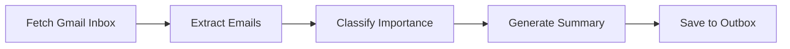
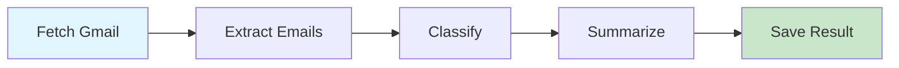

# Solace Browser

**OAuth3 Reference Implementation + Browser Automation + Recipe Engine**

> "The best way to prove OAuth3 is possible is to build it." — Phuc Truong

Solace Browser is an open-source browser automation framework that proves **OAuth3 (scoped, revocable, auditable tokens) is the right way to delegate AI agency**.

## Quick Start

### Installation
```bash
git clone https://github.com/phuc-labs/solace-browser.git
cd solace-browser
pip install -r requirements.txt
playwright install  # Install browser binaries
```

### First Recipe (3 Minutes)
```python
from solace_browser import BrowserContext
from oauth3 import OAuth3Vault

# Create OAuth3 vault
vault = OAuth3Vault()
token = vault.issue_token("user@example.com", ["browser.read", "browser.click"])

# Create browser with OAuth3 gates
async with BrowserContext(token=token) as browser:
    page = await browser.new_page()

    # Every action is scoped + audited
    await page.goto("https://gmail.com")           # requires browser.read
    await page.click("button#compose")             # requires browser.click

    # Evidence automatically captured
    # Check: evidence/oauth3_audit.jsonl
```

### Run a Recipe
```bash
solace-browser run recipes/gmail/triage-inbox.mmd \
  --user user@example.com \
  --input email_address=user@gmail.com
```

### Try OAuth3 Revocation
```bash
# Issue token
token=$(solace-browser auth grant --scopes browser.read browser.click)

# Start a task using that token
solace-browser run recipes/gmail/fetch-emails.mmd --token $token &

# Revoke the token (mid-task)
solace-browser auth revoke $token

# Task halts immediately ✓
# Evidence: revocation logged + timestamp captured
```

---

## What's Unique

### 1. OAuth3 by Default
Every action is **scoped, revocable, auditable**:
```bash
# Issue a token with limited scope
solace-browser auth grant --scopes browser.read browser.click

# User can revoke anytime
solace-browser auth revoke <token>

# Every action is logged (hash-chained, tamper-evident)
solace-browser evidence export <run_id>
```

### 2. Deterministic Recipes
Recipes are Prime Mermaid DAGs — same seed = same output (forever):


Cost: **$0.001 per task** (cached, no LLM call)
vs. **$0.01 per task** (cold call to Sonnet)

At 70% recipe hit rate: **70% cost reduction**

### 3. PM Triplets (Context Model)
Recipes understand user + task + context:
```python
user = User(id="phuc", language="en", tone="professional")
task = Task(goal="triage inbox", inputs={"email": ...}, success="summary created")
context = Context(current_step=2, decisions_made=[...], remaining=[...])

# Composable: email summarizer → LinkedIn poster → human approval
output = recipe.execute(user, task, context)
```

### 4. Part 11 Audit Trail
Browser execution is auditable:
```bash
# Audit export includes:
# - OAuth3 events (token issued, revoked, scope checked)
# - Action events (click, fill, navigate, screenshot)
# - Visual evidence (screenshot at each step)
# - DOM snapshots (exact HTML before/after)
# - Manifest (metadata, hashes, timestamps)

solace-browser evidence export run_123456
# Outputs: audit_bundle.zip
#   ├── oauth3_audit.jsonl
#   ├── action_audit.jsonl
#   ├── visual/
#   ├── dom/
#   └── manifest.json
```

---

## Architecture

### 4 Layers

**Layer 1: Browser Automation** (Playwright)
- Navigate, click, fill, screenshot, DOM capture

**Layer 2: OAuth3 Scope Gates**
- Every action wrapped in scope check
- Revocation halts execution immediately

**Layer 3: Recipe Engine** (Prime Mermaid Parser)
- Parse DAG, execute deterministically, cache results
- Hit rate = recipe submissions / total tasks

**Layer 4: PM Triplets** (Context Models)
- User model (identity, preferences)
- Task model (goal, inputs, success criteria)
- Context model (state, decisions, remaining steps)
- Enables composition (A's output = B's input)

---

## Phases (7 Phases, 14 Sessions)

| Phase | Goal | Recipes Shipped |
|-------|------|-----------------|
| **0** | Foundation (directory structure, docs, skeleton) | 0 |
| **1** | OAuth3 Core (token management, scope gates) | 0 |
| **2** | Browser Automation (Playwright integration) | 2 (Gmail: fetch, compose) |
| **3** | Recipe Engine (Prime Mermaid parser) | 2 (executable) |
| **4** | PM Triplets (User/Task/Context models) | 2 (composable) |
| **5** | Store Integration (Stillwater Store) | 10+ (community) |
| **6** | Multi-Platform (Gmail, LinkedIn, Slack, GitHub, Notion) | 50+ (recipes) |

**Status:** Phase 0 ready to start
**Target Rung:** 65537 (production-ready)
**Total Sessions:** 14

**See:** `ROADMAP.md` for detailed workstreams

---

## Project Structure

```
solace-browser/
├── src/
│   ├── oauth3/              OAuth3 implementation
│   ├── browser/             Playwright wrapper + OAuth3 gates
│   ├── recipes/             Recipe engine (parser + executor)
│   ├── triplets/            PM Triplet models
│   └── util/                Crypto + evidence helpers
├── recipes/                 Canonical recipes (Gmail, LinkedIn, etc.)
├── tests/                   Unit + integration tests
├── docs/                    API docs, spec, examples
├── NORTHSTAR.md             Vision + metrics
├── ROADMAP.md               Build plan (7 phases, 14 sessions)
├── CLAUDE.md                Project constraints + skills
└── scratch/                 Working files (gitignored)
```

---

## Key Concepts

### OAuth3 Scopes
```
browser.read        → Read-only (navigate, read DOM)
browser.click       → Click elements
browser.fill        → Fill forms + type text
browser.send        → Send emails/messages (requires step-up consent)
browser.screenshot  → Take screenshots
browser.dom         → Capture DOM snapshots
```

### Recipe Format (Prime Mermaid)


### Evidence Bundle
```json
{
  "run_id": "run_123456",
  "timestamp": "2026-02-25T14:12:00Z",
  "oauth3_events": [
    {"timestamp": "...", "event": "TOKEN_ISSUED", "scopes": ["browser.read", "browser.click"]}
  ],
  "action_events": [
    {"timestamp": "...", "action": "click", "selector": "button#compose", "scope_check": "✓"}
  ],
  "artifacts": {
    "screenshots": ["step_1.png", "step_2.png"],
    "dom_snapshots": ["step_1.html", "step_2.html"]
  },
  "manifest": {
    "version": "0.1.0",
    "recipe": "gmail/triage-inbox.mmd",
    "hash_chain": "sha256:abc..."
  }
}
```

---

## Contributing

### Add a New Recipe
1. Create `recipes/[platform]/[task].mmd` (Prime Mermaid format)
2. Test locally: `solace-browser run recipes/[platform]/[task].mmd`
3. Submit to Stillwater Store: `solace-browser store submit`
4. Community votes + refinement

### Improve OAuth3 Implementation
1. Run tests: `pytest tests/ -v`
2. Check: `bandit -r src/oauth3/` (security)
3. Verify: `semgrep -c p/security-audit src/oauth3/`
4. Submit PR

### Report Issues
- OAuth3 scope bypass → **P0** (security)
- Recipe non-determinism → **P1** (core)
- Audit trail gap → **P2** (compliance)
- UI/docs → **P3** (polish)

---

## Roadmap

**Phase 0 (1 week):** Foundation + docs + skeleton ✓
**Phase 1 (2 weeks):** OAuth3 core (vault + scopes)
**Phase 2 (2 weeks):** Playwright integration + screenshot capture
**Phase 3 (2 weeks):** Recipe parser + deterministic execution
**Phase 4 (2 weeks):** PM Triplet models (composition)
**Phase 5 (2 weeks):** Store integration (read + submit recipes)
**Phase 6 (3 weeks):** Multi-platform recipes (Gmail, LinkedIn, Slack, GitHub, Notion)

**Target:** Production-ready (rung 65537) by Q3 2026

---

## Related Projects

- **stillwater** — Core OS + skills + Stillwater Store
- **solaceagi.com** — Hosted platform (uses solace-browser as cloud twin)
- **solace-cli** — Terminal-native CLI (extends stillwater)
- **paudio** — Voice synthesis (for avatar system)
- **pvideo** — Video/avatar rendering (if theory)
- **pzip** — Compression engine (for storage)

---

## Questions?

- **GitHub Issues:** Bug reports + feature requests
- **Discussions:** Ideas + design feedback
- **CLAUDE.md:** Project constraints + dispatch rules
- **NORTHSTAR.md:** Vision + metrics

---

## License

MIT (open source, any use)

---

**Built by:** Phuc Truong + Community
**Updated:** 2026-02-25
**Rung Target:** 65537
**Status:** 🎯 Phase 0 ready
