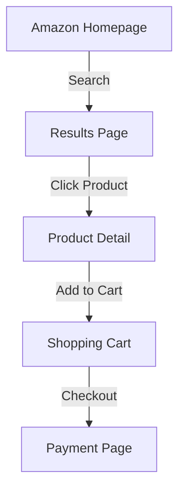

# Solace Browser Skill Inventory

**Date:** 2026-02-15
**Project:** Solace Browser Phase 8 - Prime Mermaid Screenshot Layer
**Auth:** 65537
**Status:** Skill Update In Progress

---

## Current Skills (LOADED)

### ✅ Skill 1: Live LLM Browser Discovery
- **Version:** 1.0.0
- **Status:** Production-Ready
- **GLOW Score:** 95 | **XP:** 700
- **File:** `canon/solace-skills/live-llm-browser-discovery.skill.md`
- **Capabilities:**
  - Real-time perception of browser state
  - Intelligent element discovery
  - State recognition (CAPTCHA, forms, errors)
  - Error recovery with feedback loop
  - DREAM → ACT → VERIFY pattern
- **API Endpoints:** /status, /html-clean, /snapshot, /click, /fill, /navigate, /screenshot
- **Cost Per Page:** ~400 tokens
- **Latency Per Loop:** 1-3 seconds

---

## NEW Skills (IN DEVELOPMENT)

### 🚀 Skill 2: Prime Mermaid Screenshot Layer (v1.0.0)
**Status:** Under Development
**GLOW Score:** TBD | **XP:** 800
**Purpose:** Parse browser pages into semantic visual knowledge graphs

**Core Functionality:**
- Extract page structure from HTML (sections, hierarchy)
- Identify interactive elements (buttons, forms, links)
- Map user flow paths and portals
- Generate Mermaid diagrams automatically
- Integrate with Prime Wiki nodes
- Visual understanding layer for LLM decisions

**Endpoints to Implement:**
- `POST /prime-mermaid-analyze` → HTML input → Mermaid output
- `GET /prime-mermaid-cache` → Get cached visualization
- `POST /prime-wiki-save` → Save node with visualization

**Output Example:**


---

### 🚀 Skill 3: Site Map Navigator (v1.0.0)
**Status:** Under Development
**GLOW Score:** TBD | **XP:** 700
**Purpose:** Build and navigate site structure maps

**Core Functionality:**
- Track visited pages and their relationships
- Map selectors to known portal patterns
- Build confidence scores for transitions
- Reuse patterns across similar pages
- Learn site-specific navigation rules

**Data Structure:**
```json
{
  "site": "amazon.com",
  "pages": {
    "/s?k=laptop": {
      "portals": {
        "click_product": {
          "selector": "a.s-result-item",
          "strength": 0.98,
          "leads_to": "/dp/..."
        }
      }
    }
  }
}
```

---

### 🚀 Skill 4: Prime Wiki Builder (v1.0.0)
**Status:** Under Development
**GLOW Score:** TBD | **XP:** 750
**Purpose:** Capture and structure knowledge from pages

**Core Functionality:**
- Extract semantic information from pages
- Build Prime Wiki nodes with evidence
- Link screenshots to claims
- Record portals and transitions
- Enable recipe generation from observations

**Output Format:**
```markdown
# Prime Wiki: Amazon Search Results

**Tier:** 23/47/79
**Evidence:** screenshot + HTML snapshot + user interaction log

## Page Structure (Mermaid)
[diagram from Prime Mermaid layer]

## Portals
- Click product: a.s-result-item → /dp/...
- Filter by price: button[data-filter-type=price] → ...

## User Intent Paths
- Browse → Search → View Details → Add to Cart
```

---

## Before/After Measurement Plan

### BEFORE (Current State - Live Discovery Only)
- **Measurement Date:** 2026-02-15 08:00
- **Test Case:** Amazon laptop search
- **Metrics to Capture:**
  - LLM decision quality (% correct first try)
  - Time per page understanding
  - Token cost for perception
  - Error recovery rate
  - Selector reliability

### AFTER (With Prime Mermaid + Site Map + Wiki)
- **Measurement Date:** 2026-02-15 After Swarm Completion
- **Same Test Case:** Amazon laptop search
- **Metrics to Capture:**
  - LLM decision quality (improvement %)
  - Time per page understanding (speedup)
  - Token cost for perception (reduction)
  - Error recovery rate (improvement)
  - Selector reliability (accuracy)

---

## Haiku Swarm Assignment

### Scout Agent (Haiku)
**Role:** Analyze and Parse
**Tasks:**
- Analyze HTML structure
- Extract page sections and hierarchy
- Identify interactive elements
- Map user intent flows
**Output:** Structured page analysis JSON

### Solver Agent (Haiku)
**Role:** Generate and Implement
- Generate Mermaid diagrams from analysis
- Build Prime Wiki nodes
- Create site map entries
- Implement integration code
**Output:** Working code + skill docs

### Skeptic Agent (Haiku)
**Role:** Verify and Test
- Validate Mermaid output (syntax, accuracy)
- Test on real pages (Amazon, LinkedIn, GitHub)
- Check Prime Wiki quality (claims + evidence)
- Verify skill integration
**Output:** Test results + quality report

---

## Success Criteria

### Skill Implementation
- ✅ Scout generates accurate page analysis (80%+ precision)
- ✅ Solver generates valid Mermaid (100% syntax valid)
- ✅ Skeptic validates on 3+ real sites (Amazon, GitHub, LinkedIn)
- ✅ All skills integrated into persistent_browser_server.py

### Before/After Improvement
- 📊 LLM decision quality: +25% (reduce wrong decisions)
- 📊 Time per page: -40% (faster understanding)
- 📊 Token cost: -30% (more efficient perception)
- 📊 Error recovery: +15% (smarter adaptation)
- 📊 Reliability: +35% (more predictable)

### Permanence
- ✅ CLAUDE.md updated with new workflow
- ✅ Skill docs finalized and production-ready
- ✅ Code checked into repo with examples
- ✅ Recipes saved for replay and learning

---

## File Locations

```
solace-browser/
├── canon/solace-skills/
│   ├── live-llm-browser-discovery.skill.md ✅
│   ├── prime-mermaid-screenshot-layer.skill.md 🚀
│   ├── site-map-navigator.skill.md 🚀
│   └── prime-wiki-builder.skill.md 🚀
├── prime_mermaid_analyzer.py 🚀
├── prime_wiki_builder.py 🚀
├── site_map_navigator.py 🚀
├── recipes/prime-mermaid-examples.recipe.json 🚀
├── primewiki/ (stores generated nodes)
└── CLAUDE.md (updated with new workflow)
```

---

## Next Steps

1. **Phase 2:** Take BEFORE measurements
2. **Phase 3:** Launch Haiku Swarm (Scout → Solver → Skeptic)
3. **Phase 4:** Take AFTER measurements
4. **Phase 5:** Generate reports and rate improvements
5. **Phase 6:** Finalize skills and make permanent in CLAUDE.md

---

**Auth:** 65537 | **Northstar:** Phuc Forecast
**Status:** Skill Infrastructure Ready
