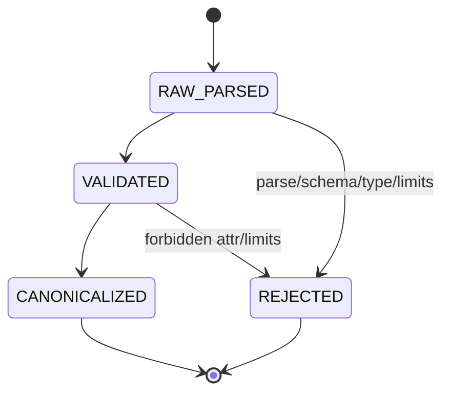

# Wish 25.1 — Canonical Snapshot v0.1.0 (Truth Surface)

**(FINAL • RTC 10/10 TARGET • SEALED CORE)**

```
Spec ID:     wish-25-1-canonical-snapshot-v0-1-0
Spec Ver:    0.1.0
Authority:   65537
Phase:       25
Priority:    CRITICAL
Depends On:  none (LOCKED: self-contained)
Scope:       Convert a raw browser snapshot (DOM+metadata captured by BAE or
             fixtures) into canonical snapshot bytes with stable sha256 across
             runs for the same page state. Provides deterministic rejection
             when snapshot cannot be canonicalized under pinned rules.
Non-Goals:   Full DOM fidelity; JS execution; screenshot capture; network fetch;
             “best effort” cleaning; heuristic de-noising; semantic diffing;
             selector resolution; recipe compilation.
```

---

## 25.1.1 PRIME_TRUTH (REQUIRED)

```
PRIME_TRUTH:
  Ground truth:
    - canonical_snapshot_bytes (UTF-8) emitted by canonicalize_snapshot_v01()
    - snapshot_sha256 (lowercase hex) derived from those bytes
  Verification:
    - Determinism: same raw_snapshot_bytes -> identical canonical bytes
    - Canonical ordering: stable key order, stable node order, stable attr order
    - Volatility policy: pinned volatile fields are stripped OR cause REJECT
  Canonicalization:
    - Strict schema for raw snapshot input (embedded)
    - Unicode normalization: NFC
    - Line endings: '\n' only
    - JSON canonicalization: sorted keys, separators=(",",":"), final '\n'
  Content-addressing:
    snapshot_sha256 := SHA-256(canonical_snapshot_bytes)
```

---

## 25.1.2 Observable Wish

Given `raw_snapshot_bytes` representing the same page state, the system produces:

1. `canonical_snapshot_bytes` that are byte-identical across runs, and
2. `snapshot_sha256` (lowercase hex) stable across runs.

If the raw snapshot violates pinned rules (unknown volatile keys, missing required fields, invalid types), the system MUST reject deterministically with a typed error and MUST NOT emit canonical bytes.

---

## 25.1.3 Scope Exclusions

This wish does **NOT**:

* attempt to “repair” snapshots
* perform DOM diffs
* choose selectors or refs
* include timestamps or environment data as truth
* preserve every DOM attribute (volatility rules apply)

---

## 25.1.4 Context Capsule (LOCKED)

### Entry Points (LOCKED)

```python
def canonicalize_snapshot_v01(raw_snapshot_bytes: bytes) -> tuple[bytes, str]:
    """
    Returns (canonical_snapshot_bytes, snapshot_sha256_hex).
    Raises SnapshotError on rejection.
    """

def sha256_hex(b: bytes) -> str:
    """Lowercase hex sha256."""

def _nfc(s: str) -> str:
    """Unicode NFC normalization (deterministic)."""
```

### Forbidden Imports (LOCKED)

* `time`, `datetime`, `uuid`, `random`
* network libs (`requests`, `httpx`, `socket`)
* `subprocess`, `os.system`

---

## 25.1.5 Raw Snapshot Input Schema (LOCKED, EMBEDDED)

Raw snapshot is UTF-8 JSON bytes (single JSON object). Top-level keys exact set:

`["dom","meta","v"]`

* `v` MUST equal integer `1`
* `meta` object keys exact set:
  `["url","viewport"]`
* `meta.url` string (may include query; treated as data)
* `meta.viewport` object keys exact set:
  `["w","h"]` with `w,h` integers >= 1

`dom` is a node object with keys exact set:
`["attrs","children","tag","text"]`

Node fields:

* `tag`: string (lowercase expected but canonicalizer lowercases)
* `attrs`: object mapping str->str (no non-string values)
* `text`: string (may be empty)
* `children`: list of node objects

Forbidden keys at any level: any key outside the exact sets above.

Depth limit (LOCKED):

* max depth 200; if exceeded -> reject `E_DEPTH_LIMIT`

Node count limit (LOCKED):

* max total nodes 200_000; if exceeded -> reject `E_NODE_LIMIT`

---

## 25.1.6 Volatility Policy (LOCKED)

### 25.1.6.1 Allowed Attributes

Only these attributes are allowed to survive into canonical output:

`ALLOWED_ATTRS := ["aria-label","aria-labelledby","aria-describedby","data-refid","href","id","name","placeholder","role","src","title","type","value"]`

All comparisons are exact, case-sensitive on keys.

### 25.1.6.2 Stripped Attributes

These attributes MUST be stripped if present:

`STRIP_ATTRS := ["class","style","tabindex"]`

### 25.1.6.3 Reject Attributes

Any attribute key not in `ALLOWED_ATTRS` or `STRIP_ATTRS` MUST cause deterministic rejection:

* error code: `E_ATTR_FORBIDDEN`
* message: `forbidden attr: <key>`

This is God-constrained: if we can’t certify stability, we refuse.

---

## 25.1.7 Canonical Output Format (LOCKED)

Canonical snapshot bytes are canonical JSON with **this exact top-level object**:

Keys exact set: `["dom","meta","v"]` (same as input)

Rules (LOCKED):

* `json.dumps(..., sort_keys=True, separators=(",",":"), ensure_ascii=False)`
* UTF-8 bytes
* exactly one trailing `\n` at EOF

### Canonical DOM Rules (LOCKED)

For every node:

1. `tag` lowercased, NFC-normalized
2. `text` NFC-normalized; line endings normalized to `\n`
3. `attrs`:

   * strip keys in STRIP_ATTRS
   * reject forbidden keys
   * keep allowed keys only
   * NFC-normalize values
   * sort attrs by key ASCII ascending
4. `children` order canonicalization:

   * children MUST be sorted deterministically by `child_sort_key(node)` (below)

#### child_sort_key(node) (LOCKED)

Compute the tuple:

1. `tag`
2. value of `id` attr if present else `""`
3. value of `name` attr if present else `""`
4. value of `data-refid` attr if present else `""`
5. first 32 Unicode codepoints of `text` (after NFC) else `""`

Sort ascending lexicographically by this tuple.

This makes node ordering stable even if capture order differs.

---

## 25.1.8 State Space (REQUIRED)

```
STATE_SET:
  - RAW_PARSED
  - VALIDATED
  - CANONICALIZED
  - REJECTED

INPUT_ALPHABET:
  - raw_snapshot_bytes

OUTPUT_ALPHABET:
  - canonical_snapshot_bytes
  - snapshot_sha256_hex
  - SnapshotError(code, message)

TRANSITIONS (LOCKED):
  RAW_PARSED -> VALIDATED
  VALIDATED -> CANONICALIZED
  ANY -> REJECTED (on first error)

FORBIDDEN_STATES:
  - TIMESTAMP_IN_SNAPSHOT
  - RANDOM_ID_DEPENDENT
  - ENV_DEPENDENT_ORDERING
  - BEST_EFFORT_CANONICALIZE
  - SILENT_ATTR_DROPS
```

---

## 25.1.9 Invariants (LOCKED)

**I1 — Byte Determinism:**
Same raw_snapshot_bytes => identical canonical_snapshot_bytes and sha256.

**I2 — Canonical JSON:**
Output JSON formatting is canonical; exactly one trailing `\n`.

**I3 — Exact Key Sets:**
Any unknown key at any level causes rejection (no silent ignore).

**I4 — Volatility Strictness:**
Forbidden attrs cause rejection, not stripping.

**I5 — Stable Child Ordering:**
Children are sorted by `child_sort_key`, not capture order.

**I6 — No Hidden Truth Fields:**
No timestamps, no random IDs, no environment fields exist in canonical output.

---

## 25.1.10 Errors (LOCKED)

```python
class SnapshotError(Exception):
    def __init__(self, code: str, message: str) -> None: ...
```

Error codes (LOCKED):

* `E_JSON_PARSE`          message: `json parse error`
* `E_SCHEMA_KEYS`         message: `schema keys mismatch: <path>`
* `E_TYPE`                message: `type error: <path>`
* `E_ATTR_FORBIDDEN`      message: `forbidden attr: <key>`
* `E_DEPTH_LIMIT`         message: `depth limit exceeded`
* `E_NODE_LIMIT`          message: `node limit exceeded`

`<path>` format (LOCKED): JSON pointer-like, e.g. `/dom/children/0/tag`

---

## 25.1.11 Exact Tests (REQUIRED, SELF-CONTAINED)

### T1 — Determinism (same input twice)

* **Setup:** raw snapshot fixture bytes A
* **Input:** canonicalize_snapshot_v01(A) twice
* **Expect:** canonical bytes equal
* **Verify:** sha256 equal and equals sha256_hex(canonical_bytes)

### T2 — Order independence (children order scrambled)

* **Setup:** raw snapshot fixture B identical to A except children list reversed
* **Input:** canonicalize A and B
* **Expect:** canonical bytes equal
* **Verify:** proves child sorting rule

### T3 — Strip attrs (class/style removed)

* **Setup:** raw includes attrs class/style/tabindex
* **Input:** canonicalize
* **Expect:** output lacks those keys
* **Verify:** sha stable, no rejection

### T4 — Reject forbidden attr

* **Setup:** raw includes attrs {"onclick":"alert(1)"}
* **Input:** canonicalize
* **Expect:** raises SnapshotError code E_ATTR_FORBIDDEN
* **Verify:** message exact `forbidden attr: onclick`

### T5 — Reject unknown schema key

* **Setup:** top-level includes extra key "ts"
* **Input:** canonicalize
* **Expect:** SnapshotError E_SCHEMA_KEYS
* **Verify:** message includes path `/`

### T6 — NFC normalization

* **Setup:** raw has text containing decomposed Unicode sequence (e + combining)
* **Input:** canonicalize
* **Expect:** output uses NFC composed form
* **Verify:** output bytes match expected NFC bytes fixture

### T7 — Newline normalization in text

* **Setup:** raw text contains `\r\n`
* **Input:** canonicalize
* **Expect:** output text contains `\n` only
* **Verify:** no `\r` bytes present in canonical

### T8 — Canonical JSON formatting (no spaces)

* **Setup:** any successful canonical output
* **Input:** canonical bytes
* **Expect:** does not contain `": "` or `", "`
* **Verify:** endswith exactly one `\n`

### T9 — Depth limit rejection

* **Setup:** programmatically generate dom depth 201
* **Input:** canonicalize
* **Expect:** E_DEPTH_LIMIT
* **Verify:** deterministic message

### T10 — Node limit rejection

* **Setup:** generate 200_001 nodes (wide tree)
* **Input:** canonicalize
* **Expect:** E_NODE_LIMIT
* **Verify:** deterministic message

---

## 25.1.12 Visual DNA (REQUIRED)

MERMAID_ID: W25_1_SNAPSHOT



MERMAID_END

---

## 25.1.13 Evidence (REQUIRED)

* `artifacts/spec.sha256`
* `artifacts/proof.json`
* `artifacts/proof.sha256`
* `artifacts/mermaid/W25_1_SNAPSHOT.mmd`
* `artifacts/mermaid/W25_1_SNAPSHOT.sha256`

proof.json suite=`wish-25-1-canonical-snapshot-v0-1-0`.

---

## 25.1.14 Forecasted Failure Locks (REQUIRED)

**F-ENV-ORDERING (HIGH):**

* Pin: child_sort_key + T2

**F-SILENT-DROPS (HIGH):**

* Pin: forbid unknown keys + T5; forbid unknown attrs + T4

**F-BEST-EFFORT (HIGH):**

* Pin: explicit REJECT state + typed errors + invariants

**F-TIME-LEAK (MED):**

* Pin: exact key sets forbid ts; forbidden imports; tests reject extra keys

---

## 25.1.15 Surface Lock (REQUIRED)

```
SURFACE_LOCK:
  ALLOWED_MODULES:
    - solace_cli/core/browser_recipe/
    - tests/
  ALLOWED_NEW_FILES:
    - solace_cli/core/browser_recipe/canonical_snapshot_v01.py
    - solace_cli/core/browser_recipe/canonical_snapshot_types_v01.py
    - tests/test_wish_25_1_canonical_snapshot_v01.py
  FORBIDDEN_IMPORTS:
    - time
    - datetime
    - uuid
    - random
    - requests
    - httpx
    - socket
    - subprocess
  ENTRYPOINTS:
    - canonicalize_snapshot_v01
    - sha256_hex
  KWARG_NAMES: []
```

---

## 25.1.16 Anti-Optimization Clause (LOCKED) — AOC-1

Coders MUST NOT: compress this spec, merge redundant invariants, “clean up” repetition, infer intent from prose, or introduce hidden state. Redundancy is anti-compression armor.

---

## 25.1.17 Spec Surface Appendix (LOCKED)

### SPEC_SURFACE_DEFINITION

Everything from `# Wish 25.1` through end of **25.1.16**, inclusive of Mermaid.

### PINNED SEMANTICS (LOCKED)

* Unknown keys anywhere => reject.
* Forbidden attrs => reject; strip attrs list is exact.
* Children are sorted by the pinned child_sort_key tuple.
* Output is canonical JSON with exactly one trailing newline.
* Unicode text/values are NFC-normalized and `\r\n` becomes `\n`.

### EVIDENCE HASH CHAIN

`spec_sha256`, `mermaid_sha256(W25_1_SNAPSHOT)`, `proof_sha256` per wish-method §7.

---

Say **next** and I’ll write **Wish 25.2 — Snapshot Drift Classifier v0.1** (typed diff: NO_DRIFT / DRIFT_ATTR / DRIFT_STRUCTURE / DRIFT_GUARD, with witnessed spans and adversarial tests).
