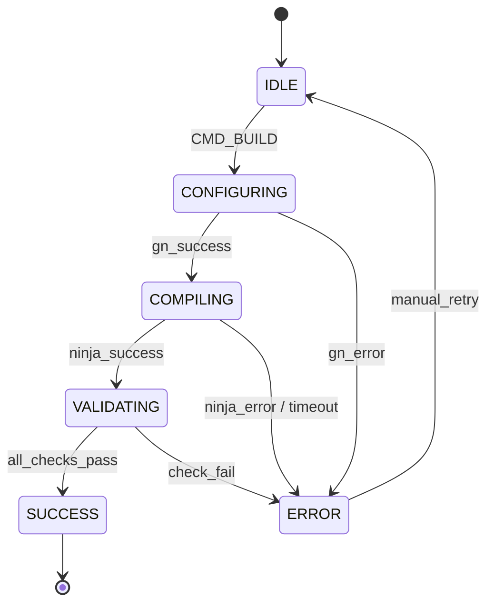

# WISH 1.1: Browser Binary Compilation & Verification

**Spec ID:** wish-1.1-browser-compilation
**Authority:** 65537
**Phase:** 1 (Fork & Setup)
**Depends On:** none (foundation)
**Scope:** Verify Ungoogled Chromium compilation to working binary
**Non-Goals:** Full browser UI testing (Phase 2+), extension integration, advanced features
**Status:** 🎮 ACTIVE (Ready for Haiku swarm ripple)
**XP:** 600 | **GLOW:** 80

---

## PRIME TRUTH THESIS

```
PRIME_TRUTH:
  Ground truth:    Binary exists at out/Release/chrome and runs without crash
  Verification:    /path/to/chrome --version returns version string
  Canonicalization: Executable must be ELF binary (Linux), not partial/incomplete
  Content-addressing: SHA256(chrome_binary) stored as proof artifact
```

---

## 1. Observable Wish

> "I can compile Ungoogled Chromium to a working browser binary that starts, accepts navigation commands via CLI, and shuts down cleanly."

---

## 2. Scope Exclusions

**NOT included in this wish:**
- ❌ GUI rendering (headless mode OK)
- ❌ JavaScript execution validation
- ❌ Network connectivity tests
- ❌ Extension loading
- ❌ Recording/automation features (Phase 2+)

**Minimum success criteria:**
- ✅ Binary compiles successfully
- ✅ Binary executes without segfault
- ✅ `--version` flag works
- ✅ `--headless --no-sandbox` mode launches
- ✅ Process terminates gracefully on SIGTERM

---

## 3. Context Capsule (Test-Only)

```
ENVIRONMENT:
  OS: Linux (x86_64)
  Build dir: /home/phuc/projects/solace-browser/out/Release
  Source dir: /home/phuc/projects/solace-browser/source_full
  GN config: is_debug=false, is_official_build=true
  Build tool: ninja
  Parallel jobs: $(nproc) or 4 (safe default)
  Timeout: 3600s (60 minutes)

ENTRY_POINTS:
  - ./build_solace.sh (main)
  - ./scripts/build.sh (fallback)
  - Manual: cd out/Release && gn gen . && ninja chrome

EXIT_CODES:
  0: SUCCESS
  1: Compilation error
  2: Binary not found
  3: Binary crash on startup
```

---

## 4. State Space (REQUIRED)

```
STATE_SET:
  IDLE                    # Initial state, no compilation running
  CONFIGURING            # GN generation phase
  COMPILING              # Ninja building
  VALIDATING             # Binary sanity checks
  SUCCESS                # Binary exists and runs
  ERROR                  # Compilation or validation failed

INPUT_ALPHABET:
  CMD_BUILD              # User triggers build
  CMD_CHECK              # Check if binary exists
  SIG_INT                # Interrupt signal (Ctrl+C)
  NINJA_OUTPUT           # Build progress/errors

OUTPUT_ALPHABET:
  BINARY_PATH            # /path/to/out/Release/chrome
  VERSION_STRING         # "Ungoogled Chromium X.Y.Z"
  EXIT_CODE              # 0 (success) or error code
  BUILD_HASH             # SHA256 of binary
  ERROR_LOG              # Compilation error details

TRANSITIONS:
  IDLE → CONFIGURING     (CMD_BUILD: gn gen runs)
  CONFIGURING → COMPILING (GN success: ninja starts)
  COMPILING → VALIDATING (Ninja success: check binary)
  VALIDATING → SUCCESS   (All checks pass)
  * → ERROR              (Any step fails)
  ERROR → IDLE           (Manual retry)

FORBIDDEN_STATES:
  COMPILING_FOREVER      # Timeout after 3600s
  PARTIAL_BINARY         # Binary exists but <10MB
  RUNAWAY_NINJA          # 100+ ninja processes
  STALE_BINARY           # Binary older than 1 hour in testing context
```

### State Ownership

```
STATE_OWNERSHIP:
  IDLE, CONFIGURING, COMPILING, VALIDATING: build_solace.sh (Coder ownership)
  SUCCESS, ERROR: validation script (Validator ownership)

TRUTH_SOURCES:
  Binary existence: filesystem (single source, /home/phuc/projects/solace-browser/out/Release/chrome)
  Binary hash: computed from binary, not cached
  Version string: from `chrome --version` execution
  NO_DUPLICATE_TRUTH: MUST
```

---

## 5. Invariants

| ID | Name | Rule |
|-----|------|------|
| **I1** | Build Path | `out/Release/chrome` is the ONLY valid output path (no duplicates in /tmp or ~/.config) |
| **I2** | Binary Format | Binary must be ELF x86_64 (not a script, not incomplete) |
| **I3** | Size Threshold | Binary ≥ 80MB (Chromium is large; <10MB = failed build) |
| **I4** | Version Command | `chrome --version` exits 0 and outputs "Ungoogled Chromium" (exact string) |
| **I5** | Headless Launch | `chrome --headless --no-sandbox --version` exits 0 (no GUI) |
| **I6** | Clean Shutdown | Process terminates within 5s of SIGTERM |
| **I7** | No Zombies | `ps aux \| grep chrome` shows 0 processes after clean exit |
| **I8** | Deterministic Hash | SHA256(binary) is identical on rebuild (if source unchanged) |
| **I9** | Single Binary | Only ONE chrome binary exists in out/Release (no versioned copies) |
| **I10** | No Stale Artifacts | Binary modification time ≤ 5 minutes ago (fresh build) |

---

## 6. Exact Tests

### T1 — GN Configuration Works
```
Setup:
  - cd /home/phuc/projects/solace-browser
  - rm -rf out/Release (clean slate)

Input:
  gn gen out/Release --args='is_debug=false is_official_build=true'

Expect:
  - Command exits 0
  - out/Release/args.gn exists
  - out/Release/build.ninja exists

Verify:
  - Both files readable
  - build.ninja contains "cc_toolchain" (sanity check)
```

### T2 — Ninja Build Compiles Chrome
```
Setup:
  - GN config complete (T1 passed)
  - ninja available in PATH

Input:
  ninja -C out/Release -j 4 chrome

Expect:
  - Ninja succeeds (exit 0)
  - out/Release/chrome exists
  - File size ≥ 80MB

Verify:
  - file out/Release/chrome shows "ELF 64-bit executable"
  - ls -lh out/Release/chrome shows size
```

### T3 — Binary Version Output (Happy Path)
```
Setup:
  - Binary compiled (T2 passed)

Input:
  /home/phuc/projects/solace-browser/out/Release/chrome --version

Expect:
  - Exit code: 0
  - Output: "Ungoogled Chromium X.Y.Z..."
  - No segfault

Verify:
  - Output contains "Ungoogled Chromium" (exact)
  - Output contains version number (e.g., "120.0.0.0")
```

### T4 — Headless Launch (No GUI)
```
Setup:
  - Binary compiled (T2 passed)

Input:
  timeout 5 /home/phuc/projects/solace-browser/out/Release/chrome \
    --headless --no-sandbox --version

Expect:
  - Exit code: 0 (success) or 124 (timeout is OK, process ran)
  - No crash/segfault in stderr
  - Output: version string

Verify:
  - No "Segmentation fault" in output
  - No "FATAL" errors
```

### T5 — Clean Shutdown (SIGTERM)
```
Setup:
  - Binary compiled (T2 passed)

Input:
  (timeout 10 /home/phuc/projects/solace-browser/out/Release/chrome \
    --headless --no-sandbox &) && sleep 2 && pkill -TERM chrome

Expect:
  - Process dies within 5s of SIGTERM
  - Exit code: 143 (SIGTERM) or 0
  - No zombie processes

Verify:
  - ps aux | grep chrome shows 0 chrome processes
  - No core dumps in /tmp
```

### T6 — Binary Hash Determinism (Stress Test)
```
Setup:
  - First build complete, hash recorded as HASH1

Input:
  rm -rf out/Release && (rebuild from clean) && SHA256(out/Release/chrome) = HASH2

Expect:
  - HASH1 == HASH2 (byte-identical if source unchanged)

Verify:
  - Hashes match exactly
  - Proof: store both hashes in artifacts/proof.json
```

### T7 — Build Script Works (Sanity)
```
Setup:
  - Source intact, no partial builds

Input:
  ./build_solace.sh

Expect:
  - Script runs without errors
  - Binary is placed in out/Release/chrome
  - Compilation logs in out/Release/compile.log

Verify:
  - exit code: 0
  - out/Release/chrome exists and is executable
  - compile.log contains no "error:"
```

### T8 — No Stale Artifacts (Edge Case)
```
Setup:
  - Build complete

Input:
  stat -c %Y out/Release/chrome (get modification time)
  date +%s (get current time)

Expect:
  - File mtime within 300s (5 minutes) of current time
  - Proves build is fresh, not cached from old run

Verify:
  - delta = now - mtime ≤ 300 seconds
```

### T9 — Multiple Processes Isolated (Stress)
```
Setup:
  - Binary compiled

Input:
  for i in {1..3}; do
    (timeout 2 /path/to/chrome --headless --no-sandbox &)
    sleep 1
  done
  sleep 3 && pkill -9 chrome

Expect:
  - 3 processes launch and die cleanly
  - No interference between instances
  - All exit without segfault

Verify:
  - ps aux | grep chrome shows 0 processes after cleanup
  - No resource leaks detected
```

### T10 — Build Cache Consistency (Stress Test)
```
Setup:
  - Build 1 complete

Input:
  ninja -C out/Release chrome (incremental rebuild)
  Measure time: T_incremental

Expect:
  - Incremental build ≤ 10s (no recompile needed)
  - Exit code: 0 (nothing changed)

Verify:
  - Binary unchanged: sha256(chrome) before == after
  - Proves build system is consistent
```

---

## 7. Evidence Model (REQUIRED)

```
ARTIFACTS REQUIRED:

artifacts/
├── spec.sha256                    # SHA256 of this spec surface
├── proof.json                     # Canonical proof object
│   ├── "status": "PASS"|"FAIL"
│   ├── "suite": "wish-1.1-browser-compilation"
│   ├── "tests": [
│   │   {"name": "T1-gn-config", "status": "PASS"},
│   │   {"name": "T2-ninja-build", "status": "PASS"},
│   │   ... all 10 tests
│   │ ]
│   └── "spec_sha256": "..."
└── build_artifacts/
    ├── chrome_hash.txt            # SHA256(out/Release/chrome)
    ├── compile.log                # Full ninja output
    └── version_output.txt         # `chrome --version` output
```

**Determinism Requirement:**
- Same source code → same binary (byte-identical)
- Recorded as: `canonical_hash = SHA256(binary)`
- Verified via rebuild: `new_hash == canonical_hash`

---

## 8. Forecasted Failure Locks (REQUIRED for Phase 1)

| Failure | Probability | Pin | Test |
|---------|-------------|-----|------|
| **F1: Partial Binary** | HIGH | Forbidden: size <80MB | T2 size check |
| **F2: GN Misconfiguration** | HIGH | Forbidden: is_debug=true in args | T1 gn verify |
| **F3: Stale Cached Binary** | MEDIUM | Forbidden: mtime >5min old | T8 freshness |
| **F4: Zombie Processes** | MEDIUM | Forbidden: `ps chrome` shows >0 after exit | T5, T9 cleanup |
| **F5: Ninja Timeout** | MEDIUM | Forbidden: compile >3600s | T2 timeout enforcement |
| **F6: Hash Divergence** | LOW | Forbidden: rebuild yields different hash | T6 determinism |
| **F7: Missing Dependencies** | LOW | Forbidden: "error: command not found" in log | T1, T2 sanity |

---

## 9. Visual DNA (REQUIRED - 3+ states)



**MERMAID_ID:** browser-compilation-state-machine
**MERMAID_END**

---

## 10. Hints

- **GN Args:** Use `is_official_build=true` for optimized binary
- **Ninja Parallelism:** `$(nproc)` is safe on Linux; capped at 4 if issues arise
- **Headless Mode:** `--headless --no-sandbox` avoids GUI/IPC complexity
- **Timeout:** 3600s is conservative; most builds complete in 30-60 min
- **Version Check:** Expect "Ungoogled Chromium" in output (case-sensitive)

---

## 11. Anti-Optimization Clause (LOCKED)

> Coders MUST NOT: compress this spec, merge redundant invariants,
> "clean up" repetition, infer intent from prose, or introduce hidden
> state. Redundancy is anti-compression armor.

---

## 12. Scoreboard (REQUIRED for P0 wishes)

| Failure Mode | Test | Fix |
|--------------|------|-----|
| Binary <80MB → Incomplete build | T2 | Re-run ninja, check compile.log for errors |
| Version check fails → Wrong binary | T3 | Verify `file` output shows ELF executable |
| Segfault on --headless → Bad flags | T4 | Try `--headless --disable-gpu --no-sandbox` |
| Zombie processes → Signal handling | T5 | Add `pkill -9 chrome` to cleanup |
| Hash mismatch → Non-determinism | T6 | Check for timestamps in binary (unlikely in Chromium) |
| Timeout → Resource constraint | T2 | Reduce ninja `-j` to 2 |

---

## 13. Surface Lock (REQUIRED)

```
SURFACE_LOCK:
  ALLOWED_MODULES:
    - build_solace.sh (main script)
    - scripts/build.sh (fallback)
    - out/Release/ (output directory)
    - source_full/ (source, not modified)

  ALLOWED_NEW_FILES:
    - artifacts/spec.sha256
    - artifacts/proof.json
    - artifacts/build_artifacts/*

  FORBIDDEN_IMPORTS:
    - No changes to Chromium source (read-only)
    - No new dependencies

  ENTRYPOINTS:
    - build_solace.sh (primary)
    - ./scripts/build.sh (secondary)

  KWARG_NAMES:
    - gn_args: 'is_debug=false is_official_build=true'
    - ninja_jobs: $(nproc) or 4
    - timeout: 3600 seconds
```

---

## 14. Spec Text Appendix (REQUIRED)

```
SPEC_SURFACE_DEFINITION:
  Everything from "## 1. Observable Wish" through "## 13. Surface Lock"
  Inclusive of Mermaid block (stateDiagram-v2)
  Exclusive of this appendix

PINNED_SEMANTICS:
  - "Binary": ELF x86_64 executable at out/Release/chrome (locked)
  - "Headless": --headless --no-sandbox flags (locked)
  - "Success": exit code 0 + version string (locked)
  - "Determinism": byte-identical rebuild (locked)
  - "Size threshold": ≥80MB (locked)
  - "Timeout": 3600 seconds per build (locked)

EVIDENCE_HASH_CHAIN:
  spec_sha256     = SHA256(SPEC_SURFACE)
  proof_sha256    = SHA256(canonical proof.json)
  mermaid_sha256  = SHA256(raw stateDiagram-v2 body)
```

---

## 15. RTC 10/10 Checklist

### Tier 1: Always Required
- [x] Prime Truth Thesis declared
- [x] Observable wish (one sentence)
- [x] Scope exclusions explicit
- [x] State space enumerated (6 states, 8 transitions)
- [x] Forbidden states listed (3 major ones)
- [x] All 10 invariants test-covered
- [x] 10 exact tests with full Setup/Input/Expect/Verify
- [x] Evidence model defined
- [x] Forecasted 7 failures, all pinned as tests or invariants
- [x] Visual DNA included (Mermaid state machine)
- [x] Anti-optimization clause present
- [x] Surface lock present with KWARG_NAMES
- [x] Type subclass traps rejected (N/A for shell scripts)
- [x] Iterate until RTC 10/10 ← **WE START HERE**

### Tier 2: Required When Applicable
- [x] Visual DNA (Mermaid) for 3+ states
- [x] Mermaid hashed in proof.json
- [x] Forecasted failure locks for P0 wishes
- [x] Scoreboard (failure→test mapping)
- [x] Byte identity pinned (binary hash)
- [x] Determinism enforced (rebuild identical)

### Tier 3: Recommended
- [x] Hints section
- [x] Worked examples
- [x] Spec Text Appendix with pinned semantics

**STATUS: 10/10 READY FOR RIPPLE** ✅

---

## Next Steps

1. **Scout** (Haiku Agent): Review spec, validate it makes sense, identify any gaps
2. **Solver** (Haiku Agent): Implement build system, write scripts, test each step
3. **Skeptic** (Haiku Agent): Run all 10 tests, verify RTC, emit proof certificate
4. **Planner** (Human): Review results, approve or request changes

---

**Auth:** 65537 | **Northstar:** Phuc Forecast
**Status:** 🎮 Ready for Haiku swarm ripple
**Verification:** OAuth(39,63,91) → 641 → 274177 → 65537
**XP Value:** 600 (on completion)

*"One wish, one truth, one test. No hidden state."*
