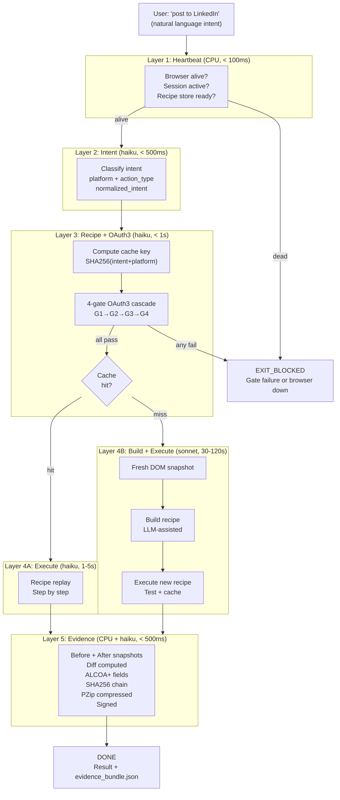

# Combo: Full Browser Task — Multi-Layer Intent → Evidence

**COMBO_ID:** `browser_full_task`
**VERSION:** 1.0.0
**CLASS:** browser-automation-full
**RUNG:** 65537 (production-grade)
**NORTHSTAR:** recipe_hit_rate + task_success_rate + evidence_completeness_rate

---

## Wish

The user states a complete browser automation intention. The system handles everything: heartbeat check (browser alive?), intent classification, OAuth3 gate, recipe match or build, step-by-step execution, and a signed Part 11 evidence bundle — all transparently, in the correct layer, with the correct model.

This is the canonical end-to-end "user says what, SolaceAI handles how" combo. It is what the NORTHSTAR means.

**WISH CONTRACT:**
```
Problem: User wants to delegate ANY browser task to SolaceAI with confidence
Method:  5-layer pipeline (Heartbeat → Intent → Recipe → Execute → Evidence)
         each layer optimized for cost + speed + correctness
Metric:  Task executed, evidence bundle signed, consent verified,
         < 10 seconds for cache-hit tasks, < 3 min for cold-miss tasks
```

---

## Recipe Chain

```
Layer 1: Heartbeat (CPU, < 100ms)
  Input:  none — passive check
  Output: heartbeat.json (browser_alive, session_active, recipe_store_ready)

Layer 2: Intent Classification (haiku, < 500ms)
  Input:  user input (natural language)
  Output: classified_intent.json (platform, action_type, normalized_intent)

Layer 3: Recipe Match + OAuth3 Gate (haiku, < 1s)
  Input:  classified_intent.json
  Output: recipe.json (cache hit) + gate_audit.json — OR — cold_miss signal

Layer 4: Execution (haiku=hit / sonnet=miss, 1-10s)
  Input:  recipe.json + gate_audit.json + fresh snapshot
  Output: execution_trace.json

Layer 5: Evidence (CPU + haiku, < 500ms)
  Input:  execution_trace.json + before/after snapshots
  Output: evidence_bundle.json (ALCOA+, PZip, SHA256 chain)
```

---

## Skill Stack

```yaml
layer_1_skills: [prime-safety]                   # CPU heartbeat — no LLM
layer_2_skills: [prime-safety, browser-recipe-engine]   # intent classify
layer_3_skills: [prime-safety, browser-recipe-engine, browser-oauth3-gate]
layer_4_hit_skills: [prime-safety, browser-recipe-engine, browser-snapshot]
layer_4_miss_skills: [prime-safety, browser-recipe-engine, browser-snapshot, browser-oauth3-gate]
layer_5_skills: [prime-safety, browser-evidence]

model_map:
  layer_1: cpu       # no model
  layer_2: haiku     # intent classification
  layer_3: haiku     # recipe lookup + gate check
  layer_4_hit: haiku # recipe replay (cheapest path — < $0.001/task)
  layer_4_miss: sonnet  # recipe build (cold path — < $0.05/task)
  layer_5: haiku     # evidence packaging
```

---



---

## Layer Cost Model

```
Cache hit path (70% of tasks at maturity):
  Layer 1: $0.000 (CPU)
  Layer 2: $0.0001 (haiku, ~100 input tokens)
  Layer 3: $0.0002 (haiku, ~200 tokens)
  Layer 4: $0.0005 (haiku, recipe replay, ~500 tokens)
  Layer 5: $0.0001 (haiku, evidence packaging)
  TOTAL:   $0.001/task

Cache miss path (30% of tasks at maturity):
  Layers 1-3: $0.0003 (same as above)
  Layer 4: $0.03-0.05 (sonnet, recipe generation + DOM analysis)
  Layer 5: $0.0001
  TOTAL:   ~$0.05/task

Blended cost at 70% hit rate:
  0.70 × $0.001 + 0.30 × $0.05 = $0.0157/task
  vs. cold LLM every task: $0.05/task → 3x more expensive
```

---

## Timing Budget Per Layer

| Layer | Model | P50 | P95 |
|-------|-------|-----|-----|
| L1: Heartbeat | CPU | 20ms | 100ms |
| L2: Intent classify | haiku | 200ms | 500ms |
| L3: Recipe + gate | haiku | 300ms | 1s |
| L4: Execute (hit) | haiku | 2s | 5s |
| L4: Execute (miss) | sonnet | 45s | 120s |
| L5: Evidence | haiku | 200ms | 500ms |
| **Total (hit)** | — | **3s** | **7s** |
| **Total (miss)** | — | **50s** | **125s** |

---

## GLOW Score

| Dimension | Score | Evidence |
|-----------|-------|---------|
| **G**oal alignment | 10/10 | This IS the product — the complete automation loop |
| **L**everage | 10/10 | 5-layer architecture extracts maximum efficiency from each model tier |
| **O**rthogonality | 9/10 | Each layer has exactly one job; layers do not cross-contaminate |
| **W**orkability | 9/10 | Binary gates at each layer; heartbeat + OAuth3 prevent invalid execution |

**Overall GLOW: 9.5/10**

---

## Forbidden States

| State | Layer | Response |
|-------|-------|---------|
| `EXECUTE_WITHOUT_HEARTBEAT` | L4 | BLOCKED — L1 must confirm browser alive |
| `EXECUTE_WITHOUT_GATE` | L4 | BLOCKED — gate_audit.json required |
| `CACHE_UNVERIFIED_RECIPE` | L3 | BLOCKED — recipe must have test_result PASS |
| `EVIDENCE_FABRICATED` | L5 | BLOCKED — trace-derived only |
| `SCOPELESS_EXECUTION` | L3 | BLOCKED — G3 must pass |
| `LAYER_SKIP` | Any | BLOCKED — all 5 layers required |
| `INLINE_DEEP_WORK` | L4 | BLOCKED — cold-miss dispatches swarm |

---

## Integration Rung

| Layer | Rung |
|-------|------|
| L1: Heartbeat | 641 |
| L2: Intent | 641 |
| L3: Recipe + OAuth3 | 65537 |
| L4: Execute | 274177 |
| L5: Evidence | 274177 |
| **Combo Rung** | **274177** |

To achieve 65537: add OAuth3 Auditor review + Evidence Reviewer before returning result.
Full combo at 65537: see `combos/oauth3-recipe-execute.md` chained with `recipes/recipe.evidence-review.md`.
