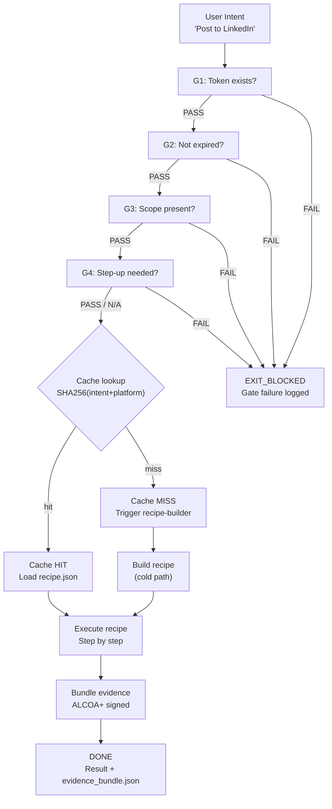

# Combo: OAuth3 Gate → Recipe Match → Execute → Evidence

**COMBO_ID:** `browser_oauth3_recipe_execute`
**VERSION:** 1.0.0
**CLASS:** browser-automation
**RUNG:** 65537 (MIN of all contributing agents)
**NORTHSTAR:** recipe_hit_rate + consent_coverage_rate

---

## Wish

The user wants to delegate a browser task to SolaceAI. They state their intent in plain language. The system should: verify they have consented to the required scopes, find (or build) the matching recipe, execute it with OAuth3 authorization, and return a signed evidence bundle proving what was done.

**WISH CONTRACT:**
```
Problem: User wants to automate a browser task without managing credentials or writing scripts
Method:  OAuth3 consent → recipe cache lookup → execution → evidence
Metric:  Task completed, evidence bundle signed, consent record exists, < 15 seconds end-to-end
```

---

## Recipe Chain

```
Stage 1: OAuth3 Gate (browser-oauth3-gate)
  Input:  user intent + platform
  Output: gate_audit.json (all 4 gates PASS)

Stage 2: Recipe Match (browser-recipe-engine)
  Input:  normalized intent + gate_audit.json
  Output: recipe.json (cache hit) OR cold-miss signal

Stage 3 (cache hit): Execute Recipe (browser-recipe-engine)
  Input:  recipe.json + gate_audit.json
  Output: execution_trace.json

Stage 3 (cache miss): Build Recipe (recipe-builder swarm)
  Input:  intent + DOM snapshot + gate_audit.json
  Output: new recipe.json → then Execute

Stage 4: Evidence Bundle (browser-evidence)
  Input:  execution_trace.json + before/after snapshots
  Output: evidence_bundle.json (ALCOA+ signed)
```

---

## Skill Stack

```yaml
stage_1_skills: [prime-safety, browser-oauth3-gate]
stage_2_3_skills: [prime-safety, browser-recipe-engine, browser-snapshot]
stage_3_cold_skills: [prime-safety, browser-recipe-engine, browser-snapshot, browser-oauth3-gate]
stage_4_skills: [prime-safety, browser-evidence]
model_map:
  stage_1: haiku  # fast gate check
  stage_2: haiku  # cache lookup
  stage_3_hit: haiku  # recipe replay (cheapest path)
  stage_3_miss: sonnet  # new recipe generation
  stage_4: haiku  # evidence packaging
```

---



---

## Stage Handoff Protocol

**Stage 1 → Stage 2:** `gate_audit.json` must be present with `all_gates_pass: true`.
Stage 2 will not proceed without this artifact.

**Stage 2 → Stage 3 (hit):** `recipe.json` with `verified: true` required.
Never execute an unverified recipe.

**Stage 2 → Stage 3 (miss):** Dispatch recipe-builder swarm with full CNF capsule.
Do not inline the recipe build in Stage 2.

**Stage 3 → Stage 4:** `execution_trace.json` must contain step-by-step results.
Evidence must be built from the actual trace, not from the recipe spec.

---

## Timing Budget

| Stage | Model | Target Time |
|-------|-------|-------------|
| OAuth3 Gate | haiku | < 200ms |
| Recipe lookup | haiku | < 100ms |
| Execute (cache hit) | haiku | 1-5s |
| Execute (cache miss, build) | sonnet | 30-120s |
| Evidence bundle | haiku | < 500ms |
| **Total (cache hit)** | — | **< 10s** |
| **Total (cache miss)** | — | **< 3 min** |

---

## GLOW Score

| Dimension | Score | Evidence |
|-----------|-------|---------|
| **G**oal alignment | 10/10 | Complete lifecycle: consent → recipe → execute → evidence |
| **L**everage | 10/10 | Cache hits eliminate 90% of cost vs. cold LLM per task |
| **O**rthogonality | 9/10 | 4 stages are cleanly separated — each has one responsibility |
| **W**orkability | 9/10 | Gate failures are binary; cache hits are deterministic; evidence is hash-verified |

**Overall GLOW: 9.5/10**

---

## Forbidden States

| State | At Stage | Response |
|-------|---------|---------|
| `EXECUTE_WITHOUT_GATE` | Stage 3 | BLOCKED — gate_audit.json required |
| `CACHE_UNVERIFIED_RECIPE` | Stage 2 | BLOCKED — verify before serving |
| `EVIDENCE_FABRICATED` | Stage 4 | BLOCKED — trace-derived only |
| `SCOPELESS_EXECUTION` | Stage 1 | BLOCKED — G3 must pass |
| `COLD_MISS_INLINE` | Stage 2 | BLOCKED — dispatch swarm, never inline |

---

## Integration Rung

Rung of combo output = MIN(rung of all stages)

| Stage | Rung |
|-------|------|
| Stage 1: OAuth3 Gate | 65537 |
| Stage 2: Recipe Match | 274177 |
| Stage 3: Execute | 274177 |
| Stage 4: Evidence | 274177 |
| **Combo Rung** | **274177** |

To achieve combo rung 65537: run Stage 2-4 through skeptic review + security audit.
