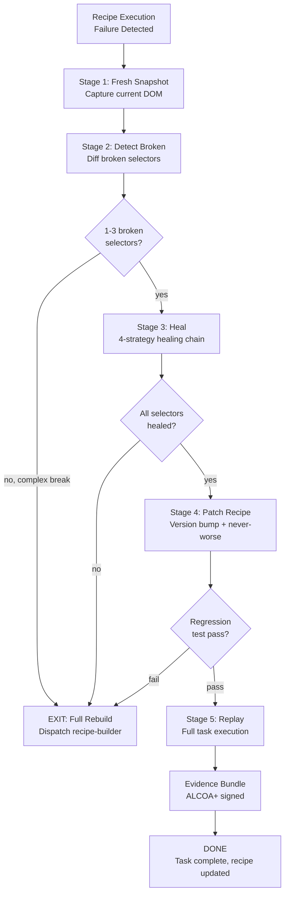

# Combo: Snapshot → Detect Broken → Heal → Replay

**COMBO_ID:** `browser_snapshot_heal_replay`
**VERSION:** 1.0.0
**CLASS:** browser-maintenance
**RUNG:** 274177
**NORTHSTAR:** recipe_hit_rate + selector_heal_success_rate

---

## Wish

A recipe that was working yesterday fails today because a website changed its DOM. The user wants the system to automatically detect the breakage, heal the affected selectors, and replay the original task — without the user having to rebuild the recipe from scratch.

**WISH CONTRACT:**
```
Problem: Recipe execution fails due to DOM drift (website changed its UI)
Method:  Capture fresh DOM snapshot → identify broken selectors → heal →
         regression test → replay original task → evidence
Metric:  Original task completes, healed selectors pass regression test,
         recipe version bumped (never-worse), evidence bundle signed
```

---

## Recipe Chain

```
Stage 1: Snapshot (browser-snapshot)
  Input:  failure URL + recipe_id
  Output: fresh_snapshot.json (current DOM, ref-map)

Stage 2: Detect Broken (selector-healer swarm)
  Input:  fresh_snapshot.json + broken recipe + error trace
  Output: failure_analysis.json + dom_diff.json

Stage 3: Heal (selector-healer swarm)
  Input:  dom_diff.json + healing chain strategies
  Output: healed_selectors.json + regression_test.json

Stage 4: Patch Recipe (recipe-builder / recipe-engine)
  Input:  healed_selectors.json + original recipe.json
  Output: recipe_v_new.json (version bumped, never-worse)

Stage 5: Replay (browser-recipe-engine)
  Input:  recipe_v_new.json + gate_audit.json
  Output: execution_trace.json + evidence_bundle.json
```

---

## Skill Stack

```yaml
stage_1_skills: [prime-safety, browser-snapshot]
stage_2_3_skills: [prime-safety, browser-snapshot]
stage_4_skills: [prime-safety, browser-recipe-engine]
stage_5_skills: [prime-safety, browser-recipe-engine, browser-oauth3-gate, browser-evidence]
model_map:
  stage_1: haiku   # fast snapshot
  stage_2: haiku   # diff detection
  stage_3: haiku   # selector healing (targeted, fast)
  stage_4: sonnet  # recipe patch (careful versioning)
  stage_5: haiku   # replay (deterministic cache)
```

---



---

## Healing Chain Decision Tree

```
Incoming: recipe failure

1. Count broken selectors:
   1-3 → attempt heal
   4+  → dispatch recipe-builder (full rebuild)

2. For each broken selector, try in order:
   a. ARIA role + accessible name  → SUCCESS: test → continue
   b. Role + visible text          → SUCCESS: test → continue
   c. CSS structural selector      → SUCCESS: test → continue
   d. XPath                        → SUCCESS: test → continue
   e. All fail                     → dispatch recipe-builder

3. Never-worse gate after all selectors healed:
   Run all existing recipe test cases.
   If any regress: dispatch recipe-builder.
```

---

## Version Bump Protocol

```
Heal applies a minor version bump:
  recipe.version: "1.0.2" → "1.0.3"

Version history records:
  {
    "version": "1.0.3",
    "changed_from": "1.0.2",
    "change_type": "selector_heal",
    "heal_run_id": "<uuid>",
    "selectors_healed": 2,
    "never_worse_tests_passed": 5
  }

Major version bump only on recipe-builder rebuild.
```

---

## Timing Budget

| Stage | Model | Target Time |
|-------|-------|-------------|
| Stage 1: Snapshot | haiku | < 2s |
| Stage 2: Detect | haiku | < 1s |
| Stage 3: Heal (per selector) | haiku | < 5s |
| Stage 4: Patch | sonnet | < 10s |
| Stage 5: Replay | haiku | 1-15s |
| **Total (2-3 selectors)** | — | **< 40s** |

---

## GLOW Score

| Dimension | Score | Evidence |
|-----------|-------|---------|
| **G**oal alignment | 10/10 | Directly defends recipe hit rate by repairing broken recipes |
| **L**everage | 9/10 | Healing is 10x cheaper than full rebuild; preserves recipe library investment |
| **O**rthogonality | 9/10 | Detect, heal, patch, replay are separate stages with clear handoffs |
| **W**orkability | 9/10 | Healing chain is deterministic; never-worse gate is binary |

**Overall GLOW: 9.25/10**

---

## Forbidden States

| State | Response |
|-------|---------|
| `UNVERIFIED_HEAL` | BLOCKED — test every healed selector before patching |
| `STALE_SNAPSHOT` | BLOCKED — snapshot must be fresh (< 5s) |
| `RECIPE_STRUCTURE_MODIFIED` | BLOCKED — only selectors change in heal |
| `NEVER_WORSE_SKIPPED` | BLOCKED — regression gate required before replay |
| `EVIDENCE_SKIP` | BLOCKED — replay must produce evidence bundle |
| `INLINE_REBUILD` | BLOCKED — if rebuild needed, dispatch recipe-builder swarm |

---

## Integration Rung

| Stage | Rung |
|-------|------|
| Stage 1: Snapshot | 274177 |
| Stage 2: Detect | 274177 |
| Stage 3: Heal | 274177 |
| Stage 4: Patch | 274177 |
| Stage 5: Replay | 274177 |
| **Combo Rung** | **274177** |
