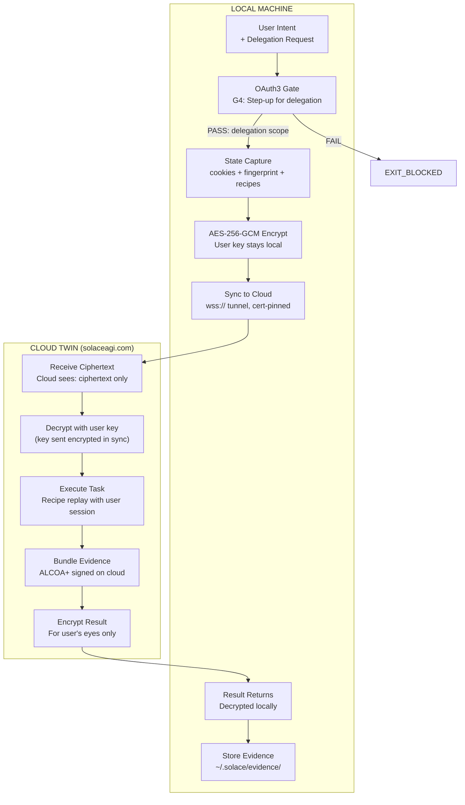

# Combo: Local Intent → Cloud Execution → Local Result

**COMBO_ID:** `browser_twin_delegation`
**VERSION:** 1.0.0
**CLASS:** browser-delegation
**RUNG:** 65537 (encryption + zero-knowledge required)
**NORTHSTAR:** twin_sync_success_rate + cloud_task_success_rate

---

## Wish

The user wants to delegate a long-running or background browser task to the cloud twin while they sleep (or work). They start the task locally, the system syncs their authenticated session to the cloud, the cloud executes the task using their session, and the result appears locally when they return.

**WISH CONTRACT:**
```
Problem: User wants browser tasks running 24/7 without keeping their laptop open
Method:  Local session sync → cloud delegation → cloud execution → result sync back
Metric:  Task executed in cloud using user's authenticated session,
         result returned to local with full evidence chain,
         user's key never left local machine
```

---

## Recipe Chain

```
Stage 1: Intent Capture + OAuth3 (local)
  Input:  user intent + delegation scope request
  Output: delegation_token.json (step-up confirmed for delegation)

Stage 2: Session Sync (browser-twin-sync)
  Input:  delegation_token.json + local browser state
  Output: sync_receipt.json (cloud twin has user's session)

Stage 3: Cloud Task Dispatch
  Input:  sync_receipt.json + task specification
  Output: cloud_task_id (task queued in cloud)

Stage 4: Cloud Execution (cloud twin, same recipe engine)
  Input:  cloud_task_id + synced session + recipe
  Output: execution_trace.json + evidence_bundle.json (on cloud)

Stage 5: Result Sync Back (browser-twin-sync)
  Input:  cloud_task_id
  Output: result + evidence_bundle.json (synced to local)
```

---

## Skill Stack

```yaml
stage_1_skills: [prime-safety, browser-oauth3-gate]
stage_2_skills: [prime-safety, browser-twin-sync, browser-evidence]
stage_3_skills: [prime-safety, browser-twin-sync]
stage_4_skills: [prime-safety, browser-recipe-engine, browser-oauth3-gate, browser-evidence]
stage_5_skills: [prime-safety, browser-twin-sync, browser-evidence]
model_map:
  stage_1: haiku    # gate check
  stage_2: sonnet   # session sync (security-critical)
  stage_3: haiku    # dispatch
  stage_4: haiku    # cloud execution (recipe replay)
  stage_5: haiku    # result sync
```

---



---

## Zero-Knowledge Guarantee

```
WHAT THE CLOUD SEES:
  ✓ Ciphertext (AES-256-GCM encrypted payload)
  ✓ Nonce (96-bit, random per sync)
  ✓ Auth tag (GCM authentication)
  ✓ SHA256 of ciphertext (for receipt verification)
  ✗ Plaintext state
  ✗ Raw cookies
  ✗ Passwords
  ✗ User's encryption key

ZERO-KNOWLEDGE PROOF:
  Cloud cannot decrypt without user's key.
  User's key is derived from user's password.
  User's password never leaves local machine.
  Evidence: cloud's sha256(ciphertext) confirms receipt of exactly what was sent.
```

---

## LOCAL_WINS Protocol

```
If cloud state diverges from local state (e.g., cloud ran an older recipe version):

  local_wins_version = local.sync_counter (monotonic)
  cloud_wins_version = cloud.sync_counter

  if local >= cloud: apply local to cloud (LOCAL_WINS — automatic)
  else:              require explicit user merge confirmation (MANUAL_MERGE)

NEVER auto-merge cloud state onto local.
NEVER allow cloud to overwrite local sessions.
```

---

## Timing Budget

| Stage | Location | Target Time |
|-------|---------|-------------|
| Intent + Gate | Local | < 500ms |
| Session sync | Local → Cloud | 5-15s |
| Task dispatch | Cloud | < 500ms |
| Cloud execution | Cloud | 1-300s (task dependent) |
| Result sync back | Cloud → Local | 2-10s |
| **Total (user wait)** | — | **< 30s to dispatch; result async** |

---

## GLOW Score

| Dimension | Score | Evidence |
|-----------|-------|---------|
| **G**oal alignment | 10/10 | Directly enables "work while you sleep" — the core twin promise |
| **L**everage | 10/10 | Cloud execution runs 24/7; user's compute is freed |
| **O**rthogonality | 9/10 | Local → cloud boundary is explicit; each stage has one owner |
| **W**orkability | 9/10 | AES-256-GCM + certificate pinning + LOCAL_WINS = deterministic trust |

**Overall GLOW: 9.5/10**

---

## Forbidden States

| State | Response |
|-------|---------|
| `UNENCRYPTED_SYNC` | BLOCKED — AES-256-GCM required |
| `KEY_ESCROW` | BLOCKED — user key never stored on server |
| `CLOUD_OVERRIDES_LOCAL` | BLOCKED — LOCAL_WINS is absolute |
| `DELEGATION_WITHOUT_STEP_UP` | BLOCKED — G4 step-up required for delegation scope |
| `PLAINTEXT_COOKIES` | BLOCKED — cookies travel in ciphertext only |
| `TUNNEL_DOWNGRADE` | BLOCKED — ws:// not accepted |
| `EVIDENCE_DESYNC` | BLOCKED — evidence chain must reconcile before next delegation |

---

## Integration Rung

| Stage | Rung |
|-------|------|
| Stage 1: OAuth3 Gate | 65537 |
| Stage 2: Session Sync (zero-knowledge) | 65537 |
| Stage 3: Task Dispatch | 274177 |
| Stage 4: Cloud Execution | 274177 |
| Stage 5: Result Sync | 65537 |
| **Combo Rung** | **274177** |

To achieve 65537: cloud execution must also be rung 65537 (requires cloud skeptic + security audit per task).
