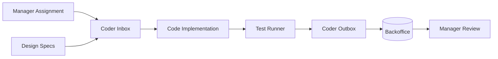

# Data Flow

```mermaid
flowchart LR
    ManagerAssignment[Manager Assignment] --> CoderInbox[Coder Inbox]
    DesignSpecs[Design Specs] --> CoderInbox
    CoderInbox --> Implementation[Code Implementation]
    Implementation --> TestRunner[Test Runner]
    TestRunner --> CoderOutbox[Coder Outbox]
    CoderOutbox --> Backoffice[(Backoffice)]
    Backoffice --> ManagerReview[Manager Review]
```
