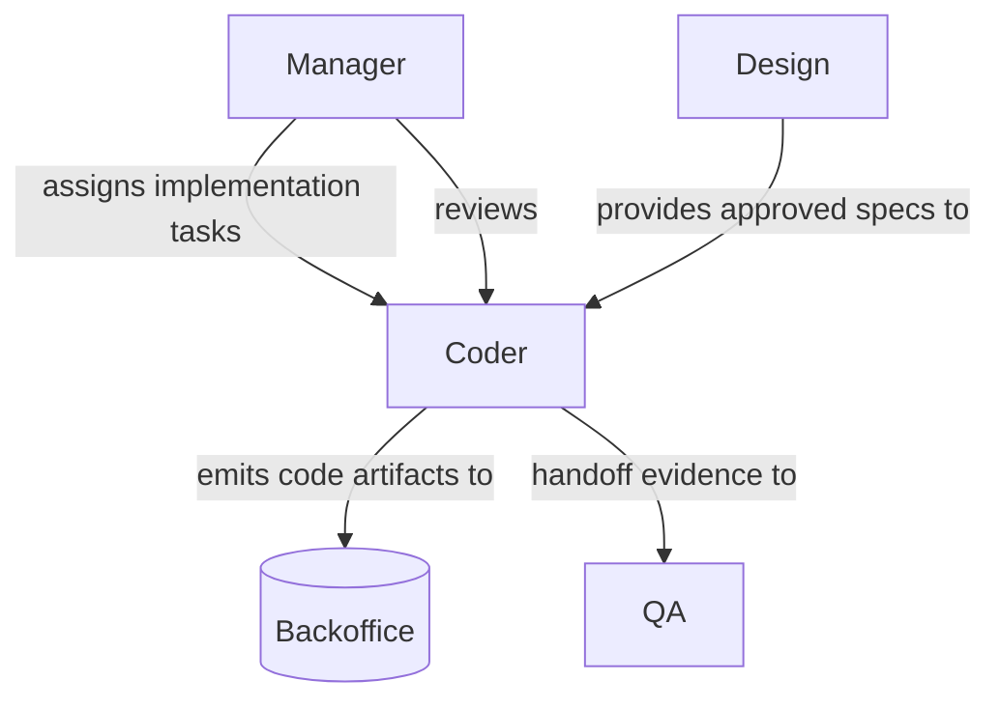

# Partner Contracts

```mermaid
graph TD
    Manager[Manager] -->|assigns implementation tasks| Coder[Coder]
    Design[Design] -->|provides approved specs to| Coder
    Coder -->|emits code artifacts to| Backoffice[(Backoffice)]
    Coder -->|handoff evidence to| QA[QA]
    Manager -->|reviews| Coder
```
