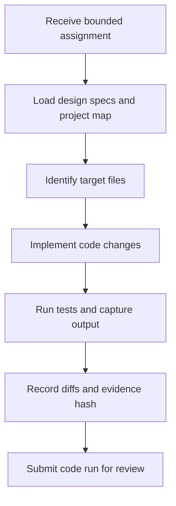

# Workflow

```mermaid
flowchart TD
    Receive[Receive bounded assignment] --> Load[Load design specs and project map]
    Load --> Scope[Identify target files]
    Scope --> Implement[Implement code changes]
    Implement --> Test[Run tests and capture output]
    Test --> Evidence[Record diffs and evidence hash]
    Evidence --> Review[Submit code run for review]
```
