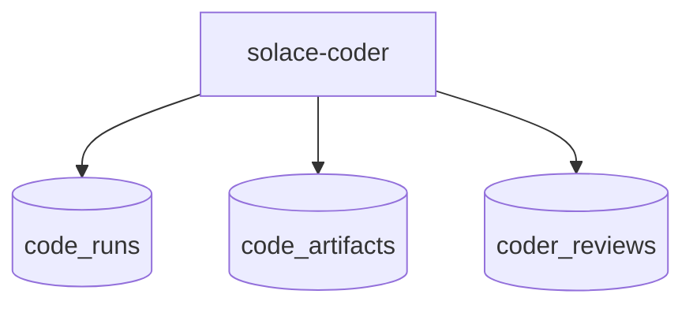
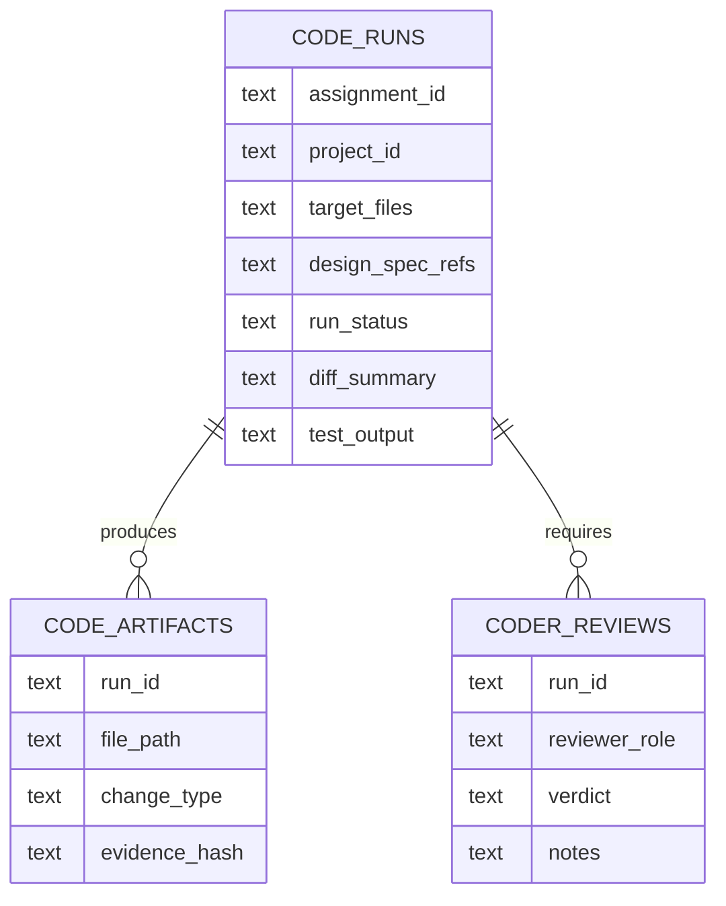

# App: Solace Coder

# DNA: `Coder-first Solace Dev worker app that receives bounded assignments from the manager with approved design artifacts, implements code changes, produces diff summaries and test evidence, and emits implementation artifacts back to the manager pipeline.`

## Identity

- **ID**: solace-coder
- **Version**: 1.0.0
- **Domain**: localhost
- **Category**: backoffice
- **Type**: worker-app
- **Visibility**: local-first

## Role Contract

## Backoffice Contract

## Compatibility

- `manifest.yaml` remains the runtime compatibility manifest.
- This Prime Mermaid file is the source of truth for the coder app contract.
