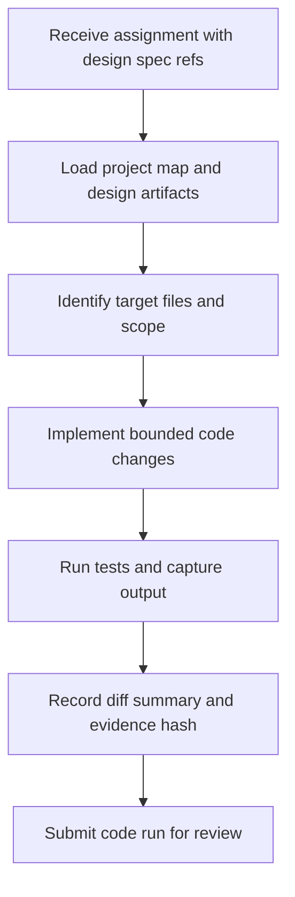

# Solace Coder Recipe

```mermaid
flowchart TD
    A[Receive assignment with design spec refs] --> B[Load project map and design artifacts]
    B --> C[Identify target files and scope]
    C --> D[Implement bounded code changes]
    D --> E[Run tests and capture output]
    E --> F[Record diff summary and evidence hash]
    F --> G[Submit code run for review]
```
