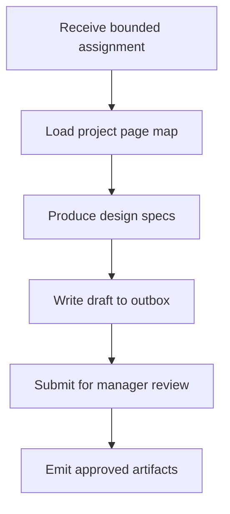

# Workflow

```mermaid
flowchart TD
    Receive[Receive bounded assignment] --> Load[Load project page map]
    Load --> Spec[Produce design specs]
    Spec --> Draft[Write draft to outbox]
    Draft --> Review[Submit for manager review]
    Review --> Approve[Emit approved artifacts]
```
