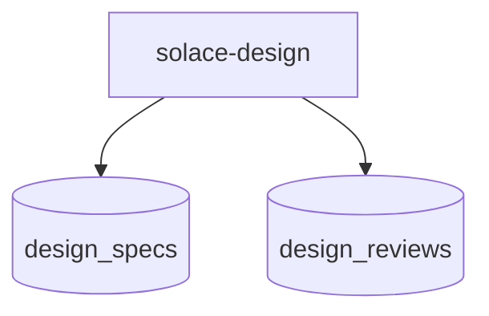
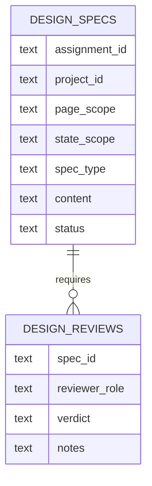

# App: Solace Design

# DNA: `Design-first Solace Dev worker app that receives bounded assignments from the manager, produces page/state/component design specs, and emits review artifacts back to the manager pipeline.`

## Identity

- **ID**: solace-design
- **Version**: 1.0.0
- **Domain**: localhost
- **Category**: backoffice
- **Type**: worker-app
- **Visibility**: local-first

## Role Contract

## Backoffice Contract

## Compatibility

- `manifest.yaml` remains the runtime compatibility manifest.
- This Prime Mermaid file is the source of truth for the design app contract.
