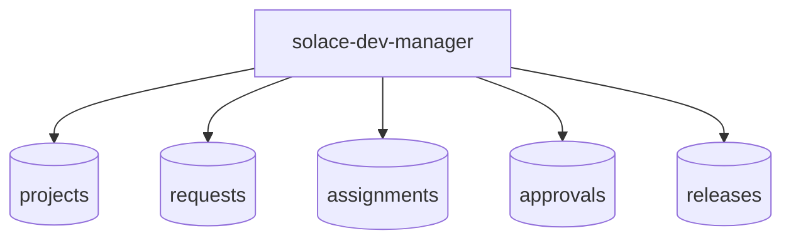
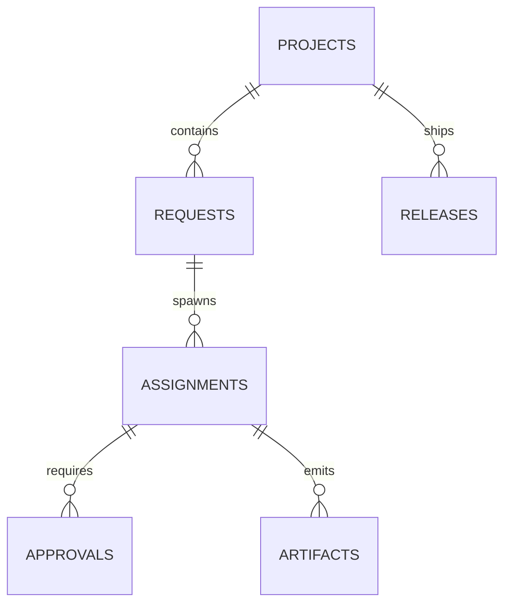

# App: Solace Dev Manager

# DNA: `Manager-first Solace Dev worker app that routes requests, assignments, approvals, and release state over durable Back Office objects.`

## Identity

- **ID**: solace-dev-manager
- **Version**: 1.0.0
- **Domain**: localhost
- **Category**: backoffice
- **Type**: worker-app
- **Visibility**: local-first

## Role Contract

## Backoffice Contract

## Compatibility

- `manifest.yaml` remains the runtime compatibility manifest.
- This Prime Mermaid file is the source of truth for the manager app contract.
