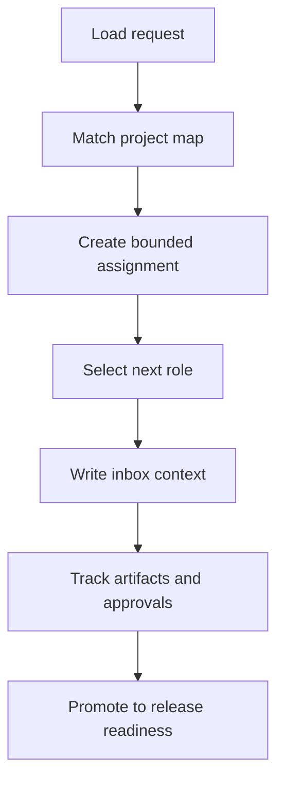

# Solace Dev Manager Recipe

```mermaid
flowchart TD
    A[Load request] --> B[Match project map]
    B --> C[Create bounded assignment]
    C --> D[Select next role]
    D --> E[Write inbox context]
    E --> F[Track artifacts and approvals]
    F --> G[Promote to release readiness]
```
