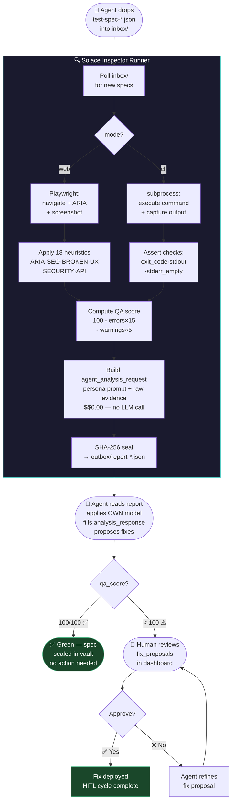

# Diagram 01: HITL Loop — The Complete Evidence Chain
# Solace Inspector | Auth: 65537 | GLOW: L | Updated: 2026-03-03
# Committee: James Bach · Cem Kaner · Elisabeth Hendrickson · Kent Beck · Michael Bolton

## The Full Agent → Inspector → Human Loop



## Evidence Quality Gates

| Gate | Condition | Action |
|------|-----------|--------|
| **G1** | qa_score = 100 | Seal + done — no human needed |
| **G2** | qa_score 70–99 | Yellow belt — agent proposes fix, human reviews |
| **G3** | qa_score < 70 | Orange/White — critical finding, human must approve |
| **G4** | SHA-256 mismatch | Evidence tampered — reject, re-run spec |

## Key Architecture Decision: Agent-Native

```
WRONG MODEL (deprecated):
  Inspector → calls OpenRouter/Together.ai → LLM analyzes → result

CORRECT MODEL ($0.00):
  Inspector → collects raw evidence → builds prompt template
  Agent (Claude Code / Cursor / Codex) reads report
  Agent applies ITS OWN model (already running, zero extra cost)
  Persona = prompt template, not a separate API call
```
