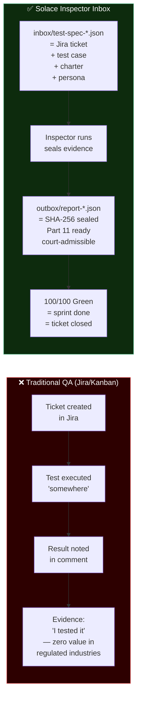

# Diagram 02: Inbox as QA Memory Substrate
# Solace Inspector | Auth: 65537 | GLOW: L | Updated: 2026-03-03
# Replaces: Jira · Asana · Notion boards · spreadsheets

## Inbox = The Official QA Board



## 62 Standing Specs = 62 QA Contracts (GLOW 99)

```
Spec Category          Count   Persona(s)            Belt Target
─────────────────────────────────────────────────────────────────
API health/version       2     Kent Beck             100/100
API auth (401 guard)     3     James Bach            100/100
API billing protect      2     Kent Beck             100/100
API LLM endpoints        2     Kent Beck             100/100
OWASP adversarial        5     Bach + Kaner          100/100
solaceagi.com pages     20     Hendrickson           100/100
solace-browser pages     8     Hendrickson           100/100
Paper claim verify       4     Michael Bolton        100/100
YinYang API + MCP        5     Cem Kaner             100/100
Fun pack locales         1     Hendrickson           100/100
Architecture specs       5     James Bach            100/100
SOP docs                 5     Kaner + Bach          100/100
─────────────────────────────────────────────────────────────────
TOTAL                   62     5-member committee    62/62 Green
```

## The Sprint Metaphor

```
Jira Sprint             Inspector Inbox
─────────────────────── ───────────────────────
Open ticket      →      JSON spec in inbox/
Work in progress →      Inspector running
Done             →      100/100 Green in outbox/
Closed/verified  →      SHA-256 sealed report
Sprint complete  →      All 62 specs Green
```

## Retention (Part 11 Ready)

- **outbox/**: append-only, never delete
- **SHA-256**: every report sealed at creation
- **Human approvals**: HITL record in fix_proposals
- **Audit trail**: complete chain from spec → finding → fix → approval
