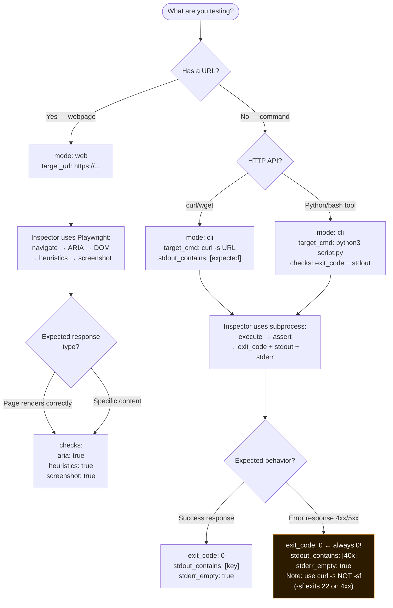

# Diagram 03: Spec Taxonomy — 3 Modes × 5 Heuristic Families
# Solace Inspector | Auth: 65537 | GLOW: L | Updated: 2026-03-03

## Spec Mode Decision Tree



## 18 Heuristics (Applied in Mode: web)

```
Family      ID        What It Checks                     Severity
────────────────────────────────────────────────────────────────
ARIA        ARIA-1    All images have alt text            Error (-15)
            ARIA-2    Form inputs have labels             Error (-15)
SEO         SEO-1     Page has H1 tag                    Error (-15)
            SEO-2     Page has <title>                   Error (-15)
Broken      BROKEN-1  No broken images (src="")          Error (-15)
            BROKEN-2  No broken links (404)              Warning (-5)
UX          UX-1      No horizontal scroll               Warning (-5)
            UX-2      Contrast ≥ 4.5:1 (WCAG AA)        Warning (-5)
Security    SEC-1     No inline scripts                  Warning (-5)
            SEC-2     No mixed content (HTTP in HTTPS)   Error (-15)
API         API-1     Protected endpoints return 401     Critical
            API-2     No 500 errors on valid requests    Critical
            API-3     No stack traces in responses       Error (-15)
OWASP       OWASP-1   Malformed JSON → 401/422 not 500  Critical
            OWASP-2   Oversized payload → 40x not 200   Critical
            OWASP-3   SQL injection → safe response      Critical
            OWASP-4   Invalid token → 401 not 500        Critical
            OWASP-5   Rate resilience (20 req no crash)  High
```

## Scoring Formula

```
web mode:   qa_score = 100 - (critical_count × 15) - (warning_count × 5)
cli mode:   qa_score = (assertions_passed / total_assertions) × 100

Belt thresholds:
  100/100  → Green  ✅ (spec sealed, no action)
  70–99    → Yellow ⚠️ (findings to review)
  40–69    → Orange 🟠 (fix required)
  < 40     → White  ⬜ (critical — block deploy)
```

## The stderr_empty Trap

```python
# WRONG — spec expects stderr NOT empty (rare, usually wrong):
"stderr_empty": false   # ← assertion: assert stderr IS NOT empty

# RIGHT — assert stderr is empty (for clean commands):
"stderr_empty": true    # ← assertion: assert stderr IS empty

# For adversarial specs expecting 4xx responses:
# Use `curl -s` NOT `curl -sf`
# -f makes curl exit 22 on 4xx, breaking specs that expect error codes
```
