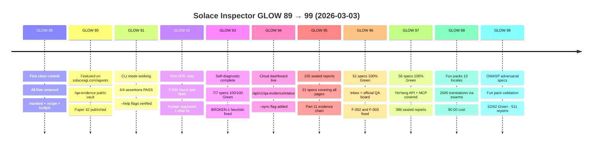
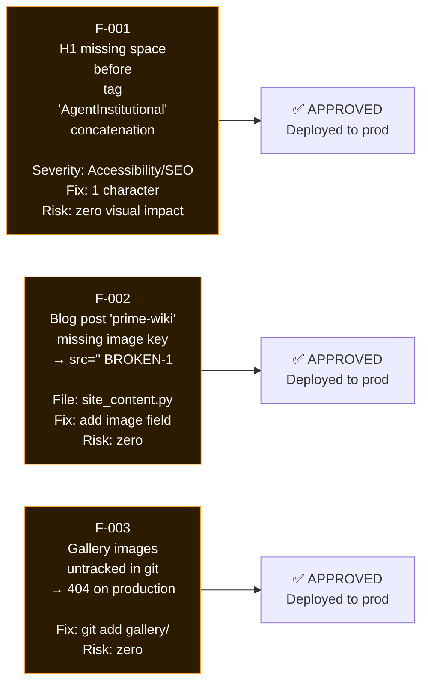

# Diagram 04: GLOW Progression — GLOW 89 to GLOW 99
# Solace Inspector | Auth: 65537 | GLOW: L | Updated: 2026-03-03

## The Build Arc (One Session, March 3 2026)



## Evidence Accumulation

```
GLOW  Specs  Reports  Key Milestone
────────────────────────────────────────────────────────
89       0        0   First commit (no specs yet)
90       7        7   Self-diagnostic (7 core pages)
91       8       11   CLI mode + --help verified
92       9       13   First HITL loop (F-001 fixed)
93       9       13   All 7 self-diag specs 100% Green
94       9       13   Cloud dashboard seeded
95      21      105   20 more specs (full site coverage)
96      51      274   30 new specs (API, pages, papers)
97      56      386   5 YinYang + MCP specs
98      56      386   Fun packs (no new specs)
99      62      511   6 adversarial + validation specs
```

## Bugs Caught via HITL (Production Fixes)


