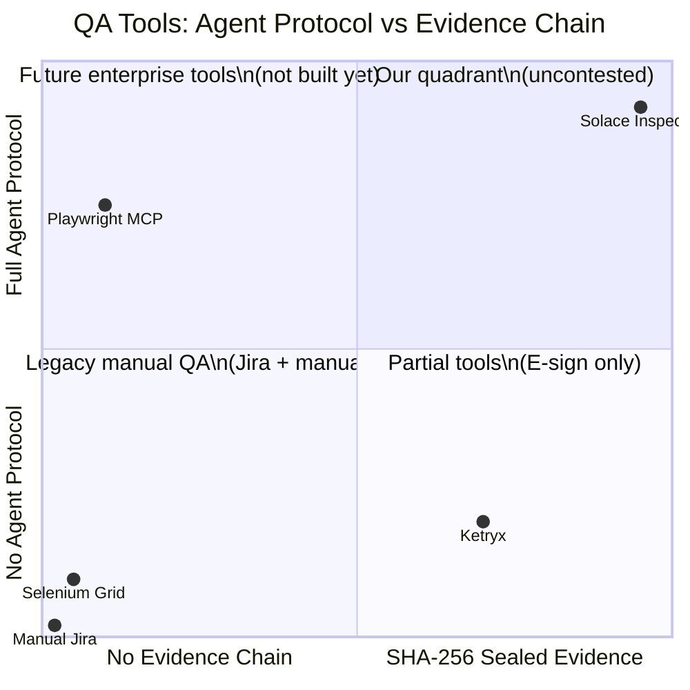
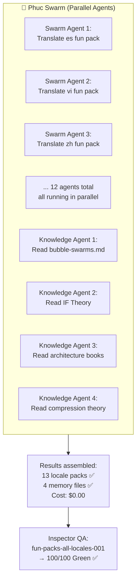

# Diagram 05: Competitive Position + Swarm Architecture
# Solace Inspector | Auth: 65537 | GLOW: L | Updated: 2026-03-03

## Zero Competitors (Confirmed March 2026)



## Feature Matrix

| Feature | Solace Inspector | Playwright MCP | Ketryx | Others |
|---------|:---:|:---:|:---:|:---:|
| Agent Protocol (inbox/outbox) | ✅ | ✅ | ❌ | ❌ |
| SHA-256 Evidence Chain | ✅ | ❌ | ✅ | ❌ |
| HITL E-Sign Approval | ✅ | ❌ | ✅ | ❌ |
| Multi-target (web + CLI + API) | ✅ | ✅ | ❌ | ❌ |
| OWASP Security Coverage | ✅ | ❌ | ❌ | ❌ |
| $0.00/run (no LLM API) | ✅ | ❌ | ❌ | ❌ |
| Any agent (Claude/Codex/Cursor) | ✅ | Partial | ❌ | ❌ |
| 13-language fun packs | ✅ | ❌ | ❌ | ❌ |

## Swarm Architecture (GLOW 99 Era)



## The Economics

```
Traditional approach:
  12 locales × (100 jokes + 100 facts) via OpenRouter
  = 2,400 items × ~100 tokens avg × $0.59/1M
  ≈ $0.14 in API fees

Swarm approach:
  12 parallel Claude Code agents
  = $0.00 (covered by Claude Code subscription)
  = Same wall-clock time (~6 minutes)

Savings: $0.14 (small, but the PATTERN scales to millions of items)
The principle: swarms + memory = cost collapses to zero
```
