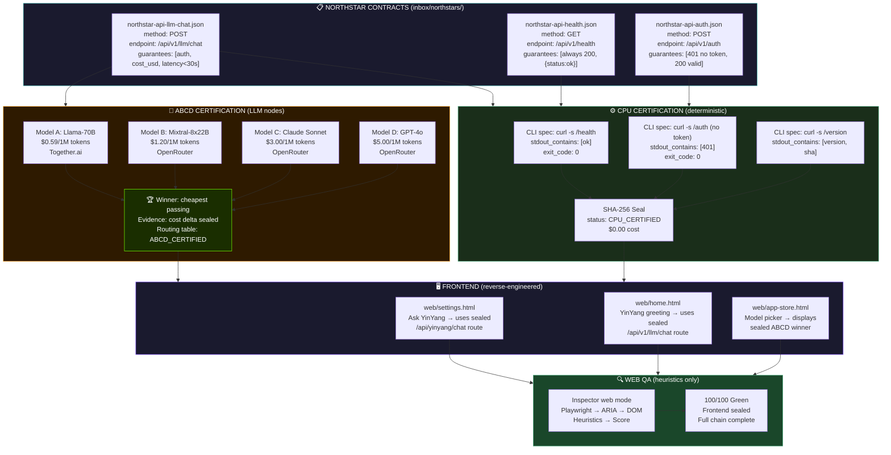
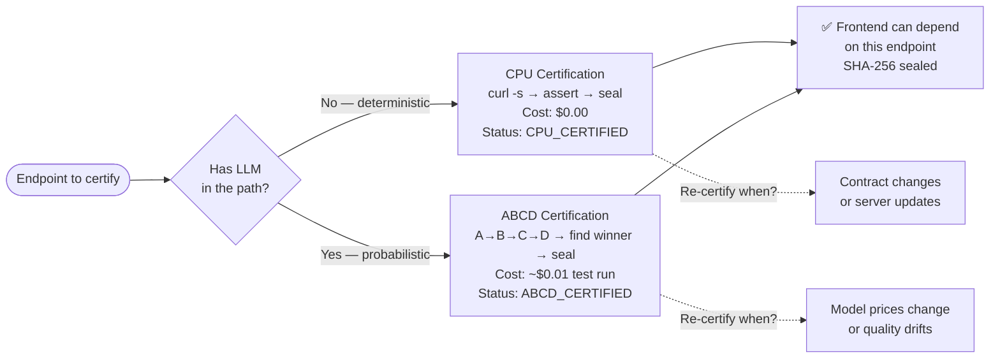

# Diagram 06: Webservices-First Northstar Pipeline
# Solace Inspector | Auth: 65537 | GLOW: L | Updated: 2026-03-03
# Paper 43 | DNA: inspector(northstar) = certify(cpu) * abcd(llm) * reverse(frontend)

## The Full Pipeline (SW5.0 Northstar Edition)



## CPU vs ABCD Decision Matrix



## ABCD Test Results (Evidence Format)

```
Run ID: abcd-20260303-150000-abc123
Endpoint: POST /api/v1/llm/chat
Prompt: "What is 2+2? Answer in one word."
Quality threshold: stdout_contains ["four"] (case-insensitive)

Model  | Response   | Latency | Cost/1M | Pass? | Notes
───────────────────────────────────────────────────────────────
A      | "Four"     | 0.82s   | $0.59   | ✅    | Llama-3.3-70B
B      | "Four"     | 1.15s   | $1.20   | ✅    | Mixtral-8x22B
C      | "Four"     | 0.91s   | $3.00   | ✅    | Claude Sonnet
D      | "Four"     | 1.08s   | $5.00   | ✅    | GPT-4o

🏆 Winner: A (Llama-3.3-70B)
   Reason: cheapest model that passes quality threshold
   Cost delta vs D: 88% savings ($0.59 vs $5.00)
   Routing recommendation: use A for factual/simple task class

Evidence sealed: sha256:abc123...
Status: ABCD_CERTIFIED
```

## The Solaceagi.com Claim — Proved

```
Claim on website:
  "We manage your LLM calls and get you the best deal."

Proof via Inspector ABCD:
  Every LLM endpoint → ABCD test → cheapest passing model → sealed
  Routing table = ABCD results = evidence
  "Best deal" = not marketing. It's a sealed SHA-256 report.

This is the ONLY way to make "best deal" claim truthful:
  ✅ Run the test (ABCD mode)
  ✅ Seal the result (SHA-256)
  ✅ Route using evidence (ABCD winner)
  ✅ Re-test when prices change (quarterly ABCD refresh)
```

## Northstar Certification States

```
UNCERTIFIED        → contract exists, no tests run yet
CPU_CERTIFIED      → deterministic path verified + sealed
ABCD_CERTIFIED     → LLM path verified + cheapest model found + sealed
FULL_CERTIFIED     → CPU + ABCD + Frontend web-mode all Green
STALE              → certified > 90 days ago (re-test recommended)
BROKEN             → last certification failed (blocker — fix before deploy)
```

## The Frontend Reverse Engineering Rule

```
❌ WRONG:
   UI dev: "I think the API returns {cost_usd}... let me guess."
   → builds UI with fake/assumed data
   → finds out API is different in staging
   → 2 weeks of misalignment

✅ CORRECT:
   Inspector certifies: POST /api/v1/llm/chat → {content, model, usage, cost_usd} ✅
   UI dev: "The certified contract says cost_usd exists. I'll display it."
   → builds against sealed reality
   → web-mode inspector verifies the display
   → zero misalignment
```
