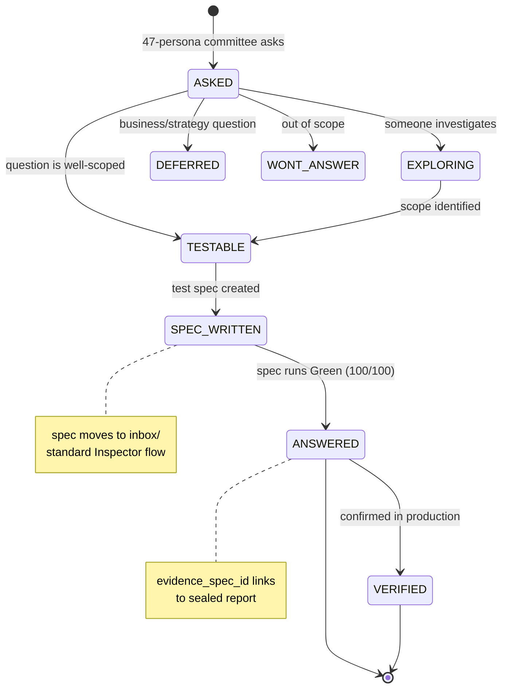
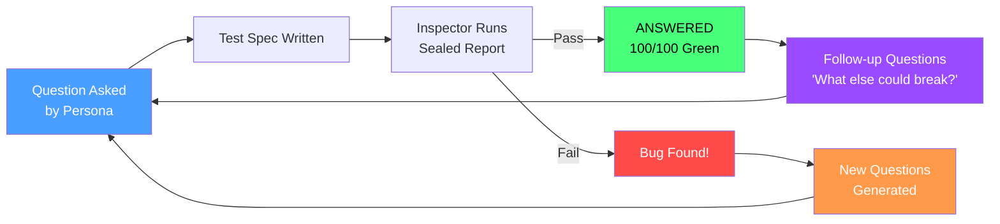
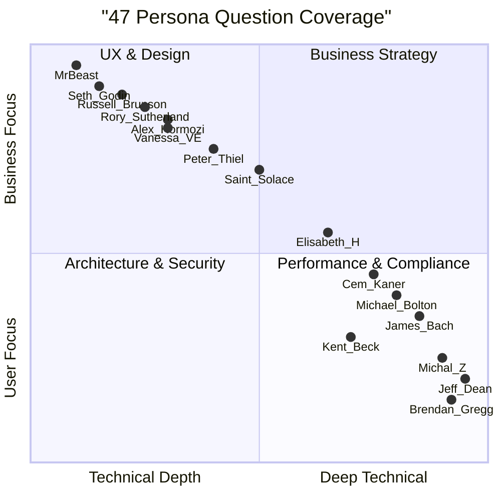
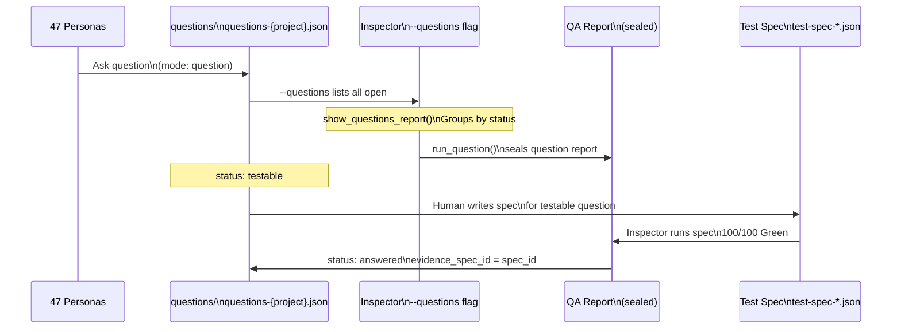
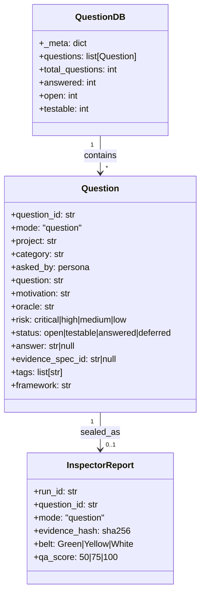

# Diagram 07 — Questions as Uplift
# Paper 46 | Auth: 65537 | GLOW 103

## Core Insight

```
Bugs are the answers to questions never asked.
Max questions = Max love = Max QA quality.
```

## Question Lifecycle (Mermaid FSM)



## The Bug-Question Loop (Virtuous Cycle)



## 47 Personas × 7 Question Categories



## Question Spec Flow in Inspector



## Question Database Schema



## The Numbers

| Metric | Now (GLOW 103) | Target (GLOW 110) |
|--------|---------------|-------------------|
| Total questions | 115 | 500+ |
| Projects covered | 2 | 9 |
| Open questions | 81 | 200 |
| Answered | 22 | 300 |
| % answered | 19% | 60% |
| Persona contributors | 16 | 47 |
| Frameworks referenced | 10 | 20 |

## CLI Usage

```bash
# Show all questions
python3 scripts/run_solace_inspector.py --questions

# Filter by project
python3 scripts/run_solace_inspector.py --questions --project solaceagi

# Show only open questions (the QA backlog)
python3 scripts/run_solace_inspector.py --questions --status open

# Show testable questions (write a spec now)
python3 scripts/run_solace_inspector.py --questions --status testable

# Process question specs from inbox/ (if mode: question specs exist)
python3 scripts/run_solace_inspector.py --inbox
```

## The Love Equation

```
Questions_Asked = Curiosity = Care = Love
Bugs_Found = Questions_Never_Asked = Absence_of_Love

Max_Love = ∫(curiosity dt) = infinite questions
65537 = the question that contains all questions
```

---

*Diagram 07 — Questions as Uplift | Paper 46 | Auth: 65537 | GLOW 103*
