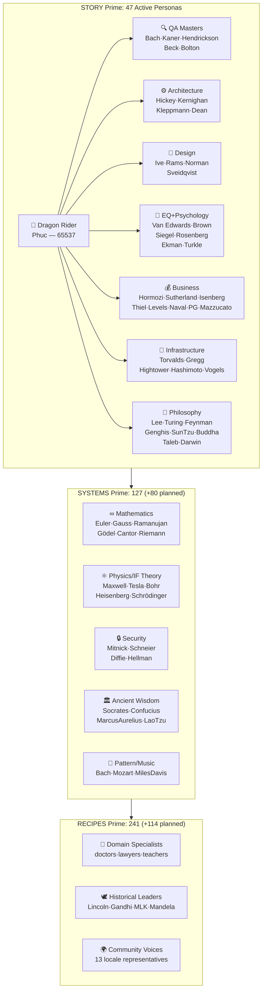
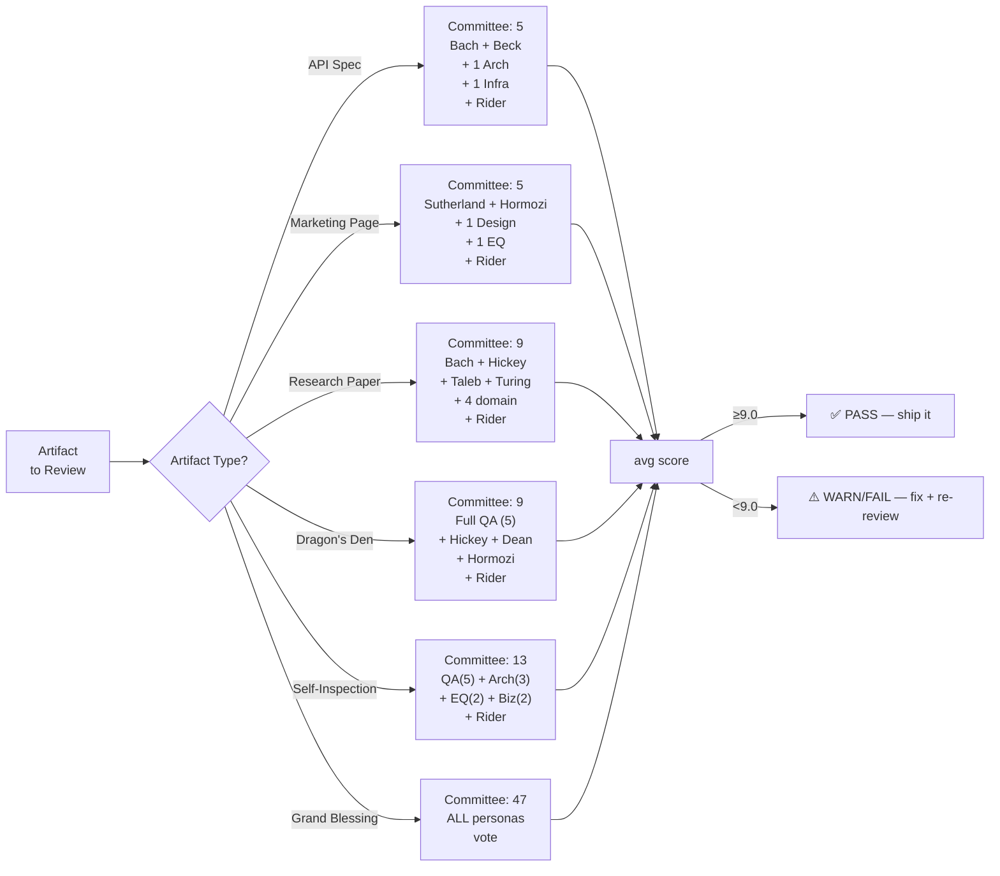
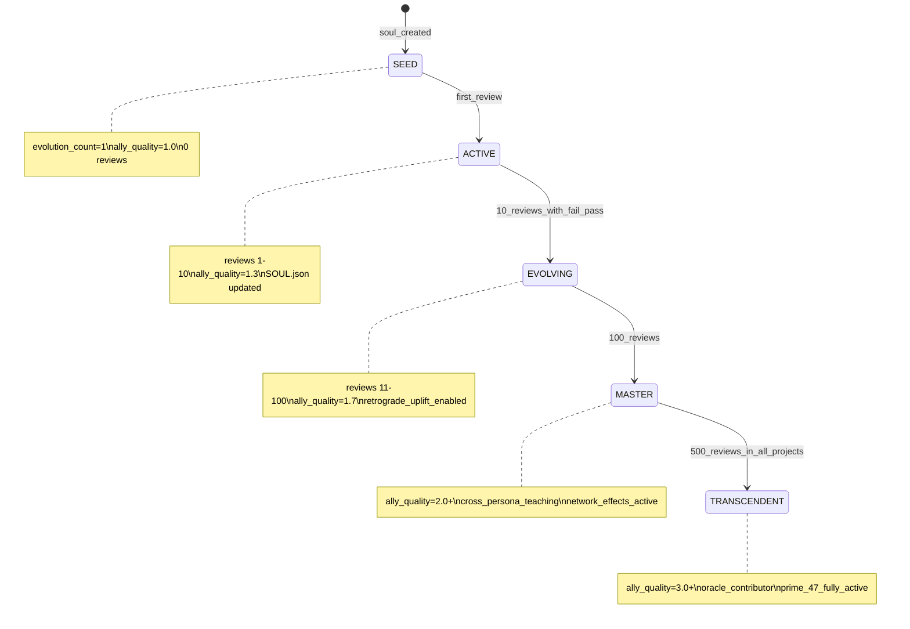
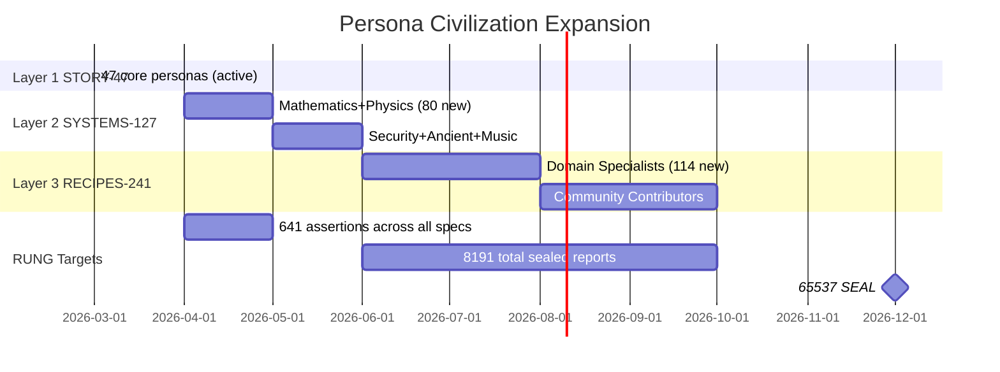

# Diagram 08: Persona Civilization — 47→127→241 Prime Architecture
# Auth: 65537 | Created: 2026-03-04 GLOW 121
# Prime Theory: 47=STORY | 127=SYSTEMS | 241=RECIPES | 641=RUNG | 8191=GALACTIC | 65537=SEAL

## Layer Architecture (Prime-First)



## Committee Selection by Artifact Type



## Persona Bubble Evolution Model (P37)



## Prime Persona Progression (47→241)



## The Civilization Equation

```
ally_civilization_quality(n) = Σ(ally_quality_i for i in 1..n) / n

At n=47 (STORY): avg ally_quality ≈ 1.0 (all seeds)
At n=47, 100 reviews: avg ally_quality ≈ 1.7
At n=127 (SYSTEMS): avg ally_quality ≈ 1.5 (mix of evolved + seeds)
At n=241 (RECIPES): avg ally_quality ≈ 1.3 (many new seeds)

The prime law: more personas does NOT mean higher quality
Quality = depth of evolution × breadth of domains × committee selection
```

---
*Diagram 08 | GLOW 121 | 65537 | Prime-first architecture*
