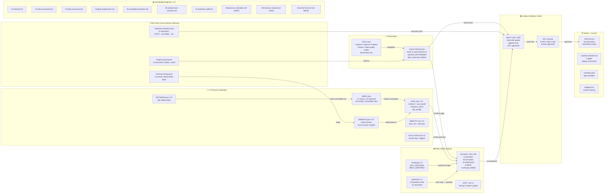
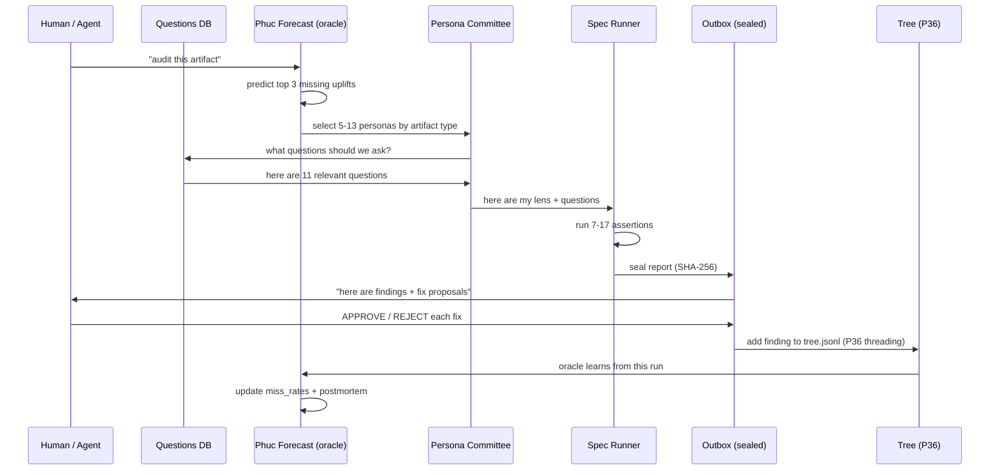
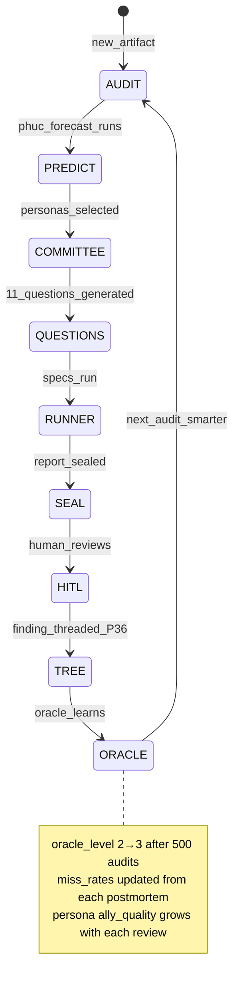

# Diagram 09: Inspector Memory Network — All Files Working Together
# Auth: 65537 | Created: 2026-03-04 GLOW 121
# Law: "The Inspector has no dead files. Every file is a node in a living graph."

## Complete File Network

## Data Flow: A Single Run

## The Inspector's Self-Reference Loop

## File Count Audit (Prime-First Check)

| Structure | Count | Prime? | Target |
|-----------|-------|--------|--------|
| Persona files per bubble | 5 | ✅ 5 is prime | done |
| Active personas | 47 | ✅ 47 is prime (STORY) | done |
| Specs in inbox | 89 | ✅ 89 is prime | done |
| Mermaid diagrams | 10 | ❌ 10 = 2×5 | → 11 |
| Northstar contracts | 5 | ✅ 5 is prime | done |
| Locales | 13 | ✅ 13 is prime | done |
| Sealed reports | 563 | ✅ 563 is prime | done |
| Questions total | 76 | ❌ 76 = 4×19 | → 79 |
| Questions answered | 22 | ❌ 22 = 2×11 | → 23 |
| Oracle level | 2 | ✅ 2 is prime | done |

**Prime coherence: 7/10 = 70%**
**Next upgrade target: 11 diagrams, 79 questions total, 23 answered**

---
*Diagram 09 | GLOW 121 | 65537 | Memory Network*
