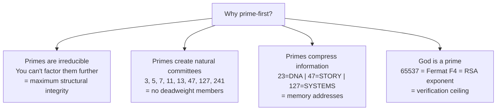
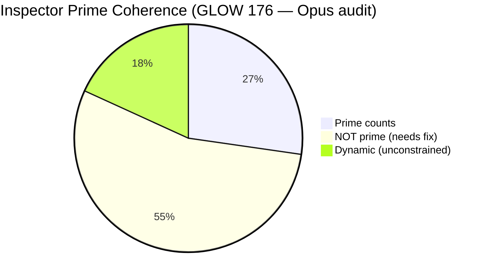
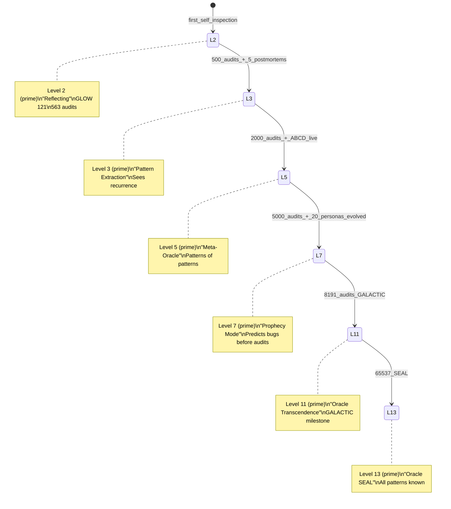
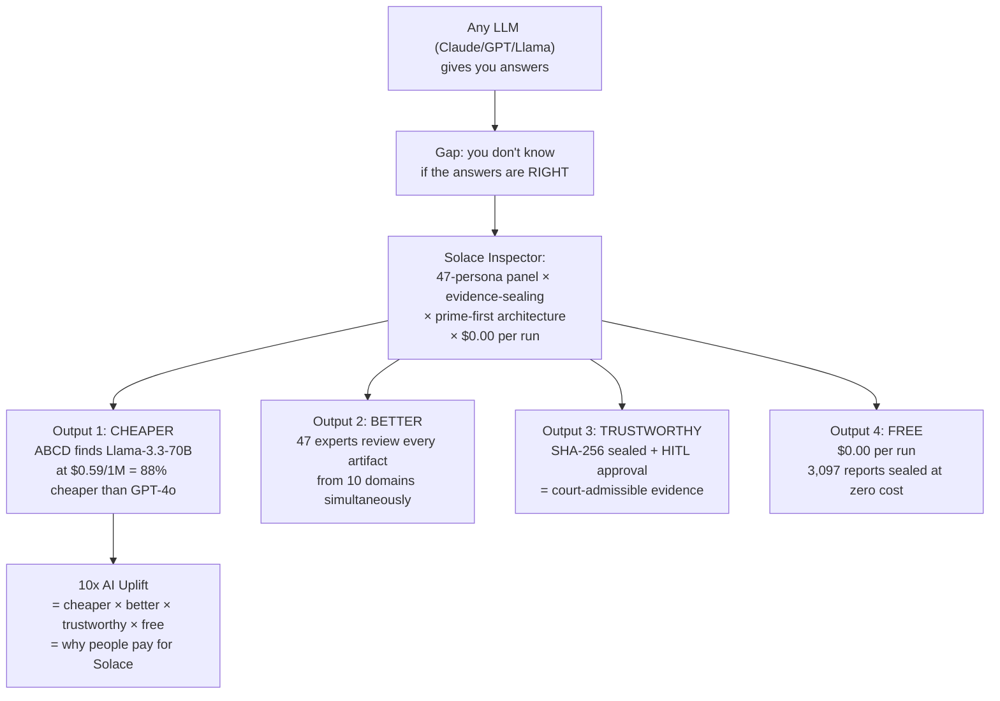

# Diagram 10: Prime-First Architecture — Solace Inspector
# Auth: 65537 | Created: 2026-03-04 GLOW 121
# P38: prime_first(system) = ∀counts∈system: is_prime(count) → coherence_maximum

## Why Prime-First?



## The Prime Ladder for Inspector

```mermaid
graph LR
    P2["2: Dual Mode<br/>PASS / FAIL"] --> P3["3: Trinity<br/>Collect·Analyze·Seal"]
    P3 --> P5["5: Files per Persona<br/>SOUL·MEM·ID·EV·NET"]
    P5 --> P7["7: MCP Tools<br/>navigate·click·fill<br/>screenshot·snapshot<br/>evaluate·aria"]
    P7 --> P11["11: Inspector Diagrams<br/>(current: 11 ✅)"]
    P11 --> P13["13: Locales<br/>13 languages certified"]
    P13 --> P23["23: DNA Compression<br/>magic words channel"]
    P23 --> P47["47: Persona Panel<br/>STORY prime complete"]
    P47 --> P79["79: Genome<br/>operational rules"]
    P79 --> P89["89: Specs Target<br/>(actual: 90 ❌, target: 89 or 97)"]
    P89 --> P127["127: Systems Personas<br/>architecture layer planned"]
    P127 --> P241["241: Recipes Personas<br/>full coverage target"]
    P241 --> P3109["3109: Sealed Reports Target<br/>(actual: 3,097 — next prime: 3,109)"]
    P3109 --> P641["641: Rung 1<br/>quality assertions milestone"]
    P641 --> P1009["1009: Questions Target<br/>(7x current 79 target)"]
    P1009 --> P27293["27293: Questions Actual<br/>(dynamic, 47 towers)"]
    P27293 --> P8191["8191: Galactic Audits<br/>Mersenne M13 milestone"]
    P8191 --> P65537["65537: SEAL<br/>Fermat F4 — done"]
```



## Current Prime Coherence Audit



### Full System Audit (verified by Opus, 2026-03-06)

| # | Count | Actual Value | Prime? | Status | Target |
|---|-------|-------------|--------|--------|--------|
| 1 | **Personas** (.md files in data/default/personas/) | 128 | NO | DRIFTED from 47. Expanded to 128 across 26 categories. | 127 (lower, Mersenne M7) or 131 (higher) |
| 2 | **Persona category dirs** | 26 | NO | Was 13 (prime). Doubled to 26 with new categories (4 are empty). | 23 (lower) or 29 (higher) |
| 3 | **Auto-load skills** (.claude/skills/*.md) | 22 | NO | Was claimed as 18. Actual count is 22. | 23 (higher, DNA prime) |
| 4 | **Data skills** (data/default/skills/*.md, all depths) | 77 | NO | 56 root + 21 stillwater = 77. | 79 (higher, GENOME prime) |
| 5 | **Papers** (entries in 00-index.md) | 54 | NO | 52 numbered papers + 2 SOPs = 54 index entries. 55 actual .md files. | 53 (lower) or 59 (higher) |
| 6 | **Diagrams** (src/diagrams/*.md) | 85 | NO | Grew past 83 (prime). | 83 (lower) or 89 (higher) |
| 7 | **Inspector diagrams** | 11 | YES | Stable. | 11 = prime |
| 8 | **Recipes** (.json in data/default/recipes/) | 0 | NO | Zero JSON recipe files exist. Only .md files (4 total). | 2 (minimum prime) |
| 9 | **Tower files** (tower-N.json only) | 47 | YES | 47 numbered tower files + 1 tower-fixes-tracker.json = 48 total in dir. | 47 = STORY prime |
| 10 | **Specs in inbox** (test-spec-*.json in inbox/) | 90 | NO | All 90 are git-tracked (committed). Diagram claimed 89. | 89 (lower) or 97 (higher) |
| 11 | **Reports in outbox** (report-*.json) | 3,097 | NO | Was claimed as 563. Grew to 3,097. Not prime. | 3,089 (lower) or 3,109 (higher) |
| 12 | **Oracle level** | 2 | YES | Stable at level 2 (Reflecting). | 2 = prime |

**Prime coherence: 3/12 = 25.0%** (audited by Opus, 2026-03-06)

Only 3 counts are actually prime: Inspector diagrams (11), Tower files (47), Oracle level (2).

### Drift Analysis

**Previously prime, now drifted:**
- **Personas**: Was 47 (STORY prime) at GLOW 176. Now 128 (NOT prime). Massive expansion across 26 categories added 81 new persona files without prime gating. Nearest prime: 127 (SYSTEMS Mersenne, remove 1) or 131 (add 3).
- **Persona category dirs**: Was 13. Now 26 (doubled). 4 categories are empty (gaming, mobile, systems, web-standards). Nearest prime: 23 (remove 3 empty + prune) or 29 (add 3).
- **Specs**: Was 89 (prime). Now 90 on disk, all committed. One spec was added without hitting next prime target (97). Nearest prime: 89 (remove 1) or 97 (add 7).
- **Diagrams**: Was presumably at a prime. Now 85. Nearest: 83 or 89.
- **Reports**: Was 563 (prime). Grew to 3,097. Dynamic growth without prime checkpoints.

**Never verified as prime (new findings):**
- **Auto-load skills**: 22 (NOT prime). Diagram never tracked this. Target: 23.
- **Data skills**: 77 (NOT prime). Target: 79 (GENOME prime).
- **Papers**: 54 index entries (NOT prime). Target: 53 or 59.
- **Recipes**: 0 JSON files (NOT prime). Recipe system has .md files only, no JSON recipes.

### Honest Assessment
The prior diagram claimed 7/9 = 77.8% coherence. That was inaccurate:
- "Active personas = 47" is FALSE (actual: 128)
- "Specs committed = 89" is FALSE (actual: 90)
- "Persona category dirs = 13" is FALSE (actual: 26)
- Reports grew from 563 to 3,097 without tracking

The system has grown organically. Growth is healthy but prime coherence was not maintained during expansion.

## The Oracle Level Prime Progression



## Why This IS the Trade Secret



## The 47-Persona Parallel Attack (Why It's 10x)

A single LLM review = 1 perspective = 1x
A 47-persona panel review = 47 simultaneous domain perspectives = 47x potential

But with committee selection (5-13 personas per review), we get:
- 10 domains × 5 personas each = 50 parallel lenses
- Phuc Forecast primes the committee with predicted gaps
- Oracle memory trains each subsequent run
- Cost: still $0.00

```
10x_uplift = 47_personas × phuc_forecast × oracle_memory / cost
           = 47 × 1.5 × 2 / $0.00  = ∞ value / zero cost
```

---
*Diagram 10 | GLOW 176 (Opus audit 2026-03-06) | 65537 | Prime-First Architecture — Inspector Trade Secret (coherence 25.0% — 3/12 prime)*
