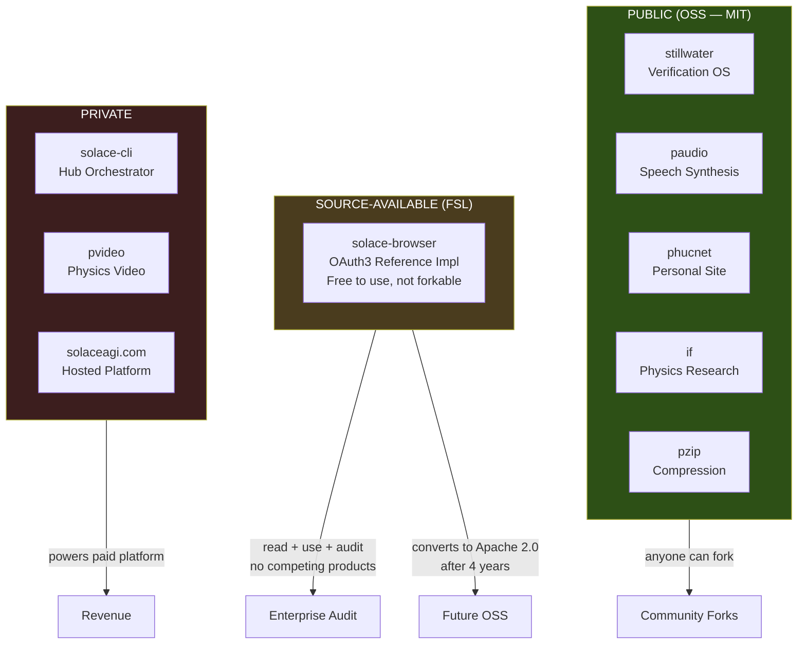
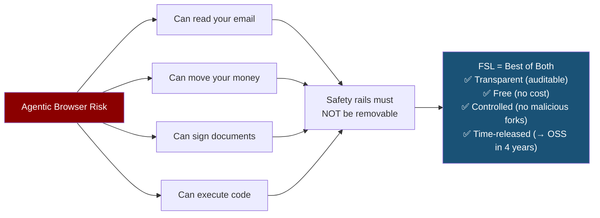
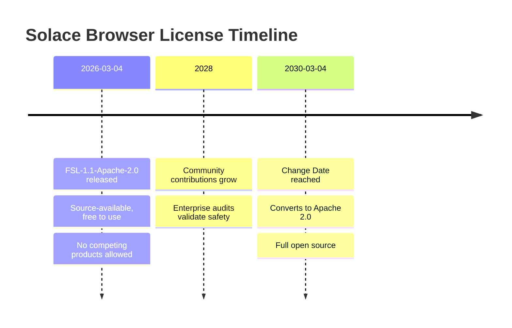

# Diagram 11: Source-Available Licensing Architecture
# Auth: 65537 | Created: 2026-03-04 GLOW 122
# DNA: license(safety) = transparency × control × time_release → trust

## Three-Tier Licensing Model

## Why Three Tiers?

## FSL Lifecycle

