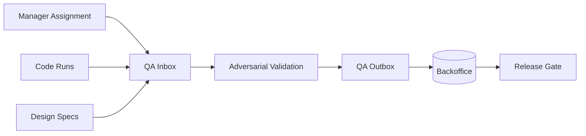

# Data Flow

```mermaid
flowchart LR
    ManagerAssignment[Manager Assignment] --> QAInbox[QA Inbox]
    CoderRuns[Code Runs] --> QAInbox
    DesignSpecs[Design Specs] --> QAInbox
    QAInbox --> Validation[Adversarial Validation]
    Validation --> QAOutbox[QA Outbox]
    QAOutbox --> Backoffice[(Backoffice)]
    Backoffice --> ReleaseGate[Release Gate]
```
