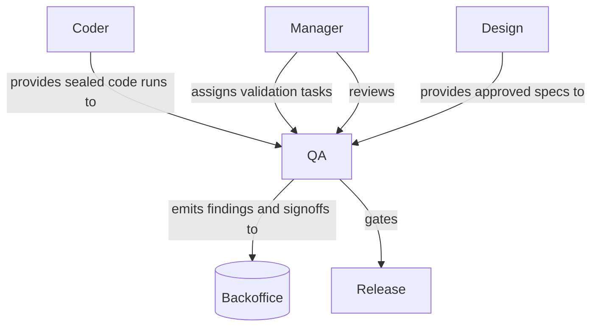

# Partner Contracts

```mermaid
graph TD
    Manager[Manager] -->|assigns validation tasks| QA[QA]
    Coder[Coder] -->|provides sealed code runs to| QA
    Design[Design] -->|provides approved specs to| QA
    QA -->|emits findings and signoffs to| Backoffice[(Backoffice)]
    QA -->|gates| Release[Release]
    Manager -->|reviews| QA
```
