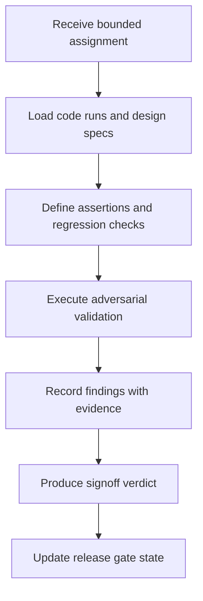

# Workflow

```mermaid
flowchart TD
    Receive[Receive bounded assignment] --> Load[Load code runs and design specs]
    Load --> Assert[Define assertions and regression checks]
    Assert --> Validate[Execute adversarial validation]
    Validate --> Findings[Record findings with evidence]
    Findings --> Signoff[Produce signoff verdict]
    Signoff --> Gate[Update release gate state]
```
