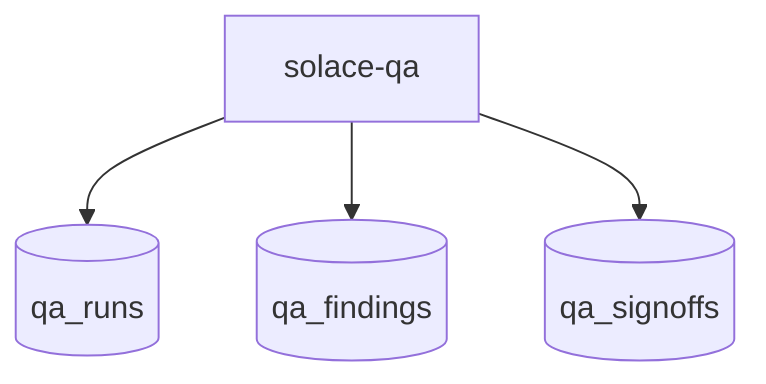
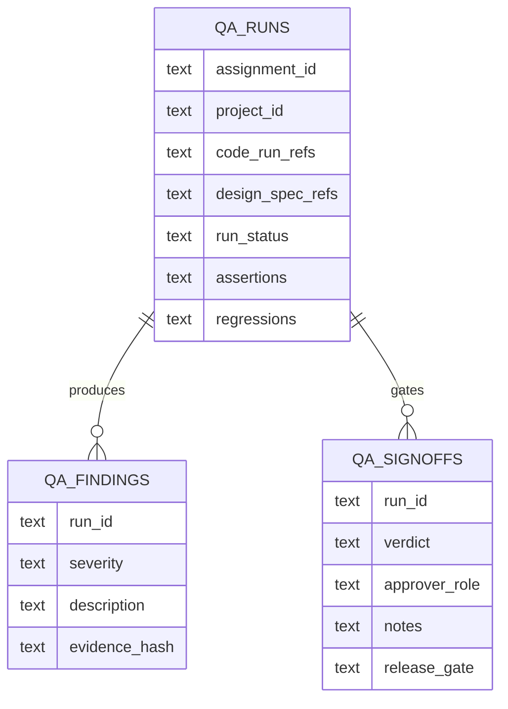

# App: Solace QA

# DNA: `QA-first Solace Dev worker app that receives bounded assignments from the manager with approved design specs and completed code runs, performs adversarial validation, produces findings and signoffs, and gates release readiness.`

## Identity

- **ID**: solace-qa
- **Version**: 1.0.0
- **Domain**: localhost
- **Category**: backoffice
- **Type**: worker-app
- **Visibility**: local-first

## Role Contract

## Backoffice Contract

## Compatibility

- `manifest.yaml` remains the runtime compatibility manifest.
- This Prime Mermaid file is the source of truth for the QA app contract.
