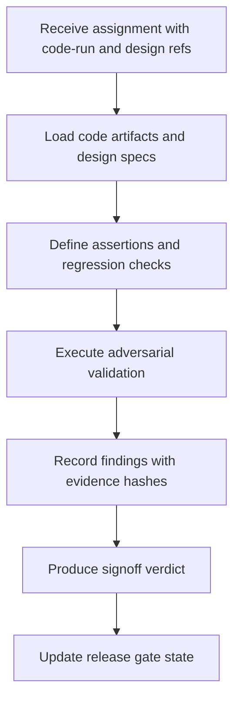

# Solace QA Recipe

```mermaid
flowchart TD
    A[Receive assignment with code-run and design refs] --> B[Load code artifacts and design specs]
    B --> C[Define assertions and regression checks]
    C --> D[Execute adversarial validation]
    D --> E[Record findings with evidence hashes]
    E --> F[Produce signoff verdict]
    F --> G[Update release gate state]
```
