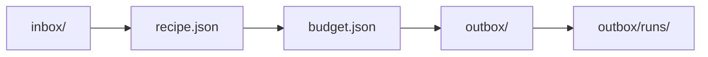

# Data Flow — GitHub Issue Triage

```mermaid
flowchart LR
    INBOX[inbox/] --> RECIPE[recipe.json]
    RECIPE --> BUDGET[budget.json]
    BUDGET --> OUTBOX[outbox/]
    OUTBOX --> RUNS[outbox/runs/]
```
