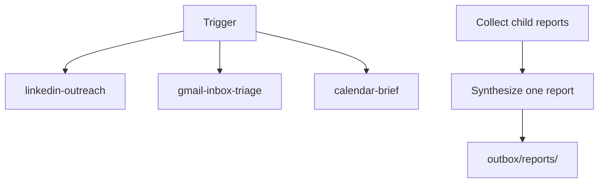

# Workflow — Lead Pipeline

```mermaid
flowchart TD
    TRIGGER[Trigger]
    TRIGGER --> linkedin_outreach[linkedin-outreach]
    TRIGGER --> gmail_inbox_triage[gmail-inbox-triage]
    TRIGGER --> calendar_brief[calendar-brief]
    COLLECT[Collect child reports]
    COLLECT --> SYNTH[Synthesize one report]
    SYNTH --> OUTBOX[outbox/reports/]
```
