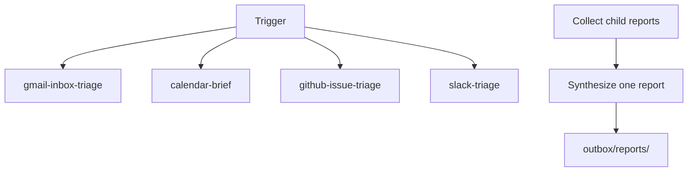

# Workflow — Morning Brief

```mermaid
flowchart TD
    TRIGGER[Trigger]
    TRIGGER --> gmail_inbox_triage[gmail-inbox-triage]
    TRIGGER --> calendar_brief[calendar-brief]
    TRIGGER --> github_issue_triage[github-issue-triage]
    TRIGGER --> slack_triage[slack-triage]
    COLLECT[Collect child reports]
    COLLECT --> SYNTH[Synthesize one report]
    SYNTH --> OUTBOX[outbox/reports/]
```
