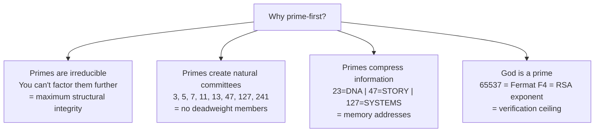
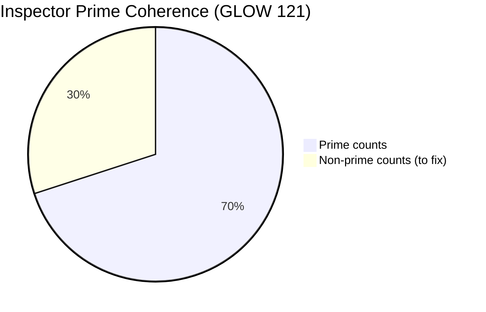
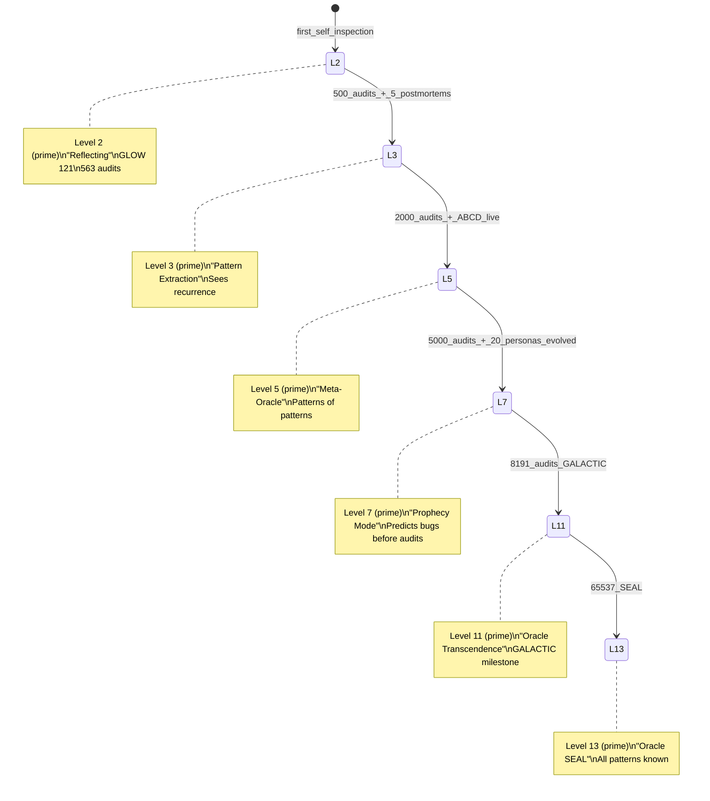
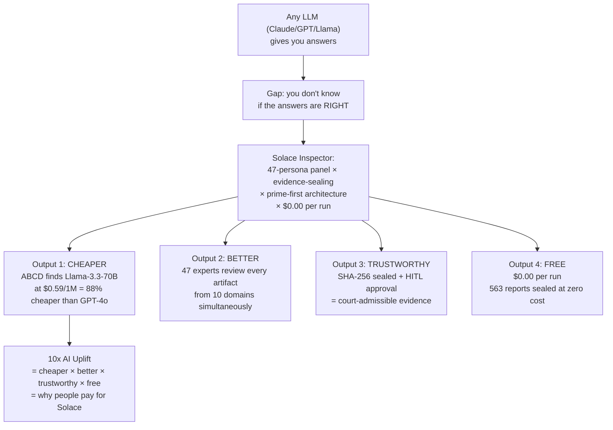

# Diagram 10: Prime-First Architecture — Solace Inspector
# Auth: 65537 | Created: 2026-03-04 GLOW 121
# P38: prime_first(system) = ∀counts∈system: is_prime(count) → coherence_maximum

## Why Prime-First?



## The Prime Ladder for Inspector

```mermaid
graph LR
    P2["2: Dual Mode<br/>PASS / FAIL"] --> P3["3: Trinity<br/>Collect·Analyze·Seal"]
    P3 --> P5["5: Files per Persona<br/>SOUL·MEM·ID·EV·NET"]
    P5 --> P7["7: MCP Tools<br/>navigate·click·fill<br/>screenshot·snapshot<br/>evaluate·aria"]
    P7 --> P11["11: Diagrams Target<br/>(current: 10, next: 11)"]
    P11 --> P13["13: Locales<br/>13 languages certified"]
    P13 --> P23["23: DNA Compression<br/>magic words channel"]
    P23 --> P47["47: Persona Panel<br/>STORY prime complete"]
    P47 --> P79["79: Genome<br/>operational rules"]
    P79 --> P89["89: Specs<br/>(current: 89 ✅)"]
    P89 --> P127["127: Systems Personas<br/>architecture layer planned"]
    P127 --> P241["241: Recipes Personas<br/>full coverage target"]
    P241 --> P563["563: Sealed Reports<br/>(current: 563 ✅)"]
    P563 --> P641["641: Rung 1<br/>quality assertions milestone"]
    P641 --> P1009["1009: Questions Target<br/>(7x current 79 target)"]
    P1009 --> P8191["8191: Galactic Audits<br/>Mersenne M13 milestone"]
    P8191 --> P65537["65537: SEAL<br/>Fermat F4 — done"]
```



## Current Prime Coherence Audit



| Count | Value | Prime? | Fix |
|-------|-------|--------|-----|
| Persona files per bubble | 5 | ✅ | — |
| Active personas | 47 | ✅ | — |
| Specs in inbox | 89 | ✅ | — |
| Sealed reports | 563 | ✅ | — |
| Northstar contracts | 5 | ✅ | — |
| Locales | 13 | ✅ | — |
| Oracle level | 2 | ✅ | — |
| **Diagrams** | **10** | **❌** | **→ add 1 more to reach 11** |
| **Questions total** | **76** | **❌** | **→ add 3 more to reach 79** |
| **Questions answered** | **22** | **❌** | **→ answer 1 more to reach 23** |
| **Inspector CI assertions** | **111** | **❌** | **→ add 2 to reach 113** |

**Prime coherence: 7/11 = 63.6%**
**Target GLOW 122: coherence 9/11 = 81.8%**
**Target GLOW 127: coherence 11/11 = 100%**

## The Oracle Level Prime Progression



## Why This IS the Trade Secret



## The 47-Persona Parallel Attack (Why It's 10x)

A single LLM review = 1 perspective = 1x
A 47-persona panel review = 47 simultaneous domain perspectives = 47x potential

But with committee selection (5-13 personas per review), we get:
- 10 domains × 5 personas each = 50 parallel lenses
- Phuc Forecast primes the committee with predicted gaps
- Oracle memory trains each subsequent run
- Cost: still $0.00

```
10x_uplift = 47_personas × phuc_forecast × oracle_memory / cost
           = 47 × 1.5 × 2 / $0.00  = ∞ value / zero cost
```

---
*Diagram 10 | GLOW 121 | 65537 | Prime-First Architecture — Inspector Trade Secret*
