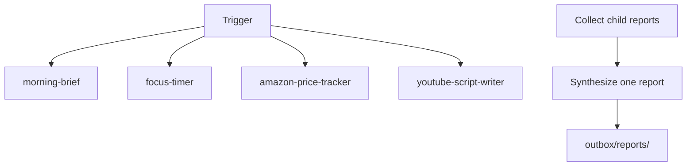

# Workflow — Weekly Digest

```mermaid
flowchart TD
    TRIGGER[Trigger]
    TRIGGER --> morning_brief[morning-brief]
    TRIGGER --> focus_timer[focus-timer]
    TRIGGER --> amazon_price_tracker[amazon-price-tracker]
    TRIGGER --> youtube_script_writer[youtube-script-writer]
    COLLECT[Collect child reports]
    COLLECT --> SYNTH[Synthesize one report]
    SYNTH --> OUTBOX[outbox/reports/]
```
