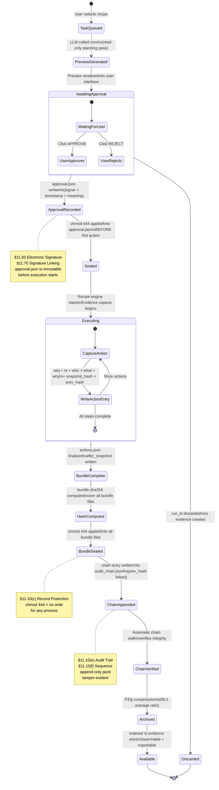
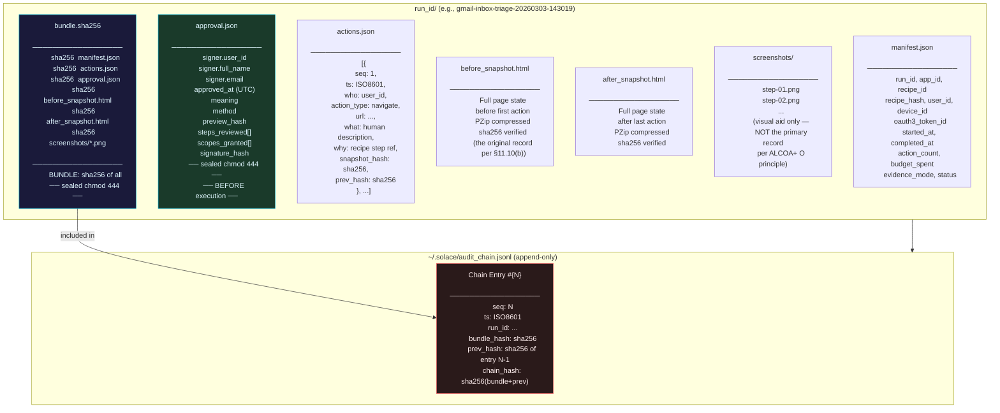
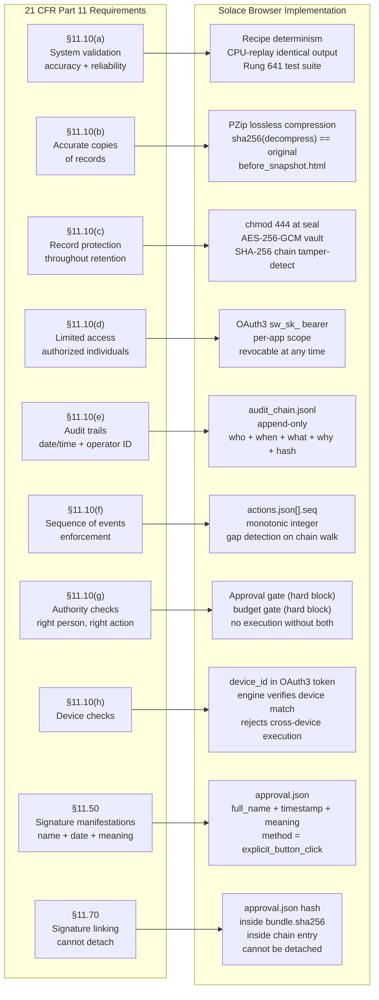
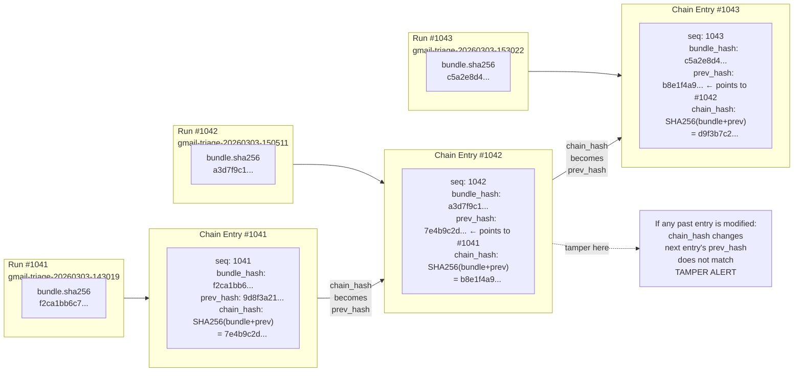

# Diagram 40 — FDA 21 CFR Part 11: Evidence Chain

**ID:** 40-part11-evidence-chain
**Version:** 1.0.0
**Type:** State diagram + compliance reference
**Primary Axiom:** INTEGRITY (evidence is immutable, chained, and sealed before the user has finished clicking)
**Tags:** part11, evidence, hash-chain, compliance, fda, seal, approval, audit, alcoa

---

## Purpose

Show the complete lifecycle of a Solace Browser agent action from user
intent to sealed, hash-chained, Part 11 compliant evidence. This diagram
is the canonical reference for auditors, enterprise buyers, and the
evidence-reviewer agent. It makes the compliance claim concrete: you can
trace every state transition to a specific file written to disk.

---

## Diagram 1: Evidence Chain State Machine (Primary)

---

## Diagram 2: Evidence Files Produced Per Run

---

## Diagram 3: 21 CFR Part 11 Section → Implementation

---

## Diagram 4: Hash Chain Structure (Tamper Evidence)

---

## Compliance Summary Table

| Requirement | File | Verification Command |
|-------------|------|---------------------|
| §11.10(a) validation | `test_suite/rung_641.py` | `pytest test_suite/ -k part11` |
| §11.10(b) accurate copies | `before_snapshot.html` (PZip) | `python3 -m solace_browser.audit --verify-pzip {run_id}` |
| §11.10(c) record protection | `chmod 444` on all files | `ls -la ~/.solace/evidence/{run_id}/` |
| §11.10(d) limited access | `approval.json.oauth3_token_id` | `python3 -m solace_browser.auth --check-token` |
| §11.10(e) audit trail | `audit_chain.jsonl` | `python3 -m solace_browser.audit --verify-chain` |
| §11.10(f) sequence | `actions.json[].seq` | `python3 -m solace_browser.audit --verify-sequence {run_id}` |
| §11.10(g) authority checks | `approval.json` + gate code | `python3 -m solace_browser.audit --verify-approval {run_id}` |
| §11.10(h) device checks | `approval.json.device_id` | `python3 -m solace_browser.audit --verify-device {run_id}` |
| §11.50 signature | `approval.json` | `python3 -m solace_browser.audit --show-signature {run_id}` |
| §11.70 signature linking | `bundle.sha256` | `python3 -m solace_browser.audit --verify-bundle {run_id}` |

---

## ALCOA+ Quick Reference

| ALCOA+ | Evidence File | Field |
|--------|--------------|-------|
| Attributable | `actions.json` | `.who` (user_id + device_id) |
| Legible | `before_snapshot.html` | Full HTML, machine-readable forever |
| Contemporaneous | `actions.json` | `.ts` (captured at execution) |
| Original | `before_snapshot.html` | Full HTML, not screenshot |
| Accurate | `actions.json` | `.snapshot_hash` (state at each step) |
| Complete | `manifest.json` | All 14 required fields present |
| Consistent | `audit_chain.jsonl` | `.chain_hash` chain walk |
| Enduring | `bundle.pzip` | Deterministic; `chmod 444` |
| Available | `~/.solace/evidence/` | Indexed; lookup < 5 seconds |

---

## Related Artifacts

- `papers/40-part11-compliance-selfcert.md` — Full compliance paper + self-cert template
- `papers/sop-01-evidence-audit.md` — Evidence capture and audit trail SOP
- `papers/06-part11-evidence-browser.md` — ALCOA+ detail (canonical)
- `data/default/diagrams/part11-alcoa-mapping.md` — ALCOA+ to component mapping
- `data/default/diagrams/evidence-pipeline.md` — Evidence pipeline components
- `data/default/skills/browser-evidence.md` — Evidence skill implementation
