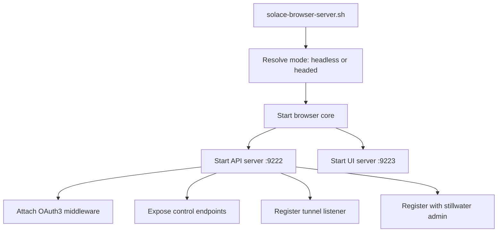
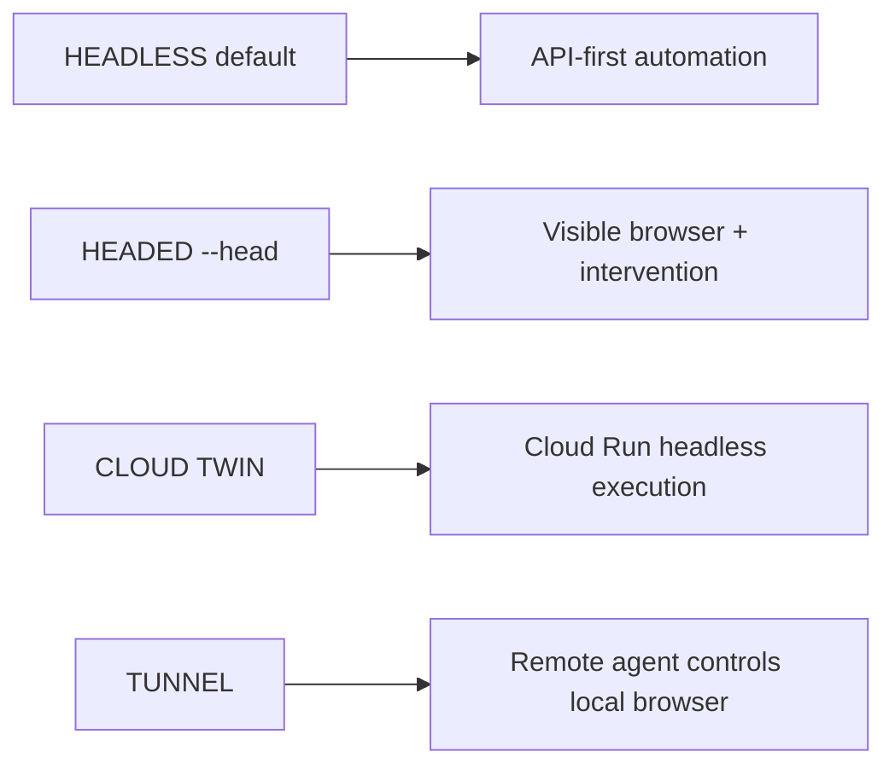
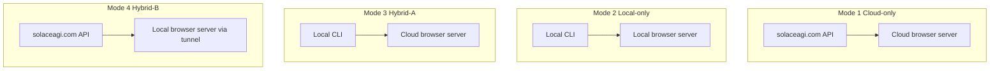

# Diagram 70: Browser Server Webservice Control Architecture

## Diagram 1: Startup Flow

## Diagram 2: Control Modes

## Diagram 3: Integration with 4-mode Self-Service

## Invariants

- API and UI are separate processes (`9222` API, `9223` UI).
- OAuth3 scope checks gate all privileged browser actions.
- Tunnels are explicit, revocable, and auditable.
- Headed/headless mode is selected at startup and visible via status API.
