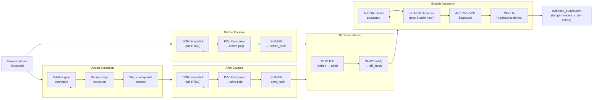
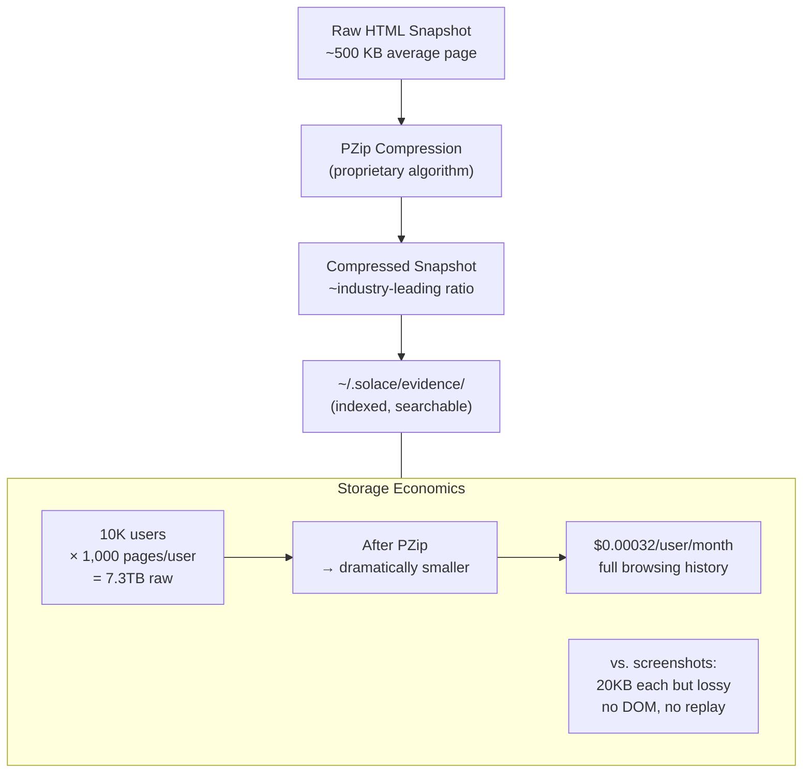
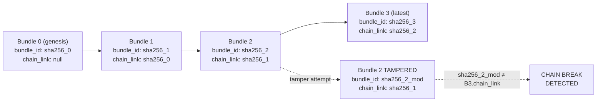
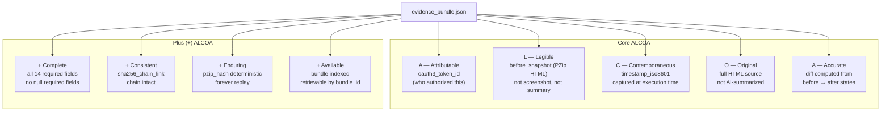
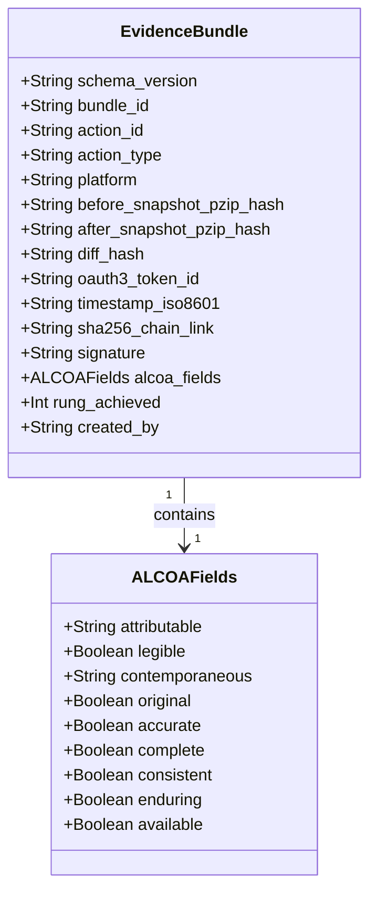

# Diagram: Evidence Pipeline

**ID:** evidence-pipeline
**Version:** 1.0.0
**Type:** Pipeline diagram + data flow
**Primary Axiom:** INTEGRITY (evidence-only claims; every action proves what happened)
**Tags:** evidence, pzip, sha256, alcoa, pipeline, integrity, audit, part11, chain

---

## Purpose

The evidence pipeline is the compliance backbone of SolaceBrowser. Every browser action flows through this pipeline, producing a tamper-evident bundle that satisfies 21 CFR Part 11 (ALCOA+). The pipeline captures before and after DOM states, computes a diff, compresses with PZip, signs with AES-256-GCM, and links to the SHA256 chain.

---

## Diagram: Primary Pipeline

---

## Diagram: PZip Compression Economics

---

## Diagram: SHA256 Hash Chain

---

## Diagram: ALCOA+ Field Mapping

---

## Diagram: Evidence Bundle Schema

---

## Pipeline Invariants

| Invariant | Description | Consequence if violated |
|-----------|-------------|------------------------|
| Before snapshot required | Before state captured BEFORE action executes | ACTION_WITHOUT_EVIDENCE → BLOCKED |
| After snapshot required | After state captured AFTER action completes | EVIDENCE_TAMPERED → BLOCKED |
| Diff non-null for state-changing actions | State-changing actions must produce non-empty diff | DIFF_SKIPPED → BLOCKED |
| PZip required for all snapshots | Raw HTML never stored uncompressed | PZIP_MISSING → BLOCKED |
| SHA256 chain must be intact | Every bundle links to previous | CHAIN_BROKEN → BLOCKED |
| Signature required | Every bundle signed with AES-256-GCM | UNSIGNED_BUNDLE → BLOCKED |
| ALCOA+ fields required | All 9 dimensions populated | EVIDENCE_INCOMPLETE → BLOCKED |
| Contemporaneous timestamps | Timestamp within 30 seconds of action | RETROACTIVE_EVIDENCE → BLOCKED |

---

## Notes

### Why PZip (Not GZIP or ZSTD)?

PZip is a deterministic compression engine with industry-leading ratios on browser history data. Two properties are essential for evidence pipelines:

1. **Deterministic**: same input always produces same output → pzip_hash is reproducible and verifiable
2. **High ratio**: makes forever-retention economically viable at $0.00032/user/month

The determinism property is what makes PZip a compliance enabler: the +Enduring ALCOA+ principle requires that evidence is reproducible indefinitely. With PZip, the sha256(pzip_hash) proves the original snapshot content forever.

### Why Full HTML (Not Screenshots)?

21 CFR Part 11 "Original" principle requires the original record — not a copy or summary. Screenshots are lossy (fonts, layouts, dynamic content), not selectable (text not machine-readable), and not replayable (cannot re-execute against a screenshot). Full HTML snapshots satisfy all three requirements.

### SHA256 Chain vs. Blockchain

The SHA256 chain in SolaceBrowser is a forward-linked hash chain — each bundle's ID includes the previous bundle's hash. This is the same principle used in certificate transparency logs and append-only audit systems. It is simpler and faster than a blockchain, with equivalent tamper detection for single-party audit trails. The chain is validated by the Evidence Reviewer agent.

---

## Related Artifacts

- `data/default/skills/browser-evidence.md` — full evidence skill specification
- `data/default/swarms/evidence-reviewer.md` — evidence review agent
- `data/default/recipes/recipe.evidence-review.md` — Part 11 review recipe
- `data/default/recipes/recipe.browser-snapshot-audit.md` — snapshot store audit recipe
- `data/default/diagrams/part11-alcoa-mapping.md` — detailed ALCOA+ compliance mapping
