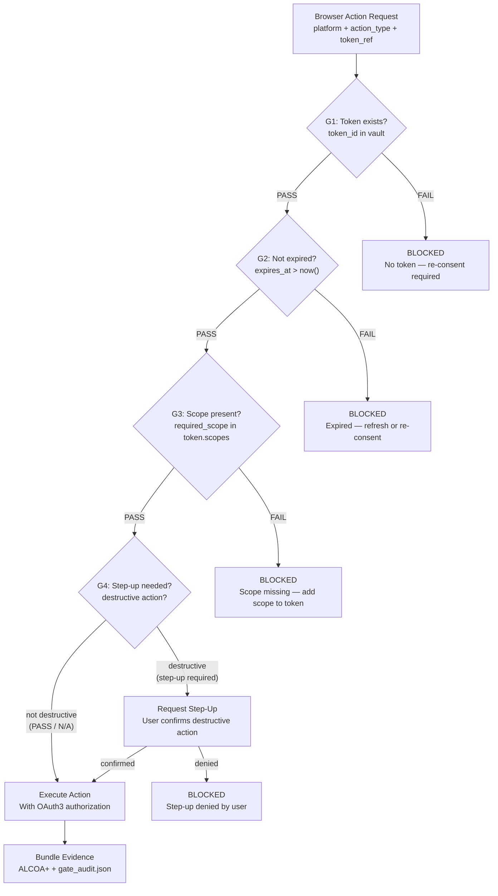
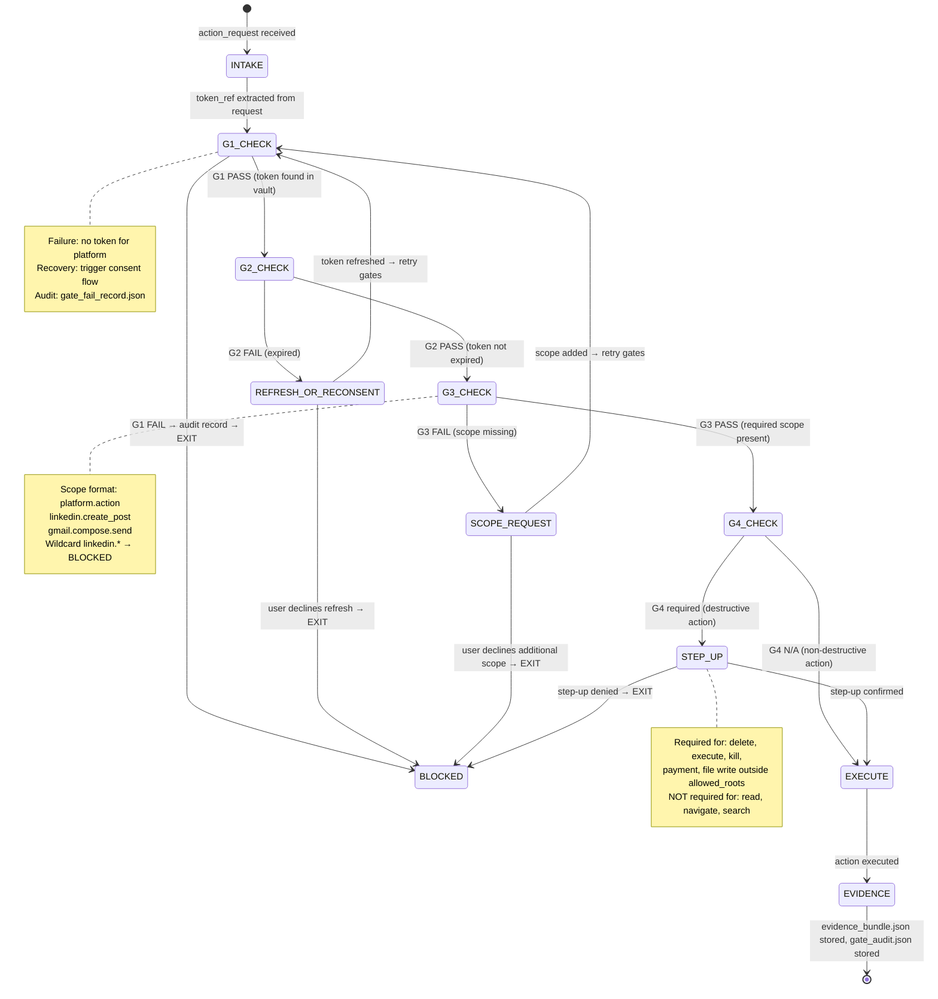
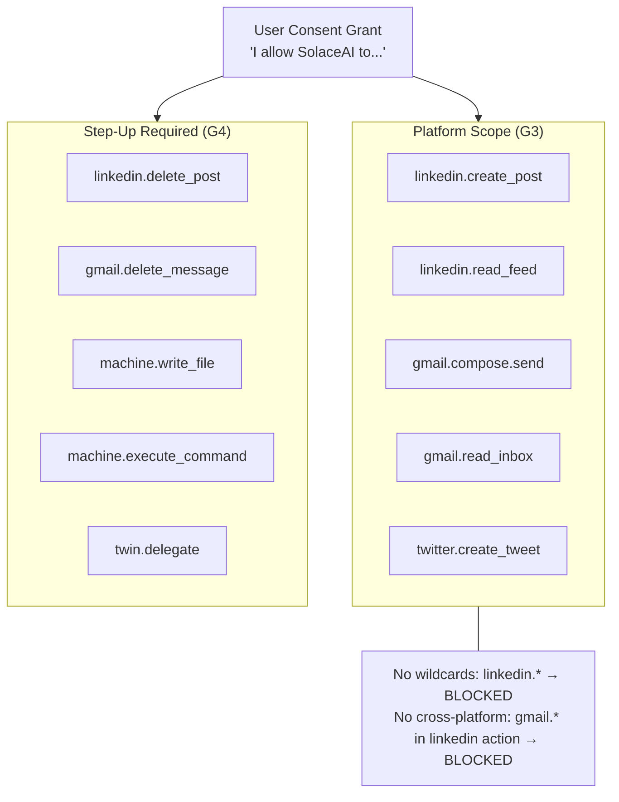
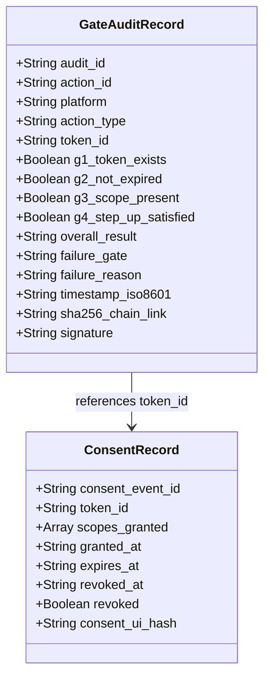

# Diagram: OAuth3 Enforcement Flow

**ID:** oauth3-enforcement-flow
**Version:** 1.0.0
**Type:** Flow diagram + state machine
**Primary Axiom:** HIERARCHY (gates are a strict precedence chain)
**Tags:** oauth3, scope, consent, step-up, enforcement, hierarchy, audit

---

## Purpose

The OAuth3 enforcement flow defines the exact sequence of checks that every browser action must pass before execution. It is a 4-gate cascade with strict precedence: later gates are only reached if earlier gates pass. Any gate failure produces a BLOCKED state and an audit record. There is no fail-open path.

---

## Diagram: 4-Gate Cascade (Primary)

---

## Diagram: Gate State Machine

---

## Diagram: Scope Hierarchy

---

## Diagram: Audit Record Schema

---

## Enforcement Rules Summary

| Rule | Description | Consequence |
|------|-------------|------------|
| Gate order | G1 → G2 → G3 → G4 strictly in order | Later gate cannot run before earlier gate |
| No gate skip | All 4 gates run every time | GATE_SKIP → BLOCKED |
| Fail closed | Any gate failure = BLOCKED | No fail-open path |
| Scope exact match | Scope must be exact: no wildcards, no pattern matching | Wildcard → G3 FAIL |
| Step-up for destructive | Delete, execute, payment, file write → G4 step-up | Step-up bypass → BLOCKED |
| Audit record | Every gate check (pass or fail) produces audit record | EVIDENCE_SKIP → BLOCKED |
| Revocation real-time | Token revocation propagates within 60 seconds | Revoked token → G1 FAIL |

---

## Notes

### Why 4 Gates (Not 1)?

A single "authorized?" check fails because authorization is multi-dimensional:
1. **Token existence** (G1) and **expiry** (G2) are temporal — they change independently of the action.
2. **Scope** (G3) is semantic — the same token may authorize some actions but not others.
3. **Step-up** (G4) is contextual — the same scope may require additional confirmation for destructive variants.

Combining them into one check would require a complex, fragile authorization function. The 4-gate cascade is simple, auditable, and each gate has a clear single responsibility.

### Why Fail Closed?

A fail-open gate means "when in doubt, allow." For AI browser delegation, fail-open is unacceptable: it means a user's accounts could be accessed, modified, or delegated without provable consent. The entire value proposition of SolaceBrowser is the consent guarantee. Fail-open destroys it.

### Scope Granularity

Scopes are formatted as `platform.action`:
- `linkedin.create_post` — NOT `linkedin.write`
- `gmail.compose.send` — NOT `gmail.*`

Granular scopes allow users to understand exactly what they are consenting to. "Allow SolaceAI to create posts on LinkedIn" is comprehensible. "Allow SolaceAI full LinkedIn access" is not.

---

## Related Artifacts

- `data/default/skills/browser-oauth3-gate.md` — full gate implementation spec
- `data/default/swarms/oauth3-auditor.md` — compliance auditor for gate results
- `data/default/recipes/recipe.oauth3-consent-flow.md` — full consent lifecycle
- `combos/oauth3-recipe-execute.md` — gate integrated into execution combo
