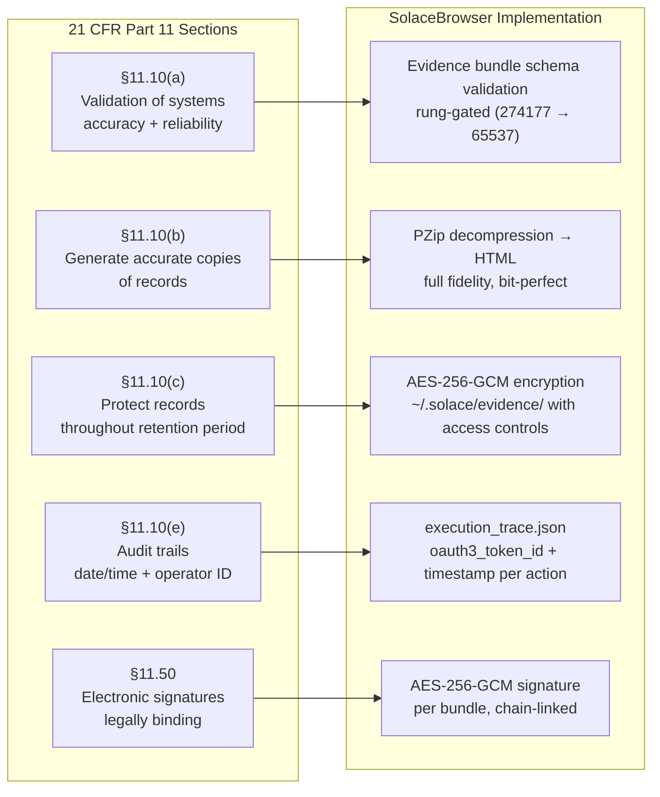
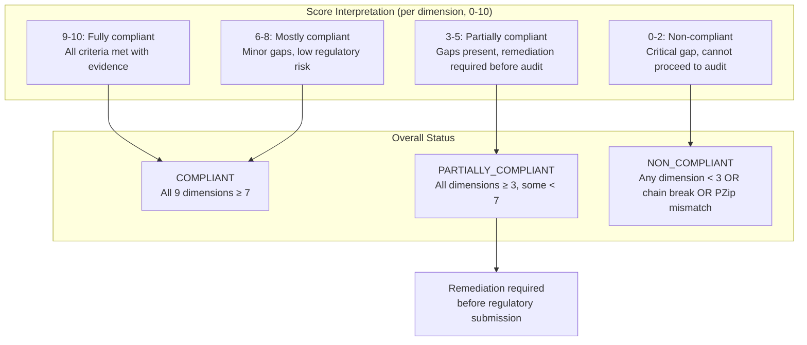

# Diagram: Part 11 ALCOA+ Mapping

**ID:** part11-alcoa-mapping
**Version:** 1.0.0
**Type:** Compliance mapping diagram
**Primary Axiom:** INTEGRITY (evidence-only claims; ALCOA+ is the standard)
**Tags:** part11, alcoa, compliance, fda, integrity, evidence, audit, healthcare, regulation

---

## Purpose

Maps every ALCOA+ data integrity principle to its specific implementation in SolaceBrowser's architecture. This diagram is the compliance reference for regulatory auditors, enterprise customers, and the evidence-reviewer agent. It shows exactly which system component satisfies which ALCOA+ requirement and how each requirement is verified.

---

## Diagram: ALCOA+ Principle → Component Mapping

```mermaid
flowchart TD
    subgraph ALCOA_CORE["Core ALCOA (5 principles)"]
        A["A — Attributable\n'Who did what, and when?'"]
        L["L — Legible\n'Is the record readable and permanent?'"]
        C["C — Contemporaneous\n'Was the record created at the time of action?'"]
        O["O — Original\n'Is this the original record, not a copy or summary?'"]
        AC["A — Accurate\n'Does the record reflect what actually happened?'"]
    end

    subgraph ALCOA_PLUS["Plus ALCOA (4 principles)"]
        CO["+ Complete\n'Is the entire record there?'"]
        CN["+ Consistent\n'Is the record consistent across time?'"]
        EN["+ Enduring\n'Can this record be retrieved forever?'"]
        AV["+ Available\n'Is the record accessible when needed?'"]
    end

    subgraph IMPLEMENTATION["SolaceBrowser Implementation"]
        IMP_A["oauth3_token_id\nidentifies agent + user + consent event"]
        IMP_L["PZip HTML snapshot\nfull page, machine-readable, deterministic"]
        IMP_C["timestamp_iso8601\ncaptured at execution, not reconstructed"]
        IMP_O["before_snapshot (full HTML)\nnot screenshot, not AI summary"]
        IMP_AC["diff (before → after)\ncomputed from actual state change"]
        IMP_CO["14-field schema validation\nall fields required, no null defaults"]
        IMP_CN["sha256_chain_link\nhash chain links all bundles"]
        IMP_EN["PZip deterministic compression\nforever replay at $0.00032/user/mo"]
        IMP_AV["Indexed evidence store\n~/.solace/evidence/ + Kanban UI"]
    end

    A --> IMP_A
    L --> IMP_L
    C --> IMP_C
    O --> IMP_O
    AC --> IMP_AC
    CO --> IMP_CO
    CN --> IMP_CN
    EN --> IMP_EN
    AV --> IMP_AV
```



---

## Diagram: 21 CFR Part 11 Section Mapping



---

## Compliance Matrix

| ALCOA+ | SolaceBrowser Field | Verification Method | Gap if Absent |
|--------|-------------------|---------------------|--------------|
| A — Attributable | `oauth3_token_id` | Resolve token_id to consent record | HIGH — no audit trail |
| L — Legible | `before_snapshot` (PZip HTML) | PZip decompress → HTML parses | HIGH — not legible |
| C — Contemporaneous | `timestamp_iso8601` | |timestamp - action| < 30s | HIGH — backdated record |
| O — Original | before_snapshot (HTML, not screenshot) | HTML length > 1000 bytes, DOCTYPE present | CRITICAL — not original |
| A — Accurate | `diff` (computed before→after) | Diff non-null for state-changing action | HIGH — accuracy unverifiable |
| +Complete | 14-field schema validation | Schema validation passes, no nulls | HIGH — incomplete record |
| +Consistent | `sha256_chain_link` | Chain walk: each link matches prev bundle_id | CRITICAL — chain break |
| +Enduring | `pzip_hash` (deterministic) | Recompute pzip_hash from source → matches | CRITICAL — not reproducible |
| +Available | Evidence store index | bundle_id lookup < 5 seconds | MED — accessible in practice |

---

## Diagram: Verification Levels per Regulatory Context

```mermaid
quadrantChart
    title Regulatory Context vs. Rung Required
    x-axis Low Stakes --> High Stakes
    y-axis Low Rigor --> High Rigor
    quadrant-1 Required: rung 65537 + external audit
    quadrant-2 Required: rung 274177 + evidence review
    quadrant-3 Required: rung 641
    quadrant-4 Consider rung 274177
    Internal testing: [0.2, 0.2]
    Personal use: [0.3, 0.3]
    Team automation: [0.5, 0.4]
    Healthcare audit: [0.85, 0.85]
    Clinical trial: [0.95, 0.95]
    Financial compliance: [0.80, 0.80]
    HIPAA PHI: [0.90, 0.90]
```

---

## Diagram: ALCOA+ Score Interpretation



---

## ALCOA+ in Practice: Comparison Table

| Capability | Screenshot-based tools | SolaceBrowser |
|-----------|----------------------|--------------|
| **A — Attributable** | No token; no identity record | OAuth3 token_id per action |
| **L — Legible** | Pixel image; not machine-readable | Full HTML; parseable, searchable |
| **C — Contemporaneous** | Timestamp often added post-hoc | Captured at execution via timestamp_iso8601 |
| **O — Original** | Screenshot is lossy rendering | Full HTML — the original source |
| **A — Accurate** | "Screenshot shows result" (claim) | Computed diff before→after (proof) |
| **+ Complete** | No standard schema | 14-field validated schema |
| **+ Consistent** | No chain | SHA256 hash chain |
| **+ Enduring** | PNG file (lossy, not replayable) | PZip HTML (lossless, replayable) |
| **+ Available** | Varies; often not indexed | Indexed; Kanban UI; bundle_id lookup |

The table above illustrates why full HTML evidence captures are required for compliance — screenshot-based approaches fail multiple ALCOA+ dimensions by design.

---

## Notes

### Why Part 11?

SolaceBrowser was designed from the start to serve users who operate in regulated industries: clinical research coordinators, financial auditors, compliance officers, HIPAA-covered entities. These users need to prove that their AI agent did exactly what they say it did. Screenshots and prose claims are not evidence in regulated contexts.

The CRIO founder (Phuc Truong, Harvard '98) brings direct domain expertise: clinical research requires ALCOA+ data integrity for all trial records. The same standard applies to any AI agent that takes actions in regulated systems.

### ALCOA+ is Not a Checkbox

ALCOA+ is a framework for thinking about data quality, not a compliance checkbox. The evidence-reviewer agent applies it as a continuous quality gate — not just at submission time but throughout the evidence pipeline. Every evidence bundle that fails ALCOA+ is flagged before it reaches a human auditor.

### PZip as Evidence Infrastructure

PZip serves two roles in the ALCOA+ context:
1. **+Enduring**: deterministic compression means the hash is reproducible forever. The original content can always be recovered from the hash.
2. **+Available**: aggressive compression makes storing complete HTML history economically viable at the per-user scale that enables the Kanban history feature.

Without PZip, the "forever retention" promise would be prohibitively expensive. With it, it is a competitive advantage.

---

## Related Artifacts

- `data/default/skills/browser-evidence.md` — evidence skill with full ALCOA+ implementation
- `data/default/swarms/evidence-reviewer.md` — evidence review agent
- `data/default/recipes/recipe.evidence-review.md` — Part 11 review recipe
- `data/default/recipes/recipe.browser-snapshot-audit.md` — snapshot store audit
- `data/default/diagrams/evidence-pipeline.md` — evidence pipeline components
- `NORTHSTAR.md` — section on FDA 21 CFR Part 11 ALCOA+ mapping
