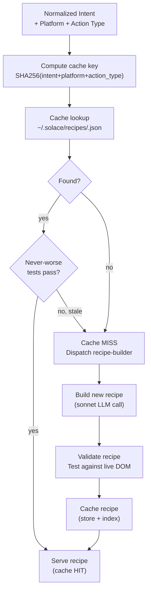
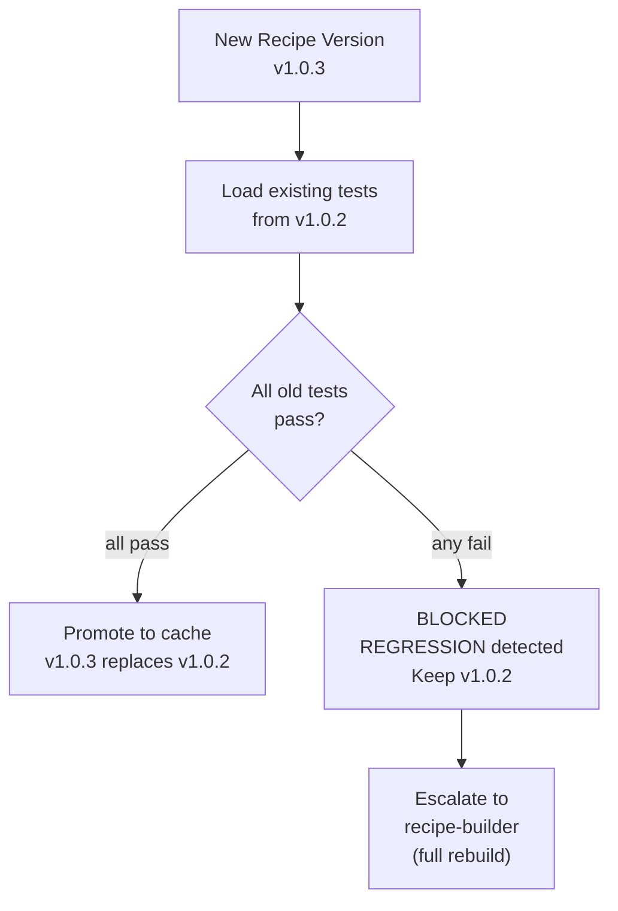
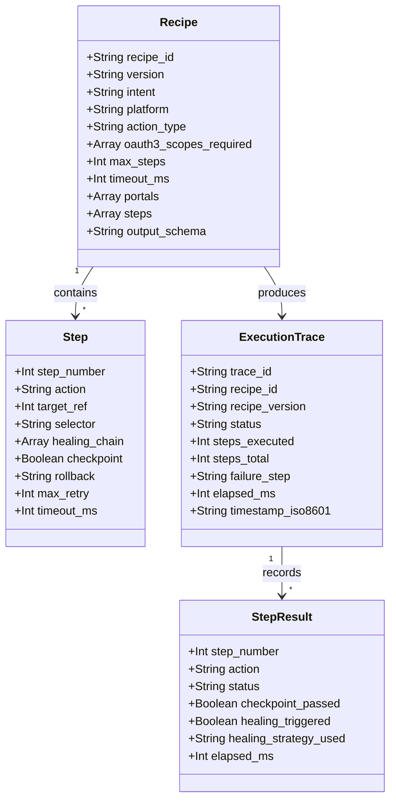

# Diagram: Recipe Engine FSM

**ID:** recipe-engine-fsm
**Version:** 1.0.0
**Type:** Finite State Machine diagram
**Primary Axiom:** CLOSURE (every recipe execution has a halting criterion)
**Tags:** recipe, cache, fsm, closure, never-worse, versioning, hit-rate, determinism

---

## Purpose

The Recipe Engine FSM defines the exact state transitions for recipe lookup, execution, and caching. It is the core of SolaceBrowser's economic model: by serving 70%+ of tasks from cache (cache hit), the engine eliminates the majority of LLM cost. Every transition is deterministic. Every terminal state produces an artifact. CLOSURE is enforced via max_steps and timeout.

---

## Diagram: Primary FSM (Intent to Execution)

```mermaid
stateDiagram-v2
    direction LR
    [*] --> INTAKE : intent + platform + action_type received

    INTAKE --> INTENT_CLASSIFY : inputs validated
    INTAKE --> EXIT_NEED_INFO : missing required inputs

    INTENT_CLASSIFY --> CACHE_LOOKUP : intent normalized → SHA256 key computed
    INTENT_CLASSIFY --> EXIT_NEED_INFO : intent classification fails (ambiguous)

    CACHE_LOOKUP --> HIT_VERIFY : cache entry found (SHA256 match)
    CACHE_LOOKUP --> CACHE_MISS : no entry found

    HIT_VERIFY --> EXECUTE : recipe verified (never-worse + tests current)
    HIT_VERIFY --> CACHE_MISS : recipe stale or broken

    CACHE_MISS --> LLM_GENERATE : dispatch recipe-builder swarm
    LLM_GENERATE --> VALIDATE : recipe.json generated by LLM
    VALIDATE --> EXECUTE : validation passes (all portals found, steps valid)
    VALIDATE --> LLM_GENERATE : validation fails → regenerate (max 3 attempts)
    VALIDATE --> EXIT_BLOCKED : max retries exceeded

    EXECUTE --> CHECKPOINT : first step executed
    CHECKPOINT --> EXECUTE : checkpoint passed → continue
    CHECKPOINT --> ROLLBACK : checkpoint failed → undo
    ROLLBACK --> EXIT_BLOCKED : action undone, user notified

    EXECUTE --> EVIDENCE : all steps completed (within max_steps + timeout)
    EXECUTE --> EXIT_BLOCKED : max_steps exceeded → UNBOUNDED_EXECUTION blocked

    EVIDENCE --> STORE : evidence_bundle.json signed + chain-linked
    STORE --> EXIT_PASS : recipe cached, PM triplet stored

    EXIT_PASS --> [*]
    EXIT_NEED_INFO --> [*]
    EXIT_BLOCKED --> [*]

    note right of INTENT_CLASSIFY
        SHA256 cache key:
        sha256(normalize(intent) + platform + action_type)
        Normalization: lowercase, trim, canonical verb form
    end note

    note right of CACHE_LOOKUP
        Cache store: ~/.solace/recipes/<sha256>.json
        Freshness: no expiry (recipes are version-controlled)
        Staleness: determined by never-worse test run
    end note

    note right of EXECUTE
        CLOSURE enforcement:
        max_steps: 50 (default, configurable)
        timeout_ms: 30000 (default, configurable)
        Both limits hard — no override without rung 65537
    end note
```

---

## Diagram: Cache Hit vs. Miss Decision Tree

---

## Diagram: Recipe Versioning + Never-Worse Gate

---

## Diagram: Execution Trace Structure

---

## State Transition Table

| From State | Event | To State | Artifact Produced |
|-----------|-------|----------|------------------|
| INTAKE | inputs valid | INTENT_CLASSIFY | — |
| INTAKE | inputs missing | EXIT_NEED_INFO | need_info.json |
| INTENT_CLASSIFY | normalize success | CACHE_LOOKUP | classified_intent.json |
| CACHE_LOOKUP | SHA256 match | HIT_VERIFY | — |
| CACHE_LOOKUP | no match | CACHE_MISS | — |
| HIT_VERIFY | tests pass | EXECUTE | recipe.json (served) |
| HIT_VERIFY | tests fail | CACHE_MISS | stale_record.json |
| CACHE_MISS | swarm dispatched | LLM_GENERATE | — |
| LLM_GENERATE | recipe generated | VALIDATE | candidate_recipe.json |
| VALIDATE | portals found, steps valid | EXECUTE | recipe.json (new) |
| VALIDATE | validation fails | LLM_GENERATE (retry) | — |
| EXECUTE | all steps complete | EVIDENCE | execution_trace.json |
| EXECUTE | max_steps exceeded | EXIT_BLOCKED | blocked_record.json |
| CHECKPOINT | passed | EXECUTE (continue) | checkpoint_record.json |
| CHECKPOINT | failed | ROLLBACK | rollback_record.json |
| EVIDENCE | bundle signed | STORE | evidence_bundle.json |
| STORE | recipe cached | EXIT_PASS | cache_entry.json |

---

## Notes

### Why SHA256 Cache Key?

Content-addressed caching ensures:
1. Same intent on same platform always hits the same cache entry
2. Slight wording variation in user intent (after normalization) → same key
3. Cache entries are platform-specific: "search for jobs" on LinkedIn ≠ "search for jobs" on indeed.com
4. Cache key is deterministic, reproducible, and verifiable

### CLOSURE Enforcement

Every recipe must declare `max_steps` and `timeout_ms` before execution begins. These are hard limits — the execution engine enforces them without exception. An agent that produces a recipe without these fields has produced a SCOPELESS_RECIPE (forbidden state).

The rationale: unbounded automation loops are both expensive and dangerous. A recipe that could run forever (even by accident) would violate CLOSURE and potentially consume unlimited compute or take unlimited browser actions.

### Never-Worse as Economic Moat

The never-worse gate is not just a quality gate — it is the recipe library's durability mechanism. Every recipe upgrade must be an improvement or at minimum neutral. This compound improvement over time means the recipe library only gets better. It cannot degrade unless explicitly reset. This is the dojo metaphor: every practice session improves the kata.

---

## Related Artifacts

- `data/default/skills/browser-recipe-engine.md` — full recipe engine skill
- `data/default/swarms/recipe-builder.md` — recipe builder agent
- `data/default/swarms/selector-healer.md` — healing for cache-miss scenarios from DOM drift
- `data/default/recipes/recipe.recipe-builder.md` — recipe to build new recipes
- `data/default/diagrams/browser-multi-layer-architecture.md` — this FSM sits in Layer 3
