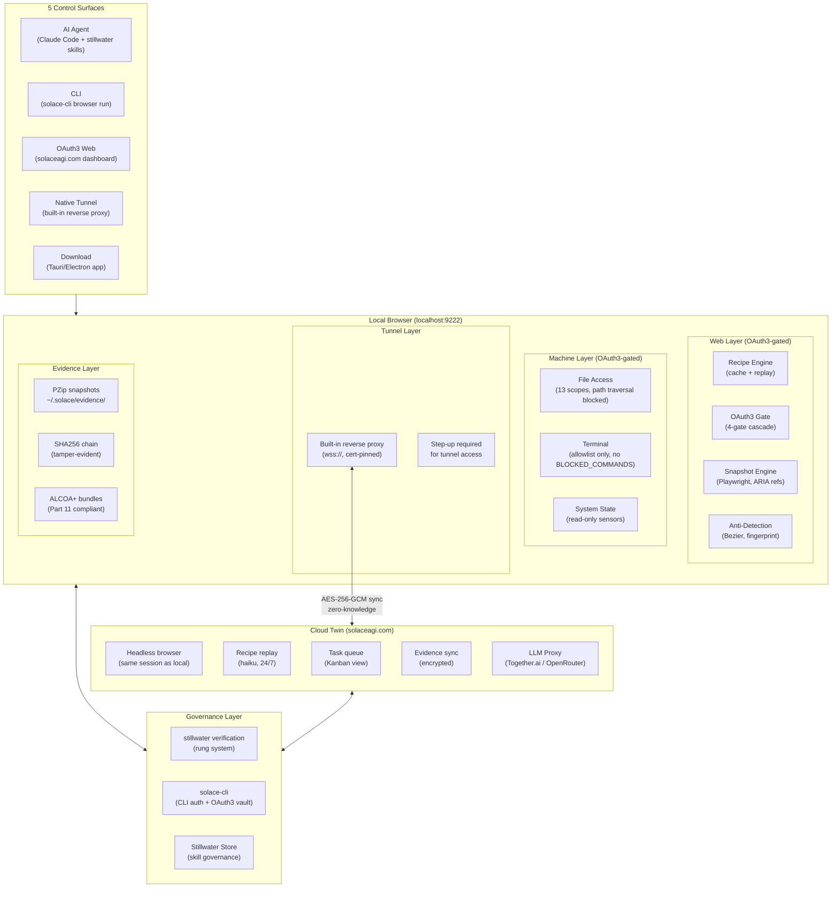
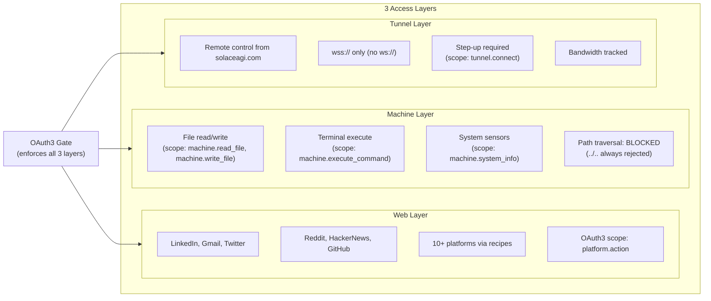
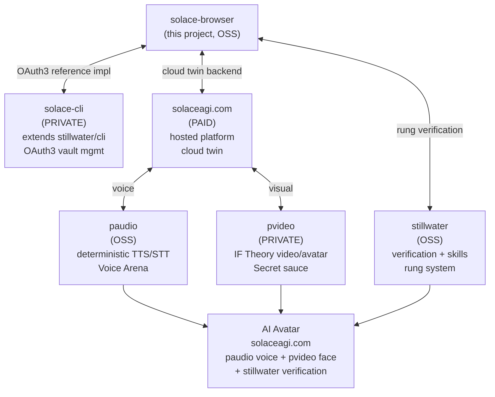
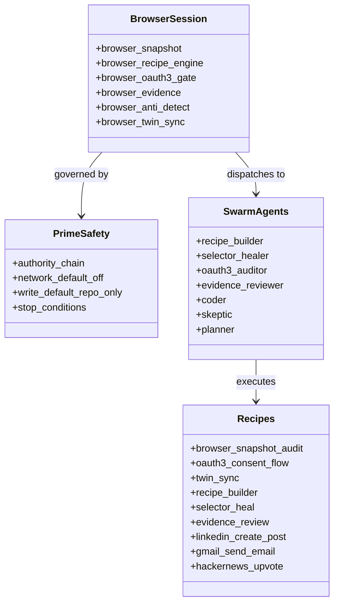
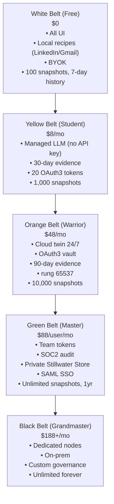
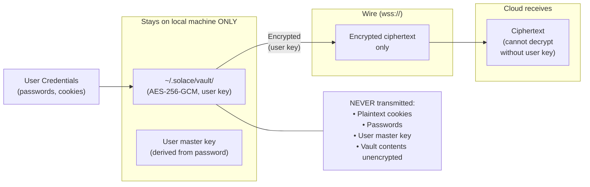

# Diagram: SolaceBrowser Full Stack

**ID:** solace-browser-full-stack
**Version:** 1.0.0
**Type:** Architecture diagram (full system)
**Primary Axiom:** NORTHSTAR (Universal Portal)
**Tags:** architecture, full-stack, local, cloud, solaceagi, oauth3, recipes, evidence, twin, machine

---

## Purpose

The full-stack diagram shows the complete SolaceBrowser system from the user's intent to the cloud, including all 5 control surfaces, the local browser layers, the cloud twin, the 3-layer access model (web + machine + tunnel), and the integration with solaceagi.com.

---

## Diagram: Complete System View

---

## Diagram: 3-Layer Access Model

---

## Diagram: Integration with Phuc Ecosystem

---

## Diagram: Skill Stack (Full)

---

## Diagram: Belt Progression + Feature Unlock

---

## Diagram: Data Flow (Credential Security)

---

## Notes

### Why This Stack Wins

The full stack is designed around one principle: the user's data is theirs, and AI agents operate as their authorized delegates — not as independent actors with their own credentials.

Seven structural moats (all competitors have 0–2):
1. Recipe system → 70% cache hit → 3x cheaper COGS
2. PrimeWiki → domain-aware navigation
3. Twin architecture → local + cloud delegation
4. Anti-detection → human-like browser behavior
5. Stillwater verification → evidence bundle per task
6. OAuth3 protocol → scoped consent, revocation, audit trail
7. Machine layer → OAuth3-gated file/terminal access

### The Canonical OSS Reference

`solace-browser` is the reference implementation of the OAuth3 open standard. Anyone who wants to verify what OAuth3 compliance looks like in a browser automation context can read this codebase.

`solace-cli` (private) extends this with vault management. `solaceagi.com` extends it further with cloud execution and managed LLM. The OSS core ensures the standard is open; the extensions are where the business model lives.

---

## Related Artifacts

- `NORTHSTAR.md` — full NORTHSTAR vision document
- `ROADMAP.md` — phase-by-phase build plan
- `data/default/diagrams/browser-multi-layer-architecture.md` — 5-layer architecture detail
- `data/default/diagrams/oauth3-enforcement-flow.md` — OAuth3 gate detail
- `data/default/diagrams/twin-sync-flow.md` — twin sync detail
- `data/default/diagrams/evidence-pipeline.md` — evidence pipeline detail
