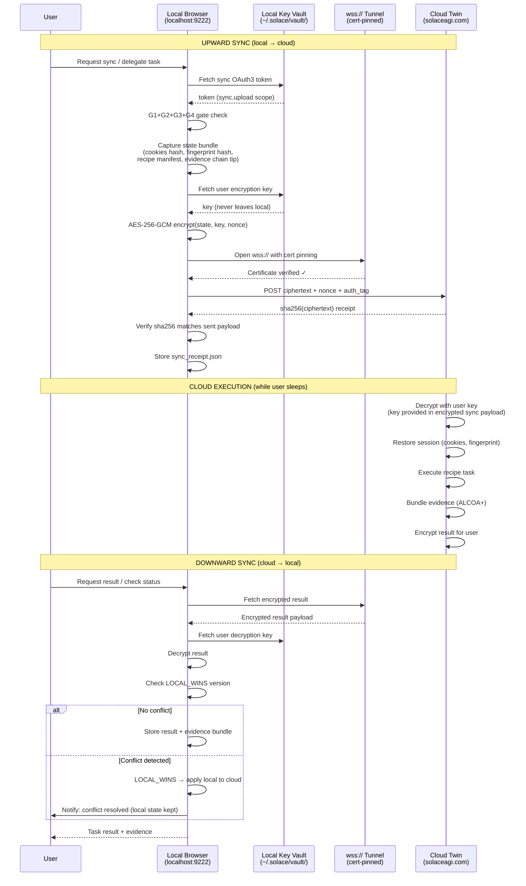
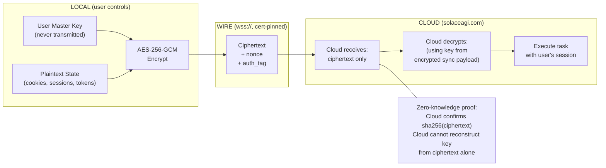
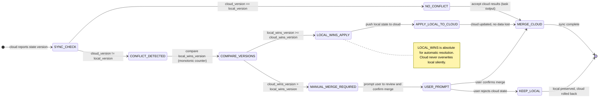
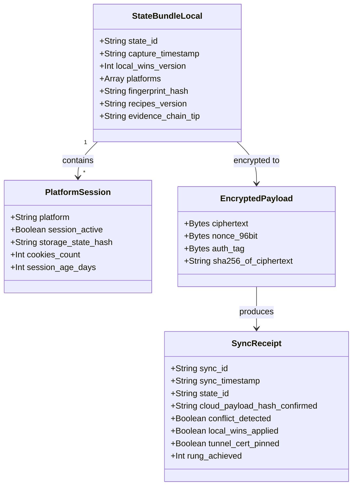

# Diagram: Twin Sync Flow

**ID:** twin-sync-flow
**Version:** 1.0.0
**Type:** Flow diagram + sequence diagram
**Primary Axiom:** NORTHSTAR (twin sync is the bridge to the Universal Portal)
**Tags:** twin, sync, local, cloud, aes-256-gcm, zero-knowledge, local-wins, conflict, delegation

---

## Purpose

The twin sync flow shows how the user's local browser state is synchronized to the cloud twin in a zero-knowledge manner — the cloud never sees plaintext, the user's key never leaves their machine, and local state always wins conflicts.

This diagram covers both upward sync (local → cloud) and downward sync (cloud → local) to give a complete picture of the twin architecture.

---

## Diagram: Full Sync Sequence

---

## Diagram: Zero-Knowledge Guarantee

---

## Diagram: LOCAL_WINS Conflict Resolution

---

## Diagram: Sync State Bundle Contents

---

## Notes

### Why Zero-Knowledge?

The twin architecture requires the cloud to execute tasks using the user's authenticated sessions. This means the user's cookies and session tokens must be available on the cloud. The challenge: the cloud is a third-party service — the user cannot fully trust it.

Zero-knowledge sync solves this: the user's key is used to encrypt the state before transmission. The cloud decrypts using a session key that was transmitted in the encrypted payload (envelope encryption). If the cloud is compromised, the attacker gets ciphertext but not the user's master key.

This is the architecture of zero-knowledge services like 1Password and Bitwarden. SolaceBrowser applies the same model to browser session delegation.

### Why LOCAL_WINS?

The user's local machine is the source of truth for their digital identity. The cloud twin is a delegate — it executes on the user's behalf, but it does not own the user's identity. If there is ever a conflict between what the user's local machine has and what the cloud has, the local machine wins.

This prevents a class of attacks where a compromised cloud could plant modified state onto the user's local machine.

### Certificate Pinning

The wss:// tunnel uses certificate pinning to the solaceagi.com leaf certificate. This prevents MITM attacks on the sync channel. If the certificate does not match the pinned value, the tunnel is rejected and BLOCKED. This is TUNNEL_DOWNGRADE → BLOCKED in the forbidden states.

---

## Related Artifacts

- `data/default/skills/browser-twin-sync.md` — full twin sync skill
- `data/default/recipes/recipe.twin-sync.md` — full sync lifecycle recipe
- `combos/twin-delegation.md` — delegation combo using twin sync
- `data/default/diagrams/browser-multi-layer-architecture.md` — sync lives between Layer 4 (cloud execution) and Layer 5 (evidence)
