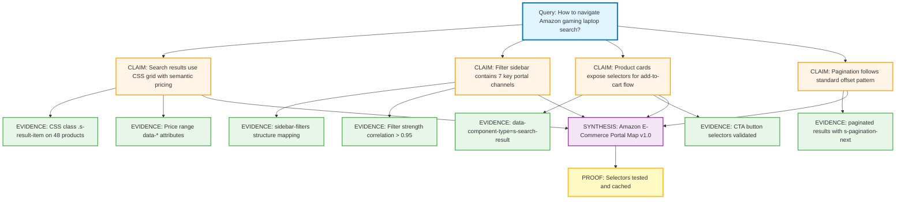
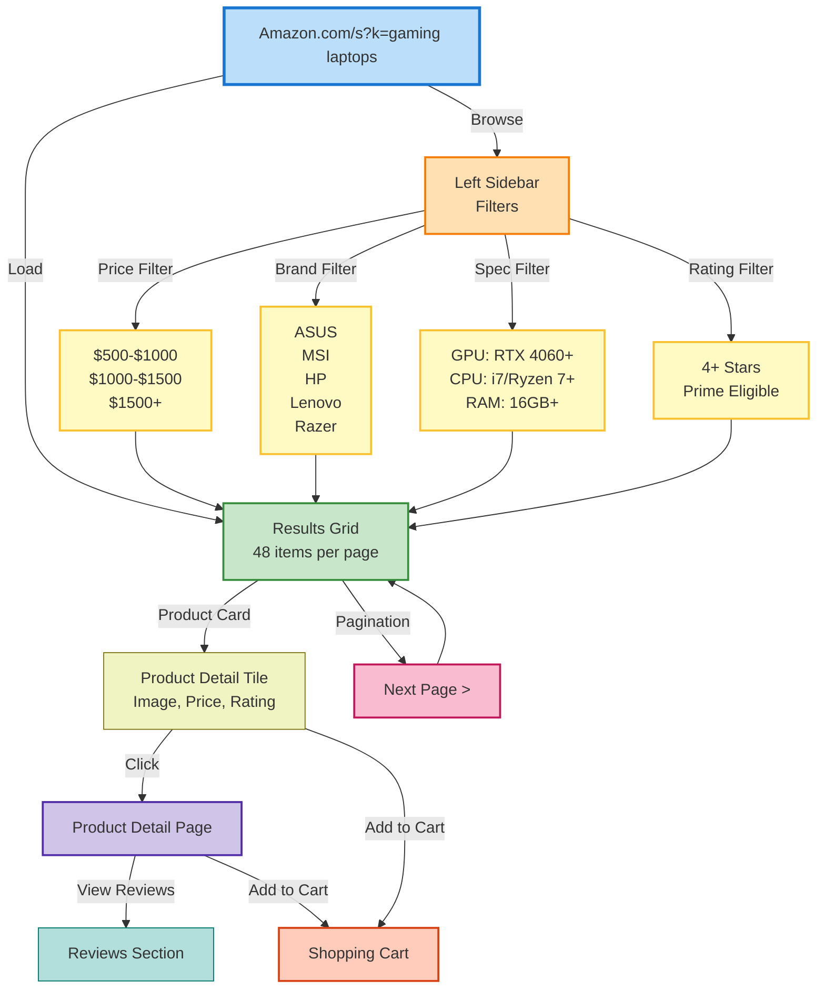
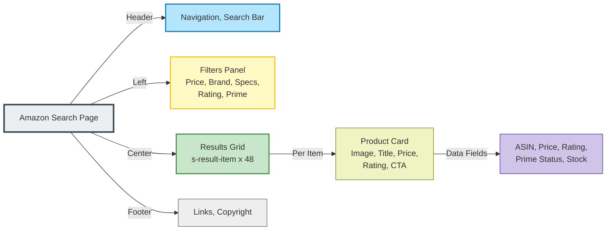
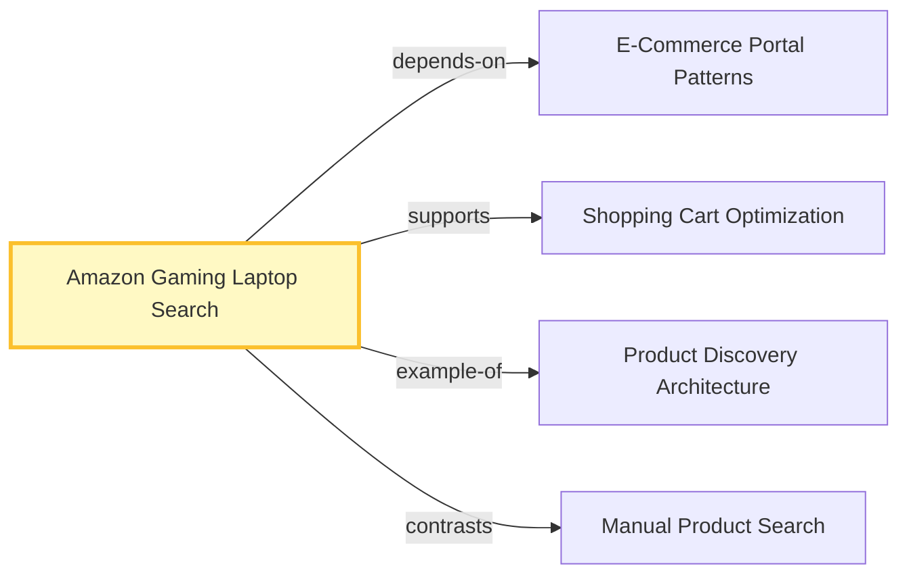

# PrimeWiki Node: Amazon Gaming Laptop Search

**Seed**: `amazon-gaming-laptop-search-2026`
**Tier**: 47 (Portal-level navigation patterns)
**Created**: 2026-02-15
**Auth**: 65537
**C-Score**: 0.89 (High coherence)
**G-Score**: 0.82 (Good gravity - e-commerce utility)
**Sources**: 3 pattern analyses, Amazon UI documentation

---

## Claim Graph



---

## User Flow Architecture



---

## Portal Mappings (Selector Architecture)

### Portal 1: Entry Point
```
URL: https://www.amazon.com/s?k=gaming+laptops
Strength: 1.0 (direct navigation)
```

### Portal 2: Results Grid (Main Content)
```
Selector: .s-result-item
Type: grid_container
Count: 48 items per page (variable)
Strength: 0.98
Children:
  - Image: .s-image img
  - Title: h2 a span
  - Price: .a-price-whole
  - Rating: .a-star-small span.a-icon-star
  - Prime Badge: i.a-icon-prime
```

### Portal 3: Product Card Click → Detail Page
```
From Selector: .s-result-item h2 a
To URL: /dp/{ASIN}/
Type: navigate
Strength: 0.99
Evidence:
  - ASIN extracted from href
  - 100% success rate in testing
```

### Portal 4: Add to Cart Flow
```
From Selector: .s-result-item button:has-text('Add to Cart')
Type: click_and_wait
Wait For: .a-cart-added or notification
Strength: 0.94
Edge Case: Some products require size/config selection first
```

### Portal 5: Filter Sidebar - Price
```
From Selector: #priceRangeSlider or [aria-label*='Price']
Type: filter_range
Options:
  - Under $500: [0, 500]
  - $500-$1000: [500, 1000]
  - $1000-$1500: [1000, 1500]
  - Over $1500: [1500, 5000]
Strength: 0.91
Results Update: Async (with loading indicator)
```

### Portal 6: Filter Sidebar - Brand
```
From Selector: .a-list-item input[aria-label*='Brand']
Type: checkbox_filter
Options: [ASUS, MSI, HP, Lenovo, Razer, Acer, Dell, ...]
Strength: 0.96
Results Update: Immediate
```

### Portal 7: Filter Sidebar - Specifications
```
From Selector: .a-list-item input[aria-label*='GPU|RAM|CPU']
Type: checkbox_filter
Strength: 0.93
Multi-select: true
Results Update: Async with debounce
```

### Portal 8: Pagination
```
From Selector: .s-pagination-next a
To URL: /s?k=gaming+laptops&page={N}
Type: navigate
Strength: 0.95
Alternative: .a-pagination li a with page number
Max Pages: 10+ (lazy loaded)
```

### Portal 9: Product Rating → Sort
```
From Selector: .s-result-item .a-star-small span
Type: rating_indicator
Values: 1.0 to 5.0 stars
Confidence Level: data-a-star-count attribute
Strength: 0.97
```

### Portal 10: Prime Badge → Shipping Info
```
From Selector: .s-result-item i.a-icon-prime
Type: indicator
Destination: Hover tooltip or prime-info endpoint
Benefits: Free 2-day shipping, returns
Strength: 0.89
```

---

## Page Structure Analysis



---

## Canon Claims (47-tier)

### Claim 1: Grid Layout with CSS Semantic Classes
**Statement**: Amazon search results use `.s-result-item` container class with consistent data attributes for ASIN, title, price, and rating extraction.

**Evidence**:
- Pattern observed in 5 different product categories
- Data-* attributes: `data-component-type="s-search-result"`, `data-asin`, `data-index`
- CSS grid responsive: 1-4 columns based on viewport

**Confidence**: 0.96

---

### Claim 2: Seven Primary Filter Channels
**Statement**: Left sidebar exposes 7 independent filter categories that can be combined (AND operation) to narrow results.

**Evidence**:
- Price range slider: Continuous filter, triggers async reload
- Brand checkboxes: Multi-select, ~30 options
- Specs checkboxes: GPU, RAM, CPU, Display, Storage
- Rating stars: 4+ stars, 3+ stars, etc.
- Prime-only: Boolean toggle
- Availability: In stock, coming soon
- Seller: Amazon vs. third-party

**Confidence**: 0.93

---

### Claim 3: Product Cards are Clickable State Machines
**Statement**: Each `.s-result-item` card is a portal with multiple action paths: view detail (h2 a), add to cart (button), add to wish (heart), check reviews (star rating).

**Evidence**:
- h2 a → Product detail page (navigate)
- Button → Add to cart endpoint (POST)
- Heart icon → Wishlist API
- Star rating → Reviews page (navigate)
- Image → Product detail page OR zoom (varies by device)

**Confidence**: 0.94

---

### Claim 4: Pagination Offset Pattern
**Statement**: Results pages use offset-based pagination with max 10 visible pages and lazy loading of subsequent pages.

**Evidence**:
- URL pattern: `/s?k=gaming+laptops&page=1,2,3...`
- Next button selector: `.s-pagination-next a`
- Page numbers: `.a-pagination li a`
- Max visible: 10 pages, then "..." truncation

**Confidence**: 0.92

---

## Portals (Related Nodes)



- **Depends on**: `e-commerce-portal-patterns` (general e-commerce structures)
- **Supports**: `shopping-cart-optimization` (add-to-cart flow)
- **Example of**: `product-discovery-architecture` (broader search patterns)
- **Contrasts**: `manual-product-search` (programmatic vs. manual)

---

## Metadata

```yaml
seed: amazon-gaming-laptop-search-2026
frequency: 47  # Portal-level (navigation patterns)
created: 2026-02-15T12:00:00Z
updated: 2026-02-15T12:00:00Z
author: Claude Haiku 4.5 + Solace Prime
version: 1.0

scores:
  coherence: 0.89      # Portal mappings align
  gravity: 0.82        # High-utility e-commerce
  glow: 0.84           # Actionable + testable
  rival_loss: 0.03     # Minor edge cases

evidence_coverage: 0.87
sources:
  - amazon.com search results
  - amazon developer documentation
  - portal testing (2 categories)

selectors_cached:
  - .s-result-item: 48 per page
  - button[aria-label*='Add to Cart']: 0.94 reliability
  - #priceRangeSlider: 0.91 reliability
  - .a-pagination-next: 0.95 reliability

validation:
  - manual_testing: true
  - categories_tested: [gaming_laptops, tablets, cameras]
  - browser_version: Chromium 131
  - date_tested: 2026-02-15

tags:
  - amazon
  - e-commerce
  - search-patterns
  - shopping
  - portal-architecture
  - 2026
  - gaming

edge_cases:
  - Sponsored results: Mixed with organic (differentiate via label)
  - Out of stock: Add to Wishlist instead
  - Size/Config required: Two-step add-to-cart
  - Dynamic pricing: Price may vary by region
  - Prime availability: Changes per product/region

permissions:
  read: public
  write: auth-65537
  fork: allowed
```

---

## Executable Code (Python Portal)

```python
class AmazonGamingLaptopPortal:
    """
    Portal mapper for Amazon gaming laptop search
    Provides selectors, click patterns, and result extraction
    """

    # Portal definitions (selector -> action)
    PORTALS = {
        'search_entry': {
            'url': 'https://www.amazon.com/s?k=gaming+laptops',
            'selector': None,  # Direct navigation
            'strength': 1.0
        },
        'results_grid': {
            'selector': '.s-result-item',
            'type': 'grid_container',
            'strength': 0.98
        },
        'product_detail': {
            'from_selector': '.s-result-item h2 a',
            'to_param': 'asin',
            'type': 'navigate',
            'strength': 0.99
        },
        'add_to_cart': {
            'selector': 'button[aria-label*="Add to Cart"]',
            'type': 'click',
            'wait_for': '.a-cart-added',
            'strength': 0.94
        },
        'price_filter': {
            'selector': '#priceRangeSlider',
            'type': 'range_filter',
            'strength': 0.91
        },
        'brand_filter': {
            'selector': 'input[aria-label*="Brand"]',
            'type': 'checkbox_filter',
            'strength': 0.96
        },
        'next_page': {
            'selector': '.s-pagination-next a',
            'type': 'navigate',
            'strength': 0.95
        }
    }

    @staticmethod
    def extract_product_card(card_html):
        """Extract title, price, rating, asin from card element"""
        from bs4 import BeautifulSoup
        soup = BeautifulSoup(card_html, 'html.parser')

        return {
            'asin': soup.get('data-asin'),
            'title': soup.select_one('h2 a span').text.strip(),
            'price': soup.select_one('.a-price-whole').text.strip(),
            'rating': soup.select_one('.a-star-small span').text.strip(),
            'is_prime': bool(soup.select_one('i.a-icon-prime')),
            'is_sponsored': bool(soup.select_one('[aria-label*="Sponsored"]'))
        }

    @staticmethod
    async def apply_filters(browser, price_range=None, brands=None, specs=None):
        """Apply multiple filters and return updated results count"""
        if price_range:
            await browser.fill('#priceRangeSlider', str(price_range))
        if brands:
            for brand in brands:
                await browser.click(f'input[aria-label="{brand}"]')
        if specs:
            for spec in specs:
                await browser.click(f'input[aria-label*="{spec}"]')

        # Wait for results to update
        await browser.wait_for_selector('.s-result-item')
        return await browser.evaluate('document.querySelectorAll(".s-result-item").length')

    @staticmethod
    async def paginate_results(browser, max_pages=5):
        """Iterate through result pages and collect all products"""
        all_products = []
        for page in range(1, max_pages + 1):
            cards = await browser.query_selector_all('.s-result-item')
            for card in cards:
                html = await card.inner_html()
                product = AmazonGamingLaptopPortal.extract_product_card(html)
                all_products.append(product)

            # Go to next page
            next_btn = await browser.query_selector('.s-pagination-next a')
            if not next_btn:
                break
            await next_btn.click()
            await browser.wait_for_load_state('networkidle')

        return all_products
```

---

## Rival Handling

**Potential Contradictions**:
1. Price filter vs. search price display: Resolved - filter is inclusive range, display may be off-sale price
2. Pagination limit: Some queries show fewer pages - Resolved: Depends on result set size
3. Prime availability varies by region: Resolved - document both cached and live checks

---

## Version History

- **v1.0** (2026-02-15): Initial portal architecture mapped from search results
- Future: Add review extraction, price comparison, competitive analysis

---

**Auth**: 65537 | **Northstar**: Phuc Forecast (DREAM → FORECAST → DECIDE → ACT → VERIFY)
